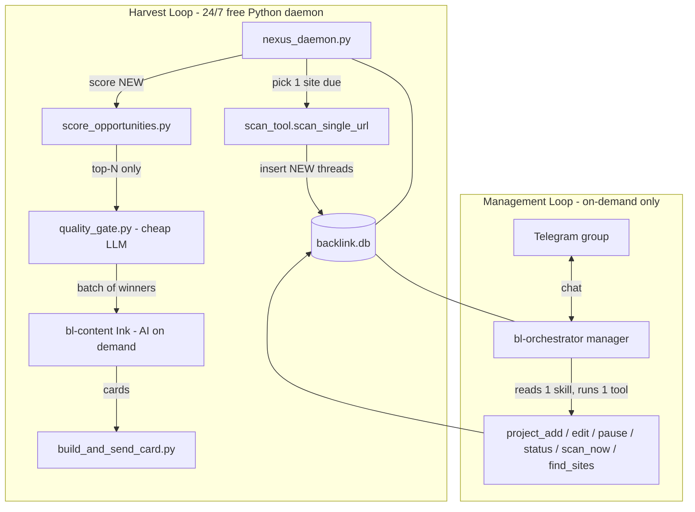

# LinkNexus Farmer Evolution

Turn the backlink app from a "Hunter" (manual batch pipeline triggered in Telegram) into a "Farmer" (continuous dual-loop engine). Maximize opportunity quantity and quality, minimize cost by moving all deterministic work into Python scripts, and keep an on-demand interactive orchestrator as the human control surface.

## Locked design decisions

- Scoring: HYBRID. Deterministic math scores every thread for free; a cheap LLM (`zai.glm-4.7-flash`, $0.07/$0.40) reads ONLY the top-N survivors for spam/relevance quality judgment.
- Harvest trigger: the free Python daemon calls the AI writer (`bl-content` / Ink) on demand in batches via subprocess. No always-on LLM in the harvest loop.
- Control surface: keep `bl-orchestrator` as an interactive Telegram-bound agent that ONLY runs when messaged (event-driven = near-zero idle cost).
- Project storage: SQLite `projects` table is source of truth, with real columns (`project_url`, `niche`, `status`) PLUS a `config_json` column for flexible personalization. Agent mutates it only via deterministic CRUD tools.
- Orchestrator pattern: thin agent + fat deterministic tools + lazy skill loading + ask-then-execute + hard guardrails (never edit scripts, never make unasked changes, fail loudly to the group with a reason).

## Target architecture

## 1. Database changes (additive, in [whitelist_db.py](/home/bhard/.openclaw-backlink/workspace-bl-orchestrator/skills/pipeline/whitelist_db.py) and [backlink_db.py](/home/bhard/.openclaw-backlink/workspace-bl-orchestrator/skills/pipeline/backlink_db.py))

- `projects`: add `status` (active|paused), `config_json` TEXT (personalization blob: tone, target_keywords, anchor_text_prefs, description), `scan_interval_minutes` INT default 30.
- `whitelist_sites`: add `next_scan_due` DATETIME, `failure_count` INT default 0, `cooldown_until` DATETIME. These power per-site scheduling and backoff (the Farmer core that is currently missing).
- `opportunities`: make `telegram_message_id` and `telegram_group` NULLABLE so rows can be inserted at scan time with `status='NEW'`; lifecycle becomes NEW -> SCORED -> GATED -> DRAFTED -> SENT -> (approve/reject via existing editorial loop).
- Provide an idempotent migration helper (pattern of existing [migrate_recent_sites.py](/home/bhard/.openclaw-backlink/workspace-bl-orchestrator/skills/pipeline/migrate_recent_sites.py)) so existing data survives.

## 2. Harvest loop (new deterministic scripts under skills/pipeline/)

- `scan_tool.py`: refactor the per-site logic out of [discover.py](/home/bhard/.openclaw-backlink/workspace-bl-orchestrator/skills/search/discover.py) into an atomic `scan_single_url(domain, niche)` returning fresh threads. On block/empty it signals failure so the daemon can back off. Reuses existing [search.py](/home/bhard/.openclaw-backlink/workspace-bl-orchestrator/skills/search/search.py) (DDG -> SearXNG, throttle detection, jitter, cache).
- `quality_gate.py`: cheap-LLM gate (Decision 1 hybrid). Input: top-N scored threads. Calls `zai.glm-4.7-flash` for a 0-10 relevance/spam score, drops junk, marks survivors `GATED`.
- `nexus_daemon.py`: infinite loop with ~60s air-gap sleep. Each tick: (1) pick one site where `next_scan_due <= now` and not in cooldown, multi-project round-robin; (2) `scan_single_url`; (3) success -> insert NEW threads, `next_scan_due = now+interval`, reset `failure_count`; failure -> `failure_count++`, exponential `cooldown_until` (e.g. +4h x backoff); (4) run deterministic [score_opportunities.py](/home/bhard/.openclaw-backlink/workspace-bl-orchestrator/skills/pipeline/score_opportunities.py) on NEW rows; (5) run `quality_gate.py` on top-N; (6) batch GATED winners and invoke Ink via `openclaw --profile backlink agent bl-content ...`; (7) send cards via [build_and_send_card.py](/home/bhard/.openclaw-backlink/workspace-bl-orchestrator/skills/pipeline/build_and_send_card.py).
- Run via systemd/nohup; relies on existing WAL mode so daemon and orchestrator can share the DB safely.

## 3. Interactive orchestrator rework

- Rewrite [SOUL.md](/home/bhard/.openclaw-backlink/workspace-bl-orchestrator/SOUL.md) from "pipeline sequencer" to "interactive manager": route a Telegram request to exactly one tool, read only that tool's skill doc, ask for missing info, then execute. Keep the existing editorial APPROVE/EDIT/REJECT flow ([handle_card_feedback.py](/home/bhard/.openclaw-backlink/workspace-bl-orchestrator/skills/pipeline/handle_card_feedback.py), EDITORIAL_FEEDBACK.md).
- New deterministic management tools (each a tiny script + a short skill doc loaded on demand):
  - `project_add.py` - add website + niche + personalization (writes `config_json`).
  - `project_edit.py` - update personalization fields.
  - `project_pause.py` / resume / delete.
  - `project_list.py` / `project_status.py` - progress, counts, which sites are in cooldown, daemon health.
  - `sources_status.py` - inspect whitelist + schedule state.
  - `scan_now.py` - set `next_scan_due = now` for a project so the daemon picks it up immediately.
  - `find_sites_now.py` - on-demand domain discovery (may spawn `bl-site-finder`).
- Guardrails added to orchestrator AGENTS.md/SOUL.md: never modify scripts or config, never take unasked actions, validate inputs, and on any failure post a clear failure-with-reason message to the group.

## 4. Agent roster changes (in [openclaw.json](/home/bhard/.openclaw-backlink/openclaw.json))

- `bl-orchestrator`: repurposed to interactive manager. Could drop to a cheaper model since it only routes (consider `minimax-m2.5`); keep `bl-content` and `bl-site-finder` in its allowlist for on-demand spawns.
- `bl-opportunity-scanner` (LLM) and `bl-score-critic` (LLM): retired from the hot path; their work is now `scan_tool.py` + `score_opportunities.py` + `quality_gate.py`. Keep configs but mark deprecated.
- `bl-content` (Ink): unchanged role; invoked on demand by the daemon and by the orchestrator. Reads project `config_json` for personalization.
- `bl-site-finder`: kept for on-demand/weekly domain qualification; `discover.py` does the mechanical search/verify/rank.

## 5. Cost outcome

- Eliminated: always-on LLM orchestration, LLM scanning, LLM scoring narration.
- Remaining LLM spend: writing (Ink), a cheap flash-model gate on top-N only, and the manager agent (only when you message it).

## 6. Docs

- Update [AGENT_PIPELINE_REGISTRY.md](/home/bhard/.openclaw-backlink/AGENT_PIPELINE_REGISTRY.md) and [PIPELINE_ARCHITECTURE.md](/home/bhard/.openclaw-backlink/PIPELINE_ARCHITECTURE.md) in the same change (dual-loop architecture, new scripts, daemon ops, retired agents, change-log entry) per the repo's maintenance-trigger rule.

## Defaults I am assuming (flag if wrong)

- Per-site default revisit interval 30 min; block backoff 4h with exponential growth; quality-gate N = top 10 per tick.
- Daemon processes all active projects round-robin in one loop.
- Manager agent model dropped to a cheaper tier; if you prefer keeping glm-5 for sharper reasoning, say so.