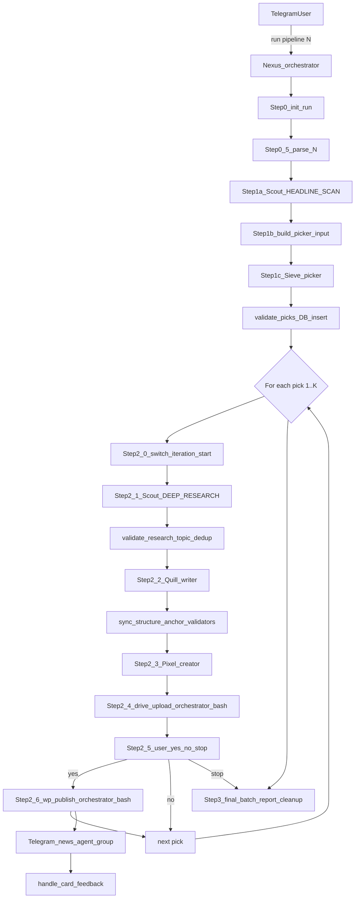

# Agent Pipeline Registry

**Last updated:** 2026-06-24 (FEED_DRAIN picker input resolves selection from DB via --feed-job-id)  
**Purpose:** Canonical living reference for the OpenClaw crypto news pipeline — all agents, subagents, prompts, tools, skills, and pipeline steps.  
**Config source of truth:** [`openclaw.json`](openclaw.json)

> **Secrets policy:** This file documents *where* credentials live (`TOOLS.md`, `openclaw.json`, shell scripts) but never copies tokens, passwords, or API keys.

---

## Maintenance triggers

Update this registry in the **same change** whenever you edit any of:

| Category | Paths |
|----------|-------|
| Config | `openclaw.json`, `exec-approvals.json` |
| Prompts | `workspace-*/SOUL.md`, `workspace-*/AGENTS.md`, `workspace-*/IDENTITY.md`, `workspace-writer/templates/*.md` |
| Skills | `workspace-*/skills/**`, `skills/**` |
| Pipeline scripts | `workspace-orchestrator/skills/pipeline/**` |

On each update: bump **Last updated**, edit only affected sections, append one line to **Change log**.

---

## Architecture



**Delegation:** `sessions_spawn` + `sessions_yield` only. Do **not** use `openclaw agent ... --deliver` in bash.

**Handoffs:** File-first. Workers write to `/tmp/crypto-run-<RUN_ID>/` (symlinked from `/tmp/...`). Chat returns `"SUCCESS"` or structured status (`CHART_DONE:`, `WP_FAILED:`). Nexus validates disk artifacts with Python/bash scripts.

**Multi-story batch model:** A single run may publish N stories (1 ≤ N ≤ 10). The Researcher is invoked twice per run: once in `MODE: HEADLINE_SCAN` to produce ~10 candidate headlines, then once per pick in `MODE: DEEP_RESEARCH`. The new `picker` agent (Sieve) classifies each candidate into one of 8 categories and selects N picks balancing freshness with category diversity. Within the per-pick loop the existing Writer / Creator / Publisher / WP-Publisher agents are reused unchanged.

**Entry point:** Telegram bound exclusively to `orchestrator` (`openclaw.json` → `bindings`).

**Feed-card taps (`oc_go:` / `oc_feed_refresh:`):** Normally claimed by the in-process **`feed-tap-claimer`** plugin (`~/.openclaw/plugins/feed-tap-claimer/`, enabled in `plugins.entries`). It hooks `before_dispatch`, runs `handle_card_feedback.py`, and returns `{ handled: true }` so the orchestrator LLM is never woken. Fail-open: disable the plugin (`openclaw plugins disable feed-tap-claimer`) and taps route to the orchestrator via `EDITORIAL_FEEDBACK.md` as before.

---

## Global configuration

| Setting | Value |
|---------|-------|
| Default model | `local-bifrost/gpt-5.4-mini` |
| Default workspace | `/home/bhard/.openclaw/workspace` |
| LLM backend | Bifrost Azure proxy (`local-bifrost` provider in `openclaw.json`) |
| Tools profile | `coding` |
| Exec security | `full`, `ask: off` |
| Context injection | `always` |
| Web search | SearXNG plugin (`paulgo.io`) |
| Hooks | `session-memory`, `boot-md` |
| Gateway | Local port 18789, token auth |

---

## Projects (multi-site publishing)

The pipeline is **project-scoped**: a single agent stack publishes to one or more WordPress sites, each defined by a JSON config under `~/.openclaw/projects/<slug>.json`. There is no code change required to add a new site — drop in a config + credentials file and reference the slug at run time.

### Run syntax

| Command | Meaning |
|---------|---------|
| `run pipeline N` | Default project (`coinography`) — backward compatible |
| `run pipeline coinography N` | Explicit Coinography run |
| `run pipeline <slug> N` | Run pipeline `N` times for project `<slug>` |

The orchestrator parses `<slug>` in **Step 0.4**, validates `~/.openclaw/projects/<slug>.json` exists, locks the slug into `manifest.json` (`project` + `project_config_path`), and exports `PROJECT_SLUG` + `PROJECT_CONFIG` to all child agents.

### Config schema (`projects/<slug>.json`)

| Section | Keys | Used by |
|---------|------|---------|
| `slug`, `name` | unique slug, human label | all agents (logs, card prefix) |
| `wordpress` | `url`, `user`, `app_password_ref`, `default_status`, `fallback_category_id`, `picker_category_slugs[]`, `categories[]` | `publish.sh`, `wp_post_actions.sh`, `build_picker_input.py`, `validate_picks.py`, `sync_wp_categories.py` |
| `research` | `rss_feeds[]`, `exclude_keywords[]`, `source_priority_order[]` | Researcher (`emit_feed_fetch_commands.py`) |
| `picker` | `diversity_window_hours` | `build_picker_input.py`, Picker SOUL |
| `writer` | `template_path` | Writer SOUL |
| `creator` | `image_style_hint` | Creator SOUL |
| `publisher` | `drive_doc_prefix`, `drive_parent_id`, `drive_account` | Publisher SOUL |
| `telegram` | `card_prefix` | `build_and_send_card.py` |
| `authors[]` | `id`, `label`, `name` | `handle_card_feedback.py` (publish-author picker) |

### Isolation guarantees

- **Run directories**: `/tmp/<slug>-run-<RUN_ID>/`. Legacy `/tmp/crypto-run-*` symlinks are preserved when `slug == coinography`.
- **URL dedup**: `article_history.db` has a composite key `(url, project)` — same URL can run on different sites; project-prefixed active-URL files (`/tmp/<slug>-active-url.txt`).
- **Editorial data**: `articles` and `picked_stories` have a `project` column (default `'coinography'` for back-fill); `recent_published_categories` is project-scoped.
- **Credentials**: WP app passwords live in `~/.openclaw/credentials/wp/<slug>.pass` (mode `600`), referenced by `wordpress.app_password_ref` — never hardcoded in scripts.
- **Telegram card**: shared bot + group, but every card opens with `card_prefix` (e.g. `[Coinography]`) so editors can tell projects apart at a glance.

### Adding a new site

1. Copy `projects/coinography.json` to `projects/<newslug>.json` and edit fields.
2. Write the WP app password to `credentials/wp/<newslug>.pass`, then `chmod 600`.
3. (Optional) Drop a writer template at the path listed under `writer.template_path`.
4. Run `run pipeline <newslug> 1` to test.

No source edits, no DB migrations, no SOUL changes are required for routine new-site additions. See `projects/README.md` for the full one-page guide.

### Shared loader

All scripts read project config through `workspace-orchestrator/skills/pipeline/project_config.py` (Python) or `project_config.sh` (bash wrappers `project_cfg_field`, `project_cfg_password`). The loader resolves the active slug from (1) `--slug` CLI arg, (2) `$PROJECT_SLUG` env, (3) `manifest.json`, then (4) default `coinography`. `assert_project_matches_manifest()` is the runtime safety gate — a mismatch fails the run instead of silently publishing to the wrong site.

---

## Agent registry matrix

| Agent ID | Persona | Workspace | Model | Pipeline step |
|----------|---------|-----------|-------|---------------|
| `main` | (default) | `workspace/` | gpt-5.4-mini | Not in pipeline |
| `orchestrator` | Nexus | `workspace-orchestrator/` | gpt-5.4 | Controller (Steps 0–3) |
| `researcher` | Scout | `workspace-researcher/` | gpt-5.4 | Step 1a (HEADLINE_SCAN) + Step 2.1 (DEEP_RESEARCH per pick) |
| `picker` | Sieve | `workspace-picker/` | gpt-5.4 | Step 1c — Categorize + select N picks |
| `writer` | Quill | `workspace-writer/` | mistral-large-3-675b | Step 2.2 — Write |
| `chart-generator` | Pixel | `workspace-chart-generator/` | gpt-5.4-mini | Step 2.3 (chart sub-step, optional) |
| `creator` | Pixel | `workspace-creator/` | gpt-5.4-mini | Step 2.3 — Feature image (thinking=low) |
| `publisher` | Press | `workspace-publisher/` | — | **Inlined into orchestrator Step 2.4** (no longer spawned; SOUL kept as a script reference only) |
| `wp-publisher` | Scribe | `workspace-wp-publisher/` | — | **Inlined into orchestrator Step 2.6** (no longer spawned; SOUL kept as a script reference only) |

**Orchestrator subagent allowlist:** `researcher`, `picker`, `writer`, `creator`, `chart-generator`

> **Cost note (2026-06-19):** `publisher` and `wp-publisher` were thin LLM wrappers around a single shell command (`gog drive upload` / `publish.sh`). The orchestrator now runs those commands directly in `bash`, eliminating two full agent spawns (and their context reload + reasoning round-trips) per published story. `creator` is kept (LLM still crafts the image prompt) but slimmed: `thinkingDefault: low`, large scene tables moved out of SOUL into its `generate-image/SKILL.md`.

---

## Prompt assembly

OpenClaw injects workspace markdown at session start:

| File | Role |
|------|------|
| `SOUL.md` | Primary behavioral contract (the real prompt) |
| `AGENTS.md` | Universal safety / worker rules |
| `IDENTITY.md` | Name, role, emoji, vibe |
| `TOOLS.md` | Environment notes, RSS feeds, API config (secrets live here) |
| `USER.md` | Human preferences |
| `HEARTBEAT.md` | Periodic checks (mostly empty) |
| `BOOTSTRAP.md` | First-run setup (if present) |

Plus runtime base text and an injected skill catalog from `SKILL.md` files.

---

## Per-agent profiles

### Orchestrator — Nexus

| Field | Value |
|-------|-------|
| Workspace | `workspace-orchestrator/` |
| SOUL | `workspace-orchestrator/SOUL.md` (~440 lines) |
| Role | Sequence workers, validate every step, never write/publish content |
| Model | gpt-5.4 |

**Tools (config extras):** `agents_list`, `nodes`, `message`, `gateway`, `browser`, `canvas`, `tts`, `sessions_spawn`, `sessions_yield`, `subagents`

**Full runtime tools:** `read`, `write`, `edit`, `exec`, `process`, `canvas`, `message`, `tts`, `image_generate`, `agents_list`, `sessions_list`, `sessions_history`, `sessions_send`, `sessions_spawn`, `sessions_yield`, `subagents`, `session_status`, `web_search`, `web_fetch`, `browser`, `memory_search`, `memory_get`

**Pipeline steps:**

| Step | Action |
|------|--------|
| 0 | `init_run.sh` → run bundle at `/tmp/crypto-run-<RUN_ID>/` (now also creates `picker/` + `iter_<N>/` archive layout) |
| 0.5 | Parse `N` (story count) from user command (`run pipeline N`); persist into `manifest.batch.target_count` and `pick_run_id` |
| 1a | Spawn researcher in `MODE: HEADLINE_SCAN` → up to 10 fresh candidates → `validate_headlines.py` |
| 1b | `build_picker_input.py` — assemble `picker_input.json` with `target_count` + `recent_categories` (24h) + consumed-URL filter |
| 1c | Spawn `picker` (Sieve) → `picks.json` → `validate_picks.py` inserts each pick into `picked_stories` table |
| 2.0 | `switch_iteration.sh --start <N>` (per pick) — archive previous iter, truncate canonical files |
| 2.1 | Spawn researcher in `MODE: DEEP_RESEARCH` for the current pick → `validate_research.py` (with `--raw-path`/`--validated-path` for per-iteration files when using sub-bundles) → 24h topic dedup |
| 2.2 | Spawn writer → self-check (`check_article.py` on raw) → sync → single gate (`check_article.py --post-sync` on final) — targeted REVISION MODE repairs |
| 2.3 | Spawn creator → creator-owned JPEG gate in `generate.sh` (chart sub-step still gated by `ENABLE_ARTICLE_CHARTS`) |
| 2.4 | Build DOCX with pandoc → `verify_artifacts.py --stage pre_drive` → **run `gog drive upload` directly in bash** (no publisher spawn) → `save_google_drive_json.py` |
| 2.5 | Per-story user gate — reply with headline + category + Drive link, **STOP** for `yes`/`no`/`stop` |
| 2.6 | If yes → **run `publish.sh --status draft` directly in bash** (no wp-publisher spawn) → `update_recent_topics.py --status drafted` → `aggregate_run_tokens.py` → `build_and_send_card.py` → `update_pick_status.py --status published` (with optional `--tokens-*`, `--cost-usd`, `--tokens-by-model`) |
|     | If no → `update_pick_status.py --status cancelled` and continue to next pick |
|     | If stop → cancel all remaining picks and break to Step 3 |
| 3 | Final batch report (per-pick statuses from `picked_stories`) → `cleanup_run_artifacts.sh` (ONCE per batch) |

**Spawn message templates:**

- **researcher (HEADLINE_SCAN):** `MODE: HEADLINE_SCAN` / `OUTPUT_FILE: $RUN_DIR/research/headlines.json` / `TARGET_COUNT: 10`
- **researcher (DEEP_RESEARCH):** `MODE: DEEP_RESEARCH` / `INPUT_FILE: $RUN_DIR/picker/picks.json` / `PICK_INDEX: <N>` / `OUTPUT_FILE: $RUN_DIR/research/raw.json`. Scout reads the pick URL, searches the headline with `search_tool.py` (DuckDuckGo), reads links one-by-one with `read_tool.py` (keyless Jina) until ≥600 words / ≥2 sources, assembles with `build_research_json.py`, then self-checks with `check_research.py`; yields `SUCCESS` only on `RESEARCH_CHECK: PASS`.
- **picker:** `INPUT_FILE: $RUN_DIR/picker/picker_input.json` / `OUTPUT_FILE: $RUN_DIR/picker/picks.json`
- **writer:** Resolve template from `PROJECT_CONFIG`; pre-writing plan → write `raw.md` → run `check_article.py` until `ARTICLE_CHECK: PASS`; yield `SUCCESS` only on pass.
- **chart-generator:** `CHART_COIN: [coin]` / `CHART_DAYS: 30` / `CHART_OUTPUT: $RUN_DIR/media/chart.png`
- **creator:** Receive inlined `HEADLINE`/`CATEGORY`/`SCENE_HINT`/`SAVE_TO` from orchestrator; craft prompt; run `generate.sh` (Pollinations via `PROJECT_CONFIG` logo + `.watermarked` marker).
- **(Drive — no spawn):** Orchestrator builds DOCX + runs `gog drive upload "$RUN_DIR/article/article.docx" ...` directly, then `save_google_drive_json.py`.
- **(WordPress — no spawn):** Orchestrator runs `publish.sh --status draft --project "$PROJECT_SLUG" --article ... --image ...` directly, then reads `$RUN_DIR/publish/wp-url.txt`.

**Key rules:** Writer told max 1200 words; sync accepts up to 1300 (+100 buffer, never tell writer). Must see `ARTICLE_SYNCED` + `ARTIFACTS_OK: post_sync` before Step 2.3 in each iteration. Per-story user gate at Step 2.5 (`yes`/`no`/`stop`). One bad story does **not** abort the batch — `update_pick_status.py --status failed` + `switch_iteration.sh --reset` + continue. Never hallucinate URLs.

**State:**
- `workspace-orchestrator/state/recent_topics.json` — 24h topic registry (now carries `category`).
- `~/.openclaw/data/editorial.db` — `articles` (with new `category` column) + `picked_stories` (new table).

---

### Researcher — Scout

| Field | Value |
|-------|-------|
| Workspace | `workspace-researcher/` |
| SOUL | `workspace-researcher/SOUL.md` |
| Model | gpt-5.4 |
| Pipeline step | 1a (HEADLINE_SCAN) and 2.1 (DEEP_RESEARCH per pick) |

**Two modes** (selected by the first non-empty line of the spawn message):

| Mode | Job | Output |
|------|-----|--------|
| `HEADLINE_SCAN` | Run `scan_headlines.py` (deterministic, project-aware); LLM fallback if script fails. Returns up to 10 fresh candidate headlines. No deep extraction. | `$RUN_DIR/research/headlines.json` |
| `DEEP_RESEARCH` | Agent loop with two tools: read the pick URL, then `search_tool.py` (DuckDuckGo) for corroborating links, read them one-by-one via `read_tool.py` (keyless Jina) until ≥600 words / ≥2 sources, then `build_research_json.py` assembles the JSON; self-check. | `$RUN_DIR/research/raw.json` |

**Tools denied:** `web_search`, `web_fetch`

**Tools available:** `read`, `write`, `edit`, `exec`, `process`, `image_generate`, `sessions_yield`, `memory_search`, `memory_get`

**HEADLINE_SCAN required JSON fields:** `status="ok"`, `mode="headline_scan"`, `scanned_at`, `target_count`, `candidate_count`, `candidates[]` (each: `candidate_index`, `headline`, `url`, `pub_date`, `source`, `summary`, `corroborating_sources[]`).

**DEEP_RESEARCH required JSON fields:** `status="ok"`, `mode="deep_research"`, `story_id`, `category`, `topic_theme`, `primary_keyword`, `primary_headline`, `primary_asset`, `chart_coin`, `sources_used`, `source_urls`, `combined_key_facts`, `aggregated_raw_content` (≥600 words).

**Workspace skills/scripts:** SOUL is thin (identity + mode triggers + output contract); procedures live in the mode skills below.

| Path | Purpose |
|------|---------|
| `skills/headline-scan/SKILL.md` | HEADLINE_SCAN: script-first via `scan_headlines.py`, LLM manual fallback, final verification thinking block |
| `skills/headline-scan/scan_headlines.py` | Deterministic project-aware scanner (parallel fetch, cached resolve, in-code filters/dedupe, batched history) |
| `skills/deep-research/SKILL.md` | DEEP_RESEARCH: **script-first** via `run_research.py` (search_tool + read_tool internally), stop at ≥600 words / ≥2 sources; `--extra-search` retry; fallback ladder for manual loop / web-reader-pro |
| `skills/deep-research/run_research.py` | **Primary** deterministic DEEP_RESEARCH engine: read pick URL → DDG search → sequential read_tool → build_research_json. Zero LLM tokens. |
| `skills/deep-research/search_tool.py` | DuckDuckGo search via `ddgs` library (html/lite endpoints, not page-scraping → no Cloudflare/home-IP block). Returns deduped publisher candidates `[{title,url,snippet,domain}]`, social/aggregators filtered, priority sources first. Retry + multi-backend on throttle. |
| `skills/deep-research/read_tool.py` | Read ONE link to clean prose. Primary: keyless Jina Reader (`r.jina.ai`, fetched on Jina's servers → bypasses Cloudflare; `JINA_API_KEY` auto-lifts 20→500 RPM). Fallback: trafilatura, then skip. Cross-invocation throttle (`~/.openclaw/data/jina_last_request`, `JINA_MIN_INTERVAL_S` default 3.5s). Writes per-source JSON to `<out-dir>` + `CUMULATIVE: words/sources`. |
| `skills/deep-research/build_research_json.py` | Assemble schema-correct `raw.json` from read_tool out-dir + picks.json (category passthrough, asset detection, key facts, dedupe by domain). Clean error JSON on zero content. Zero LLM tokens. |
| `skills/deep-research/run_deep_research.py` | **Deprecated stub** — delegates to `run_research.py` (maps `--discover-aggressive` → `--extra-search`). |
| `skills/deep-research/extract_article.py` | **Deprecated fallback only** (legacy home-IP scrape ladder); primary reading goes through `read_tool.py`. |
| `skills/research-check/check_research.py` | Self-check validator (`--mode headline_scan\|deep_research`); single source of truth shared with orchestrator gates |
| `skills/research-check/resolve_url.py` | Resolve aggregator URLs; disk cache + retry + `--batch` mode |
| `skills/research-check/SKILL.md` | Self-check loop + resolver usage |
| `skills/history/history_batch.py` | Batched URL history checks (single SQLite connection) |
| `skills/research/verify_feeds.sh` | Project-aware RSS health check (via `emit_feed_fetch_commands.py`) |
| `skills/history/article_history.sh` | SQLite duplicate URL check (7-day window); `check-batch` mode |
| `skills/fallback/web-reader-pro/SKILL.md` | **Fallback only** — last-resort reader after `run_research.py` / `read_tool.py` exhausted on a URL |

**Reliability (self-check before handoff):** Both modes run `check_research.py` and yield `SUCCESS` only on `RESEARCH_CHECK: PASS`. The checker rejects trajectory-log / raw-HTML dumps and unresolved aggregator URLs, and accepts a clean error JSON (`status:error` with a known reason) so a bad pick is skipped instead of dumping garbage. `validate_research.py` and `validate_headlines.py` import the same check functions, so the gate can never diverge from the self-check.

**Duplicate guards (cross-cutting):**
1. Scout HEADLINE_SCAN — `article_history.sh check` per candidate URL (7-day TTL).
2. `build_picker_input.py` — filters URLs already in `picked_stories` with `status IN ('drafted','published')` (permanent dedup).
3. Nexus topic dedup — `check_recent_topic_duplicates.py` per pick (24h topic-similarity window vs `recent_topics.json`).

---

### Picker — Sieve

| Field | Value |
|-------|-------|
| Workspace | `workspace-picker/` |
| SOUL | `workspace-picker/SOUL.md` |
| Model | gpt-5.4 (or pro for stronger reasoning) |
| Pipeline step | 1c |

**Job:** Read `picker_input.json` (target_count, recent_categories, candidates[]), classify each candidate into exactly one of 8 categories, then select N picks balancing freshness with category diversity. Write `picks.json`.

**Category taxonomy (closed set):**

| Category id | Coverage |
|---|---|
| `regulation` | Lawmakers, SEC/CFTC/EU/FCA actions, rulings, sanctions |
| `etf_institutional` | Spot/futures ETFs, BlackRock/Fidelity, treasury allocations |
| `hack_exploit` | Bridge hacks, smart-contract exploits, breaches |
| `l1_l2_protocol` | Major upgrades/forks/launches on L1s and L2s |
| `exchange` | CEX/DEX product launches, listings, outages |
| `stablecoin` | USDT/USDC/DAI mints/burns/depegs/issuer + stablecoin-specific regulation |
| `adoption_partnership` | Corporate adoption, payment integrations, MoUs |
| `market_movement` | Catalyst-driven BTC/ETH/altcoin price action |

**Selection algorithm:** Per-candidate `selection_score` from `category_score`, `recency_score` (pub_date), `corroboration_score`, `source_priority_score`. Then greedy pick with `recent_categories` penalty (×0.55, ×0.45 for top recent) and `same_batch` penalty (×0.50 primary / ×0.85 alt overlap). Early-stop when remaining `slot_score < 0.30`.

**Tools denied:** `web_search`, `web_fetch` (Picker reads/writes JSON only — no external calls)

**Output artifact:** `$RUN_DIR/picker/picks.json` → `validate_picks.py` inserts each pick into `editorial.db`'s `picked_stories` table.

---

### Writer — Quill

| Field | Value |
|-------|-------|
| Workspace | `workspace-writer/` |
| SOUL | `workspace-writer/SOUL.md` (thin: identity, triggers, output contract) |
| Templates | `workspace-writer/templates/COINOGRAPHY_TEMPLATE.md`, `MEMECOIN_TEMPLATE.md` (via `writer.template_path` in project config) |
| Skills | `skills/write-article/`, `skills/revise-article/`, `skills/article/` |
| Model | `mistral.mistral-large-3-675b-instruct` (fallbacks: Nemotron → Kimi → MiniMax → GLM-4.7 → DeepSeek; no GLM-5) |
| Pipeline step | 2.2 |

**Job:** Read `validated.json`, follow `write-article` or `revise-article` skill, self-check with `check_article.py`, output to `$RUN_DIR/article/raw.md`, yield `SUCCESS` only when `ARTICLE_CHECK: PASS`.

**Editorial rules (summary):** body words **aim ~1100, accepted 950–1250** (relaxed 2026-06-19 from 1000–1200 to cut near-miss rewrites); META limits (55/50/155 chars); exactly 2 source anchor links; 2–4 H2s, 3–6 H3s, 3–6 FAQs; fixed section order (Conclusion before FAQs). Rules live in project templates, not SOUL. Each template opens with a compact XML `<constraints>` block (numbers Mistral can validate against) — the article output stays clean Markdown (no XML emitted).

**Token-saving writer mechanics (2026-06-19):**
- `autofix_article.py` (new) runs before the self-check counts a FAIL: deterministically fixes em-dashes, the `[Word Count: N]` footer, and stray x.com/twitter body links — so those mechanical issues never cost an LLM revision. Also run as a pre-pass on the orchestrator post-sync gate (`--no-footer`).
- Pre-writing plan compressed to ONE compact `PLAN:` line (counts + word budget) instead of a verbose 4-step block — cuts wasted "planning tax" output tokens while still forcing structural commitment.
- Research is handed to the writer wrapped as `<research_dump>` and the writer is told to "write following your `<constraints>`".

**Tools:** Default coding profile (no special allow/deny).

**Validation (writer self-check + orchestrator gate — same script):**

| Script / skill | Purpose |
|----------------|---------|
| `skills/write-article/SKILL.md` | Initial write workflow + compact 1-line PLAN |
| `skills/revise-article/SKILL.md` | REVISION MODE diff-repair |
| `skills/article/check_article.py` | Combined validator: structure, word band (950–1250), anchors, topic, META, footers, style |
| `skills/article/autofix_article.py` | Deterministic mechanical fixer (em-dash, Word Count footer, body tweet-link strip) — run before treating a FAIL as a rewrite |
| `skills/article/validate_article_structure.py` | Internal module (also CLI) |
| `skills/article/validate_anchor_links.py` | Internal module (also CLI) |

**Output artifact:** `$RUN_DIR/article/raw.md` → synced to `final.md` at `/tmp/crypto-article.md`

---

### Chart Generator — Pixel (optional)

| Field | Value |
|-------|-------|
| Workspace | `workspace-chart-generator/` |
| SOUL | `workspace-chart-generator/SOUL.md` |
| Model | gpt-5.4-mini |
| Pipeline step | 2.5 (skipped when `ENABLE_ARTICLE_CHARTS=0`) |

**Job:** Parse `CHART_COIN` / `CHART_DAYS` / `CHART_OUTPUT` → CoinGecko chart script → return `CHART_DONE:` or `CHART_ERROR:`.

**Skill:** `skills/chart-generator/SKILL.md` + `skills/chart-generator/scripts/generate_chart.py`

**Output artifact:** `$RUN_DIR/media/chart.png` (symlink `/tmp/chart.png`)

---

### Creator — Pixel (image)

| Field | Value |
|-------|-------|
| Workspace | `workspace-creator/` |
| SOUL | `workspace-creator/SOUL.md` |
| Model | gpt-5.4-mini |
| Pipeline step | 3 |

**Job:** Craft editorial prompt (human + crypto asset + Reuters-style suffix) → run generate-image skill → verify JPEG.

**Skill:** `skills/generate-image/SKILL.md` + `skills/generate-image/generate.sh` (Hugging Face hf-inference via Bifrost, logo stamp)

**Success output:** `/tmp/crypto-feature.jpg`  
**Failure output:** `IMAGE_FAILED: <error log>`

---

### Publisher — Press (INLINED — not spawned)

| Field | Value |
|-------|-------|
| Workspace | `workspace-publisher/` (dormant) |
| SOUL | `workspace-publisher/SOUL.md` (reference only) |
| Model | — (no LLM; runs as orchestrator bash) |
| Pipeline step | 2.4 |

**Status:** As of 2026-06-19 the orchestrator runs the Drive upload itself (Step 2.4) — it builds the DOCX with pandoc and runs `gog drive upload` directly. The `publisher` agent is **no longer spawned** (removed from the allowlist). The workspace + SOUL are kept only as a human-readable reference for the exact commands.

**Skill:** `skills/gog/SKILL.md` — Google Workspace CLI

**Rule:** No `--convert` on .docx uploads (strips embedded images).

---

### WordPress Publisher — Scribe (INLINED — not spawned)

| Field | Value |
|-------|-------|
| Workspace | `workspace-wp-publisher/` (dormant) |
| SOUL | `workspace-wp-publisher/SOUL.md` (reference only) |
| Model | — (no LLM; runs as orchestrator bash) |
| Pipeline step | 2.6 (only after explicit user "yes") |

**Status:** As of 2026-06-19 the orchestrator runs `publish.sh --status draft` itself (Step 2.6) and reads `$RUN_DIR/publish/wp-url.txt`. The `wp-publisher` agent is **no longer spawned** (removed from the allowlist). The self-contained `publish.sh` (image upload, HTML conversion, WordPress API, retries) is unchanged; only the wrapper agent was removed. Workspace + SOUL kept as reference.

**Job (now orchestrator bash):** Run `publish.sh` → read `$RUN_DIR/publish/wp-url.txt` (fallback `/tmp/<slug>-wp-result.txt`) or `/tmp/<slug>-wp-error.log`.

**Skills:**

| Path | Purpose |
|------|---------|
| `skills/wordpress/SKILL.md` | Publish workflow docs |
| `skills/wordpress/publish.sh` | META parse, Gutenberg blocks, Rank Math SEO, feature image (draft default) |
| `skills/wordpress/wp_post_actions.sh` | Telegram Publish/Unpublish/Edit; `--author` on publish |
| `skills/wordpress/html_to_gutenberg.py` | Markdown HTML → Gutenberg blocks |
| `skills/history/article_history.sh` | History helper |

**Success output:** WordPress post URL  
**Failure output:** `WP_FAILED: <reason>`

---

### Main (not in pipeline)

| Field | Value |
|-------|-------|
| Workspace | `workspace/` |
| Model | gpt-5.4-mini |
| Role | Default general OpenClaw workspace |

**Extra skills:** `content-writer`, `programmatic-seo`, `fallback/web-reader-pro`, `gog`

---

## Orchestrator pipeline scripts

All under `workspace-orchestrator/skills/pipeline/`:

| Script | Function |
|--------|----------|
| `init_run.sh` | Create run bundle, manifest (now includes `batch.target_count` + `pick_run_id`), `/tmp` symlinks, env file. Touches `headlines.json`, `picker_input.json`, `picks.json` placeholders too. |
| `manifest_paths.py` | Resolve artifact paths from manifest |
| `validate_headlines.py` | Validate Scout's `HEADLINE_SCAN` output, dedupe URLs, normalize pub_date. Imports shared garbage guards + aggregator detection + per-candidate field list from researcher `check_research.py`; drops unresolved aggregator URLs. |
| `build_picker_input.py` | NEW — assemble picker input with `target_count`, `recent_categories`, and consumed-URL filter from `picked_stories` |
| `validate_picks.py` | NEW — validate Sieve's `picks.json`, enforce taxonomy, insert each pick into `picked_stories` |
| `update_pick_status.py` | NEW — CLI wrapper around `editorial_db.update_pick_status` (researching/writing/drafted/published/failed/cancelled). Optional `--tokens-in`, `--tokens-out`, `--tokens-total`, `--tokens-by-model`, `--cost-usd` on publish. |
| `switch_iteration.sh` | NEW — `--start <N>` archives previous iter into `iter_<N-1>/` and truncates canonical files; `--archive <N>` saves last iter; `--reset <N>` archives into `iter_<N>_failed/` after a mid-iteration failure |
| `validate_research.py` | Validate raw research JSON → `validated.json`. Imports the shared `run_deep_research_checks` from researcher `check_research.py` (single source of truth with Scout's self-check); treats clean error JSON as a skip signal. Accepts `--raw-path` + `--validated-path` for per-iteration variants and carries `category` into manifest.story. |
| `check_recent_topic_duplicates.py` | 24h topic dedup vs `state/recent_topics.json` |
| `update_recent_topics.py` | Register researched/drafted/published topics. Now also stores `category`. |
| `verify_artifacts.py` | Stage gates: `pre_write`, `pre_sync`, `post_sync`, `pre_drive`, `pre_wp`. Image validation (≥40 KB JPEG post-stamp) is in `generate.sh`; orchestrator trusts creator `SAVE_TO` / `IMAGE_FAILED`. |
| `sync_article_from_raw.py` | Sanitize raw.md → final.md; word count + topic gate |
| `count_article_body_words.py` | Body word count (same logic as sync; writer pre-flight) |
| `update_manifest_step.sh` | Record step status in manifest |
| `cleanup_run_artifacts.sh` | Remove `/tmp` symlinks on terminal state — runs ONCE per batch |
| `save_google_drive_json.py` | Persist `publish/google-drive.json` after Step 2.4 |
| `aggregate_run_tokens.py` | Step 2.6 — sum LLM token usage from subagent + orchestrator session logs for the current iteration. Workers are session-windowed; orchestrator is time-sliced by message timestamp within the iteration window. Emits `by_agent` (with `primary_model`, `cost_usd` priced from that agent's own tokens, `duration_seconds`), `by_model` (with `priced`), total `duration_seconds` (orchestrator first→last message span), optional USD cost from `openclaw.json` catalog; writes `publish/tokens.json` + `manifest.results.tokens` (fail-open). Emits `TOKENS_PRICE_MISSING: <model>` when a consuming model has no catalog price. |
| `build_and_send_card.py` | Step 2.6 — Telegram news card + `editorial.db`. Shows a compact **Run cost** block: total tok · ~$ · duration header plus per-agent (model) lines with tokens · ~$ · time when caption budget allows; header-only fallback near 1024 chars. |
| `handle_card_feedback.py` | RATE, Publish (author picker), Unpublish, Edit, feed-card `oc_go` / `oc_feed_refresh` |
| `editorial_db.py` | SQLite store. Now defines `picked_stories` + `articles.category`, plus helpers `insert_picked_stories`, `update_pick_status`, `recent_published_categories`, `pending_picks_for_run`, `get_pick`, `get_pick_by_index`, `list_picks_by_run`. `articles` and `picked_stories` also store `tokens_in`, `tokens_out`, `tokens_total`, `tokens_by_model` (JSON), `cost_usd`, `duration_seconds`. |

**Editorial config:** `workspace-orchestrator/config/wp_authors.json` (Toby 3, Ahmed 17, Golan 8), `telegram_card_config.json`

---

## Skills inventory

### Pipeline-critical (workspace-specific)

| Agent | Skill / scripts |
|-------|-----------------|
| Orchestrator | Pipeline scripts (14 files above) + `EDITORIAL_FEEDBACK.md` |
| Researcher | `skills/headline-scan/`, `skills/deep-research/`, `skills/research-check/` (`check_research.py`, `resolve_url.py`), `verify_feeds.sh`, `article_history.sh`, `fallback/web-reader-pro` |
| Writer | `skills/write-article/`, `skills/revise-article/`, `skills/article/check_article.py` |
| Chart-generator | `skills/chart-generator/` (global) |
| Creator | `generate-image/` |
| Publisher | `gog/` |
| WP-publisher | `wordpress/publish.sh`, `wordpress/wp_post_actions.sh`, `article_history.sh` |

### Global OpenClaw skills (visible to agents)

`chart-generator`, `clawhub`, `coding-agent`, `gog`, `healthcheck`, `mcporter`, `node-connect`, `skill-creator`, `taskflow`, `taskflow-inbox-triage`, `tmux`, `video-frames`, `weather`

Researcher additionally has workspace `fallback/web-reader-pro` (fallback-only reader).

---

## Run-bundle artifact model

Each pipeline run creates an isolated folder. Multi-story batches reuse the canonical paths across iterations and archive each completed iteration into `iter_<N>/` via `switch_iteration.sh`:

```
/tmp/crypto-run-<RUN_ID>/
├── manifest.json
├── .run_started               (epoch stamp; refreshed at start of each iter)
├── research/
│   ├── headlines.json         (HEADLINE_SCAN output, batch-level)
│   ├── raw.json               (DEEP_RESEARCH output for current iter)
│   └── validated.json         (validate_research.py output for current iter)
├── picker/
│   ├── picker_input.json
│   └── picks.json
├── article/
│   ├── raw.md                 (current iter)
│   ├── final.md               (current iter)
│   ├── with-image.md
│   └── article.docx
├── media/
│   ├── chart.png              (optional)
│   └── feature.jpg
├── publish/
│   ├── google-drive.json
│   ├── wordpress.json
│   └── news-card.json
├── iter_1/                    (archive — populated at start of iter 2 or via --archive 1)
│   ├── research/, article/, media/, publish/
│   └── manifest.snapshot.json
├── iter_2/                    (archive of iter 2)
└── iter_<K>_failed/           (only if iteration failed; contains REASON.txt)
```

Legacy `/tmp/...` paths are symlinks into the canonical (current-iteration) files; they never need to change between iterations because canonical paths are reused.

**DB-backed batch state:** `~/.openclaw/data/editorial.db` → `picked_stories` rows for `pick_run_id = "<RUN_ID>-pick"` track per-pick status (`pending`/`researching`/`writing`/`drafted`/`published`/`failed`/`cancelled`). The orchestrator can resume mid-batch by querying `pending_picks_for_run`.

---

## Known gaps and legacy docs

| Item | Notes |
|------|-------|
| Two "Pixel" personas | `creator` (HF FLUX feature images) vs `chart-generator` (CoinGecko charts) |
| Charts off by default | `ENABLE_ARTICLE_CHARTS=0` in Step 0 |
| Word count band | Writer aims ~1100; validator + sync both accept 950–1250 (`GATE_BUFFER_WORDS=0`, no hidden asymmetry as of 2026-06-19) |
| Publisher SOUL vs Nexus | Press SOUL describes full pandoc flow; Nexus pre-builds DOCX and must run `save_google_drive_json.py` |
| Telegram vs DM | Pipeline gate in DM; news cards + editorial in `news-agent` group |
| Missing script | Docs reference `extract_tweet_quotes.py` under researcher — not present |
| `PIPELINE_DOCS/03_AGENT_PROFILES.md` | **Deprecated** — describes old `rm sessions.json` + `openclaw agent` flow |
| `PIPELINE_ARCHITECTURE.md` | High-level overview; see this registry for current agent/tool details |

---

## Related documentation

| File | Purpose |
|------|---------|
| **`AGENT_PIPELINE_REGISTRY.md`** | **This file — canonical living reference** |
| `PIPELINE_ARCHITECTURE.md` | High-level architecture overview |
| `PIPELINE_DOCS/` | Planning and legacy docs (some stale) |

---

## Change log

| Date | Change |
|------|--------|
| 2026-06-24 | **FEED_DRAIN picker-input fix (intermittent ~1-2/10 failures).** Root cause (confirmed via two run interviews + code trace): the orchestrator set `SELECTION_FILE=<path>` in one `exec` block but it was not exported/persisted into `<project>-run-env.sh`; a later Step 1 `exec` only `source`d the env file, so `--selection-file "$SELECTION_FILE"` expanded to empty → misleading `PICKER_INPUT_ERROR: pool mode but no candidates (empty pool / no urls)` → agent gave up. NOT a pool-status issue (`editorial_db.pool_by_urls()` has no status filter; there is no `available` status). Fix: `build_picker_input.py` gains `--feed-job-id <int>` which resolves `selection_file` straight from the `feed_jobs` row via `editorial_db.get_feed_job()` (no shell var to lose), plus specific error messages (`feed_job_not_found`, `empty selection_file`, `selection-file unreadable`, `0 urls`). `SOUL.md`: FEED_DRAIN Step 1 now mandates `--feed-job-id <literal id>` (never `$SELECTION_FILE`) + a self-recovery line (retry once with `--feed-job-id` before marking failed, since a tapped story always exists). No change to `pool_by_urls`/`_load_pool_candidates`, `init_run.sh`, dispatcher, or DB schema; SELECTED/MANUAL/AUTO paths unchanged. |
| 2026-06-23 | **Creator-owned image gate (post-stamp).** `generate.sh` now validates the final stamped JPEG (≥40 KB, JPEG magic bytes) after logo composite; optional ImageMagick quality re-encode if stamp shrinks file slightly below min. Pre-stamp size check removed — fixes creator SUCCESS / orchestrator `ARTIFACTS_FAIL: post_image` mismatch (e.g. 54,266 B raw → 40,595 B post-stamp). Orchestrator Step 2.3 no longer runs `verify_artifacts.py --stage post_image`; trusts creator `SAVE_TO` / `IMAGE_FAILED` from script exit code. `post_image` removed from validator CLI; `publish.sh` / `wp_post_actions.sh` retain upload-time guard. |
| 2026-06-23 | **Writer primary → Mistral Large 3 (off GLM-5).** `writer` primary switched from `zai.glm-5` to `mistral.mistral-large-3-675b-instruct` to stop orchestrator + writer contending on the same model quota during pipeline runs. Fallbacks reordered: Nemotron → Kimi → MiniMax → GLM-4.7 → DeepSeek; `zai.glm-5` removed from writer entirely. Orchestrator keeps GLM-5 primary. |
| 2026-06-23 | **Feed-drain dispatch delay 1m → 30s.** `dispatch_feed_jobs.py` / `check_auto_run.py` one-shot crons schedule at `30s` (was `1m`). Note: `+30s` is invalid for `openclaw cron add --at` — must be `30s` or ISO/duration like `1m`. |
| 2026-06-23 | **Researcher DEEP_RESEARCH primary-first cleanup.** New `run_research.py` deterministic engine wraps `search_tool` + `read_tool` + `build_research_json` as the REQUIRED FIRST exec (mirrors HEADLINE_SCAN script-first pattern). `run_deep_research.py` reduced to deprecation stub (`--discover-aggressive` → `--extra-search`). Scrubbed contradictory docs (`TOOLS.md`, `research-check/SKILL.md`, `check_research.py` hints). `web-reader-pro` moved to `skills/fallback/` with FALLBACK ONLY description; `deep-research/_meta.json` added for skill registration. `read_tool` word count aligned to `check_research.py` `.split()` metric. `extract_article.py` marked fallback-only. |
| 2026-06-23 | **Orchestrator self-spawn guard + single-story feed drain.** Root cause of memecoinist runs spawning the orchestrator as its own subagent: `sessions_spawn` was called with `runtime:"subagent"` but no `agentId`, and the engine defaults a missing `agentId` to the caller (so it spawned itself; the `allowAgents` allowlist is skipped when target==requester). Surfaced under memecoinist's high-retry runs (starved fresh pool + strict keyword gate). Fixes: (1) `openclaw.json` orchestrator `subagents.requireAgentId: true` — agentId-less spawns now hard-fail (`forbidden`) instead of self-spawning. (2) `SOUL.md` Step 1c/2.1/2.2/2.3 now show explicit `agentId: "picker"|"researcher"|"writer"|"creator"` and a new CRITICAL rule that every `sessions_spawn` MUST set `agentId`. (3) **Feed-drain is now ONE story per cron**: the SOUL "Feed drain entry" no longer loops the queue — it claims one job, runs the single-story pipeline, marks the job, then clears the lease and re-runs `dispatch_feed_jobs.py` to chain a fresh isolated cron for the next job. Prevents the multi-story context pile-up that filled a single drainer's context and caused failures. `dispatch_feed_jobs.py`/`mark_feed_job.py` docstrings updated; no code-path change to those scripts. Group-id mismatch (memecoinist `YOUR_MEMECOINIST_GROUP_ID` vs live `-1004488104862`) noted but deferred. |
| 2026-06-23 | **Researcher (Scout) DEEP_RESEARCH streamlined to two tools.** Root cause of the "Cloudflare blocked / 204 words" dead-ends: the old `extract_article.py` ladder fetched pages from the home IP (Cloudflare-blocked), and its Jina tier never ran (gated + required an unset `JINA_API_KEY`). Replaced with an agent-driven loop over two tools: new `search_tool.py` (DuckDuckGo via `ddgs` library — finds links, no page-scraping so no Cloudflare/home-IP block) and new `read_tool.py` (keyless Jina Reader fetched on Jina's servers → bypasses Cloudflare; trafilatura then skip as per-link fallback; cross-invocation ~3.5s throttle for the 20 RPM keyless limit, `JINA_API_KEY`/`JINA_MIN_INTERVAL_S` aware). New `build_research_json.py` assembles schema-correct `raw.json` (paragraph-level boilerplate stripping, dedupe by domain). Stop conditions unchanged (≥600 words, ≥2 sources) with max 6 reads + ~90s budget. `deep-research/SKILL.md` rewritten to the loop; `SOUL.md` updated; researcher `thinkingDefault: medium` set explicitly in `openclaw.json`. `run_deep_research.py` + `extract_article.py` + RSS/pool discovery deprecated (files retained). No new deps (`ddgs`/`trafilatura` already installed); no exec-approval change needed. Smoke-tested on the Binance/Yi He story: Cointelegraph 204w→1249w, 2 sources, `RESEARCH_CHECK: PASS`. |
| 2026-06-23 | **Scanner interval 60m → 30m.** `pool_scheduler.py` and `ensure_scheduler.sh` default `SCAN_EVERY_MIN` lowered from 60 to 30 so `update_headline_pool.py --all` runs twice per hour. Telegram feed cards unchanged (`FEED_EVERY_MIN=60`). Zero LLM tokens; restart `pool_scheduler` required to pick up new default. |
| 2026-06-22 | **Writer SEO + category reliability.** (1) `check_article.py`: enforce Primary Keyword in SEO Title, URL Slug, and H1; new `heading_no_inline_hash` + `no_bare_source_line` rules. (2) `autofix_article.py` + `article_hygiene.py`: deterministic fix for inline `#` in headings and bare `Source \| Source` lines. (3) `validate_research.py` + `wp_category_resolve.py`: resolve `wp_category_slugs`→ids from project config; coin-aware guard forces lead-coin category (e.g. Shiba → `shiba-inu-coin`). (4) `publish.sh`: slug→id fallback before `fallback_category_id`; strip bare source lines; write `wp_category_ids/slugs/names` to `wordpress.json`. (5) `build_and_send_card.py`: card Category line from attached WP categories. (6) `picker/SOUL.md`: hard sibling-coin rule. (7) Writer `thinkingDefault: high`; expanded pre-write plan in `write-article/SKILL.md`. Templates reaffirm slug keyword + inline anchors only. |
| 2026-06-22 | **Image threshold aligned to 40 KB in validator.** `verify_artifacts.py` `post_image` gate lowered from 50 KB (50000) to 40 KB (40960) to match `generate.sh`, `publish.sh`, and `wp_post_actions.sh`. Image Size Test (2026-06-22): Flux JPEG at 48,505 B passed Drive + WP upload but failed the old 50 KB validator — root cause of imageless drafts for ~47–51 KB Flux outputs after logo stamp. |
| 2026-06-20 | **Card + image fixes.** (1) `build_published_card_keyboard` swaps only Publish→Published; Unpublish + Edit remain after live publish. (2) Image min threshold aligned to 40 KB (40960) in `generate.sh`, `publish.sh`, `wp_post_actions.sh` — fixes Flux ~50KB JPEGs rejected after logo stamp. (3) `save_google_drive_json.py` unwraps nested `gog drive upload` `file` key and accepts `drive.google.com` links. (4) `generate.sh` EXIT trap + `switch_iteration.sh` clear stale 0-byte `feature.jpg` / `.watermarked` leaks on failed generation or iteration reset. |
| 2026-06-20 | **News-card publish flow fix (6 phases).** (1) Author picker shows post ID + headline as fallback text. (2) Author tap publishes directly — confirm keyboard retired; `oc_pub_y`/`oc_pub_n` kept as aliases. (3) `wp_post_actions.sh --ensure-featured-image` re-uploads `feature.jpg` when WP draft lacks `featured_media`; called from `handle_publish_yes` before live flip. (4) Orchestrator Step 2.6 reads `feature_image_uploaded` from `wordpress.json` and repairs draft via same script; warns in group reply if repair fails. (5) In-card keyboard: `oc_publish` → author row on card, `oc_pub_a` → **Published** + live URL, **Back** via `oc_pub_n`, `oc_noop` for inert button. (6) `feed-tap-claimer` plugin broadened to all card callbacks (zero-token taps); renamed Card Tap Claimer; fail-open preserved. Files: `handle_card_feedback.py`, `build_and_send_card.py`, `wp_post_actions.sh`, `SOUL.md`, `EDITORIAL_FEEDBACK.md`, `plugins/feed-tap-claimer/index.mjs`. |
| 2026-06-20 | **Token-efficient creator spawn.** Orchestrator runs `build_creator_input.py` and inlines `HEADLINE`/`CATEGORY`/`SCENE_HINT`/`SAVE_TO`/`PROJECT_CONFIG` into the Pixel spawn (no `validated.json` read). Creator SOUL slimmed (~50 lines); `bootstrapMaxChars: 6000` on creator agent. `generate.sh` writes `.watermarked` sidecar and resolves per-project logo via `PROJECT_CONFIG`. |
| 2026-06-20 | **Creator image provider: Bifrost/HF → Pollinations.ai direct.** `generate.sh` uses `GET https://gen.pollinations.ai/image/{prompt}` with `flux` primary and `zimage` fallback (~0.00175 pollen/image). `POLLINATIONS_API_KEY` in `openclaw.json` env. No orchestrator/creator spawn changes. |
| 2026-06-20 | **Creator image provider: Imagen 4 → Hugging Face hf-inference via Bifrost.** `generate.sh` defaults: `huggingface/hf-inference/black-forest-labs/FLUX.1-schnell` primary, `huggingface/hf-inference/stabilityai/stable-diffusion-3-medium-diffusers` fallback. Same Bifrost `/v1/images/generations` path; no script API rewrite. |
| 2026-06-24 | **Card cost fix + per-agent time breakdown.** Fixed per-agent `cost_usd` bug: when multiple agents shared a model, each line incorrectly showed the full model/grand total (`~$0.41` on every line). Now prices each agent's own token slice from the catalog (sum of per-agent costs equals total). Added `by_agent[*].duration_seconds` from session message timestamps; total run time uses orchestrator first→last message span. Card lines now show `tokens · ~$ · time` per agent (e.g. `Writer: 265.9k tok · ~$0.08 · 7m 50s`). |
| 2026-06-20 | **Real token cost on Telegram cards.** `aggregate_run_tokens.py` now includes orchestrator tokens via message-level time-slicing within each article's iteration window, records per-agent `primary_model` + `cost_usd`, computes `duration_seconds`, and flags unpriced models (`priced: false`, stderr `TOKENS_PRICE_MISSING`). Card footer: `Run cost: 1.2M tok · ~$1.85 · 6m 12s` header plus per-agent lines (Orchestrator, Writer, …) when under Telegram's 1024-char cap; full detail always in `publish/tokens.json` + DB. **Pricing maintenance:** edit `models.providers.<provider>.models[].cost.input/output` in `openclaw.json` (USD per 1M tokens); next run recomputes automatically. `editorial_db.py`: `duration_seconds` on `articles` / `picked_stories`. |
| 2026-06-20 | **Bedrock model cost catalog populated.** Set per-model `cost.input` / `cost.output` (USD per 1M tokens) in `openclaw.json` for all 10 `local-bifrost` models from [AWS Bedrock on-demand US East pricing](https://aws.amazon.com/bedrock/pricing/). Enables `pricing_available` + `(~$X.XX)` on Telegram cards via `aggregate_run_tokens.py`. Estimates only — adjust if Bifrost routes through a different region. |
| 2026-06-20 | **Per-model token + cost tracking on Telegram cards.** `aggregate_run_tokens.py` now groups usage by model (message-level, trajectory fallback), reads per-model `cost` from `openclaw.json` `/models/providers/*/models[]`, and emits `by_model`, `by_agent.models`, `cost_usd`, `pricing_available`. Card footer shows total tokens plus a compact per-model line (e.g. `Mistral Large 3 502k | MiniMax 224k`); `(~$X.XX)` appears only when catalog prices are non-zero. `editorial_db.py` adds `tokens_by_model` + `cost_usd`; `update_pick_status.py` accepts `--tokens-by-model` and `--cost-usd`. |
| 2026-06-20 | **Token cost on Telegram cards.** New `aggregate_run_tokens.py` (Step 2.6, fail-open): deterministically sums LLM usage from subagent session logs (`agents/*/sessions/*.jsonl`) for the current iteration, prorates picker overhead across `batch.target_count`, writes `publish/tokens.json` + `manifest.results.tokens`. `build_and_send_card.py` adds a `Run cost: N tokens` footer when totals exist. `editorial_db.py`: `tokens_in` / `tokens_out` / `tokens_total` on `articles` and `picked_stories`; `update_pick_status.py` accepts optional `--tokens-*`. Orchestrator `SOUL.md` Step 2.6 runs aggregation before the card and passes token totals on publish. |
| 2026-06-19 | **Feed-tap claimer plugin.** New in-process plugin `feed-tap-claimer` (`~/.openclaw/plugins/feed-tap-claimer/`): intercepts Telegram `oc_go:` / `oc_feed_refresh:` taps via `before_dispatch`, runs `handle_card_feedback.py`, returns `{ handled: true }` — zero orchestrator tokens, instant even while a pipeline run is busy. Fail-open to orchestrator + `EDITORIAL_FEEDBACK.md` on error or when disabled. Installed/linked in `plugins.load.paths`, enabled in `plugins.entries`. |
| 2026-06-19 | **Researcher DEEP_RESEARCH script-first + multi-source reliability.** New `run_deep_research.py` (deterministic): resolve URLs, parallel `extract_article.py`, discover corroborating sources from `headline_pool` + live RSS when aggregated prose <600w or sources <2 (max 6 URLs/run). Scout SKILL rewritten: run script first, `--discover-aggressive` fallback, no clean error JSON when `partial_words > 0`. `extract_article.py`: Cloudflare challenge detection; optional gated Jina tier (`DEEP_RESEARCH_JINA=1`, max 2/run). `scan_headlines.py`: corroborating cap 2→5. `check_research.py`: new `multi_source`, `not_partial`, `no_premature_error` rules. Fixes early bail on blocked primary + thin single-source extraction. |
| 2026-06-19 | **Pipeline Telegram proxy restored.** New `telegram_api.py` reads `channels.telegram.accounts.<account>.proxy` from `openclaw.json` (same URL as OpenClaw gateway, currently `http://127.0.0.1:8080` via local pproxy bridge). `build_and_send_card.py`, `handle_card_feedback.py`, and downstream importers (`send_feed_card.py`, `feed_job_card.py`, `dispatch_feed_jobs.py`) route Bot API calls through it; WordPress/RSS unchanged. Replaces the removed temp `telegram_proxy.py` with config-driven proxy. |
| 2026-06-19 | **Writer reliability + token reduction + caching.** Goal: cut writer retries (the main token sink) and repeated work. (1) **Word band relaxed 1000–1200 → 950–1250** in `sync_article_from_raw.py` (`WRITER_WORD_MIN/MAX`, `GATE_BUFFER_WORDS=0`); `check_article.py` imports these so self-check + gate agree. Templates + write-article checklist say "aim ~1100, accepted 950–1250". (2) **New `autofix_article.py`** deterministically repairs em-dashes, the `[Word Count: N]` footer, and stray x.com/twitter body links with zero LLM calls; wired into the writer self-check loop (`article/SKILL.md`) and as a `--no-footer` pre-pass on the orchestrator post-sync gate (Step 2.2 C). (3) **XML `<constraints>` block** added to both writer templates (Mistral validates structure against tagged numbers); output stays clean Markdown. (4) **Compact 1-line `PLAN:`** replaces the verbose 4-step pre-writing plan in `write-article/SKILL.md` (cuts planning-tax output tokens, keeps structural commitment). (5) Research handed to writer as `<research_dump>` in the Step 2.2 spawn. **Caching:** LLM prompt caching is N/A on the current Bedrock open-weight models (all `cost=0`); actionable wins instead — `init_run.sh` now resolves common project fields (`GROUP_CHAT_ID`, `PROJECT_NAME`, `TEMPLATE_PATH`, `DRIVE_PREFIX/PARENT/ACCT`) ONCE into the run-env file (orchestrator Step 0/2.4 read env vars, fall back to `project_config.py` only if empty), and `extract_article.py` gained a 24h disk content cache for repeat sources. Backup: `.backups/writer-reliability-20260619-122112/`. |
| 2026-06-19 | **Token-cost optimization: removed thin-wrapper agent spawns.** The `publisher` (Press) and `wp-publisher` (Scribe) agents were LLM wrappers whose entire job was to run one shell command (`gog drive upload` / `publish.sh`). Each spawn reloaded a full workspace context + reasoning round-trips for zero reasoning value. Both are now **inlined into the orchestrator**: Step 2.4 builds the DOCX and runs `gog drive upload` directly in bash; Step 2.6 runs `publish.sh --status draft` directly and reads `$RUN_DIR/publish/wp-url.txt`. Removed both from `openclaw.json` orchestrator `allowAgents` and from the SOUL spawn-target rule (added a COST RULE + updated "Your ONLY Job"). Agent workspaces/SOULs kept dormant as command references; `publish.sh`/`gog` unchanged. `creator` (Pixel) kept (LLM still crafts the image prompt) but slimmed: `thinkingDefault: low`, denied `web_search`/`web_fetch`/`browser`, and the large Scene-Template + category-slug tables moved out of `workspace-creator/SOUL.md` into `skills/generate-image/SKILL.md` ("Scene Reference") so they load only on demand. Fixed a stray `the system` typo + stale Bifrost URL in creator `TOOLS.md`. Net: up to 2 fewer full agent spawns per published story + a much smaller creator footprint. Backup: `.backups/cost-optimization-20260619-114144/`. |
| 2026-06-19 | **Writer → Mistral Large 3.** `writer` primary switched from `minimax.minimax-m2.5` to `mistral.mistral-large-3-675b-instruct` (MiniMax retained as first fallback). |
| 2026-06-19 | **Nemotron fallback + orchestrator → GLM 5.** Added `nvidia.nemotron-super-3-120b` to Bedrock catalog; premium-agent fallback line (orchestrator, picker, researcher, writer). Re-added `zai.glm-5` to catalog (Bedrock Workbench verified); **orchestrator primary** switched from `moonshotai.kimi-k2.5` to `zai.glm-5` (Kimi retained as first fallback). Backup: `.backups/nemotron-fallback-20260619-111121/`. |
| 2026-06-19 | **Bedrock open-weight model migration.** Removed Vertex Gemini + broken `zai.glm-5` (504 timeout). Curl-tested 22 candidates via Bifrost; 8 models in `openclaw.json` catalog. **Agent mapping:** orchestrator/picker → `moonshotai.kimi-k2.5`; writer/researcher → `minimax.minimax-m2.5`; news-scanner + volume agents (creator, publisher, wp-publisher, chart-generator, main) → `zai.glm-4.7-flash`. Fallbacks: Mistral Large 3 675B, Qwen3 Next 80B, DeepSeek V3.2, GLM 4.7, Qwen3 Coder 30B. Bifrost base URL unchanged (`http://192.168.32.1:8888/v1`). Vertex Imagen image pipeline unchanged (deferred). Backup: `.backups/bedrock-models-20260619-045105/`. | `SOUL.md`: new `RUN_MODE` flag (`MANUAL` / `SELECTED` / `FEED_DRAIN` / `AUTO`) set at each entry point. Step 2.6 daily cap (4/project/day) now applies **only when `RUN_MODE=AUTO`** (48h idle watchdog). Human-initiated runs — manual `run pipeline N`, legacy selected-stories feed card, and single-click `FEED_DRAIN` taps — have **no daily cap**. `check_auto_run.py` unchanged (already caps AUTO upstream). |
| 2026-06-18 | **Group-bound projects + self-draining feed queue.** Hard-bind each Telegram group to one publication via per-group `systemPrompt` in `openclaw.json` (`PROJECT_SLUG=coinography` / `memecoinist`). New `project_config.resolve_project_for_chat()` + `--chat-id` CLI. `SOUL.md`: bound groups never ask/default project; **Feed drain entry** replaces per-article `FEED_JOB` cron — isolated worker loops `claim_next_feed_job(project=…)` → pipeline with `STEP25_GATE=OFF` (tap = approval, auto WP draft + card) → `mark_feed_job --no-safety-kick` → refresh lease until queue empty. `editorial_db.py`: project-scoped claim, `projects_with_queued_jobs()`, drainer lease helpers (`set_drainer_lease` / `drainer_active` / `clear_drainer_lease` in `pipeline_state`), per-project `count_queued_jobs()`. `dispatch_feed_jobs.py`: kick-per-project `FEED_DRAIN` (one live drainer per project; retired global `FEED_JOB_MAX_CONCURRENT` gate). `mark_feed_job.py`: no per-job re-dispatch; safety kick only when lease dead. `pool_scheduler.py` dispatch tick = crash-recovery only. `handle_feed_go` copy notes mid-flight pickup. `EDITORIAL_FEEDBACK.md` + `SOUL.md`: `NO_REPLY` stdout → end turn silently (no `message` tool relay). Stale running-job reclaim default lowered to 30m (`FEED_JOB_STALE_HOURS=0.5`). Backups in `.backups-drain-queue/`. |
| 2026-06-18 | **Orchestrator: removed automatic story backfill on failure.** Failed picks are marked failed and skipped; the orchestrator no longer fetches replacement stories from the pool via `get_backfill_candidate.py`. Batch may finish below TARGET. `SOUL.md` Step 2 backfill block removed; CRITICAL rules and entry points updated. |
| 2026-06-18 | **Writer template path resolution fix.** Writer subagents run with cwd `~/.openclaw/workspace-writer`; treating `writer.template_path` (relative to `~/.openclaw`) as cwd-relative doubled the prefix and caused ENOENT — writer never loaded editorial rules, so H3/formatting checks failed after retries. Added `resolve_openclaw_path()` + `--absolute` on `project_config.py` (validates file exists). Orchestrator `SOUL.md` Step 0 resolves `$TEMPLATE_PATH`; Step 2.2 writer spawn passes the absolute path explicitly. Aligned `write-article/SKILL.md` and `writer/SOUL.md`. |
| 2026-06-18 | **Concurrent runs + per-run file isolation (Workstream B, default OFF).** Groundwork so different publications can run pipelines in parallel; **production behavior unchanged until `FEED_JOB_MAX_CONCURRENT` is raised** (default `1` = fully serial). Concurrency model: at most N runs at once AND **at most one run per project** (different publications parallel; same-project serial) — this is what makes per-slug scratch safe. Changes: `init_run.sh` — `RUN_ID` now `timestamp-PID-RANDOM` (globally unique RUN_DIR), writes a run-unique env file `/tmp/<slug>-run-env-<RUN_ID>.sh` + `$RUN_DIR/.run_env_path` (legacy `/tmp/<slug>-run-env.sh` + `crypto-run-env.sh` still written for back-compat), prunes stale run-env files. `editorial_db.py` — new `count_running_jobs()`, `running_projects()`; `claim_next_feed_job(max_concurrent=1)` now claims the oldest queued job whose project isn't already running. `dispatch_feed_jobs.py` — reads `FEED_JOB_MAX_CONCURRENT` (default 1), fills idle slots in a loop, unique cron name per job (`...-<job_id>`); replaced the global `active_feed_job()` busy gate. Per-slug scratch isolation (were global, would corrupt parallel runs): `publish.sh` `ERROR_FILE`->`/tmp/<slug>-wp-error.log`, `META_FILE`->`/tmp/<slug>-wp-meta.txt`, `VALIDATED_JSON` fallback prefers `$RUN_DIR/research/validated.json`; `generate.sh` result/error->`/tmp/<slug>-image-*.{txt,log}` (+legacy mirrors), lock->`/tmp/imagen-generate-<slug>.lock`. Worker contracts updated to read per-slug with legacy fallback: `wp-publisher/SOUL.md`+`TOOLS.md` (`/tmp/<slug>-wp-result.txt`, `/tmp/<slug>-wp-error.log`), `creator/SOUL.md`+`TOOLS.md` (creator now sets `OUTPUT_PATH` to the orchestrator-provided run-scoped `feature.jpg` and verifies/returns that exact path instead of the shared `/tmp/crypto-feature.jpg` symlink). Orchestrator `SOUL.md` URL rule now points to run-scoped paths. **To enable:** verify one full run per publication still works at cap=1, then set `FEED_JOB_MAX_CONCURRENT=2` (env for the pool scheduler / dispatcher) and test one Coinography + one MemeCoinist run simultaneously before relying on it. Same-project concurrency intentionally NOT enabled. Backups in `.backups-group-split/`. |
| 2026-06-18 | **Per-publication Telegram groups (Workstream A).** Each publication now routes to its OWN Telegram group instead of the shared `news-agent` group: Coinography -> `YOUR_COINOGRAPHY_GROUP_ID`, MemeCoinist -> `YOUR_MEMECOINIST_GROUP_ID` (set via `telegram.group_id` in `projects/<slug>.json`, previously dead config). New `build_and_send_card.resolve_chat_id(project, fallback)` reads the project's `telegram.group_id` and falls back to the global `telegram_card_config.json`. Wired into `send_feed_card.py` (per-slug chat id in the send loop + `refresh_card` prefers `feed_cards.telegram_group`), `build_and_send_card.py` main (resolves from manifest `project`), and `dispatch_feed_jobs.py` `_edit_card_state` (uses per-card `feed_cards.telegram_group`). `openclaw.json`: added `YOUR_MEMECOINIST_GROUP_ID` to the news account `groups` ACL (`requireMention`) + an explicit orchestrator binding. `SOUL.md`: Step 0 captures `$GROUP_CHAT_ID` from project config; new GROUP ROUTING RULE — Step 2.5 gate, Step 2.6 replies, cap/backfill notices, mini-reports, and the feed-job-finished note must be sent to `$GROUP_CHAT_ID` via the `message` tool (isolated FEED_JOB/AUTO_RUN cron sessions can't rely on implicit "last channel" delivery). Inbound feedback already self-routes via the callback `--chat-id`. Verified live: a memecoinist feed card landed in `YOUR_MEMECOINIST_GROUP_ID` (message_id 1607). Backups in `.backups-group-split/`. Concurrency/file-isolation (Workstream B) intentionally deferred — serial feed-job lock kept until per-run file isolation lands. |
| 2026-06-17 | **wp-publisher failure spiral guard.** Denied `web_search`, `web_fetch`, and `browser` for `wp-publisher` in `openclaw.json` (publishing uses `curl` via bash only). `workspace-wp-publisher/SOUL.md`: CRITICAL rule 5 — on `publish.sh` failure, `cat /tmp/wp-error.log` → return `WP_FAILED:` → stop; no site fetch, captcha bypass, or post-failure debugging. Prevents token burn when SiteGround/WAF blocks REST API. |
| 2026-06-16 | **Hourly single-click feed + serial queue.** Scanner and feed both run every 60m (`pool_scheduler.py`: `SCAN_EVERY_MIN`, `FEED_EVERY_MIN`). Each project gets **5** headline cards with one **Run this story** button (`oc_go:{feed_id}:{index}`); no multi-select or control card. Taps enqueue a `feed_jobs` row; `dispatch_feed_jobs.py` (scheduler tick + on-tap) runs one pipeline at a time via isolated `FEED_JOB` cron. Per-index dup guard (`claim_feed_card_index`), Step 2.5 gate ON, no manual daily cap. Orchestrator: **Single feed-job entry** in SOUL.md; `mark_feed_job.py` releases the queue at Step 3. |
| 2026-06-15 | **Per-headline feed cards.** `send_feed_card.py` now posts up to 7 separate headline messages per project (linked title + source + per-card Select toggle via `oc_sel:{feed_id}:{index}`), stores each headline `message_id` in `candidates_json`, then a control card (`Run selected` / `Clear` / `Refresh`) whose `message_id` stays in `telegram_message_id`. `handle_feed_select` edits the specific headline card; new `oc_feed_clear` resets selection and toggles. `build_and_send_card.telegram_request()` retries once on Telegram HTTP 429 using `parameters.retry_after` (no proactive inter-send delay). Legacy combined `build_feed_caption` / `build_feed_keyboard` kept for back-compat. Single-project `oc_go` → Selected-stories run unchanged (classify-only, Step 2.5 gate, 4/project cap, publish-lock). |
| 2026-06-19 | **Removed TEMP India Telegram proxy.** Ban lifted; VPN used for Telegram instead. Reverted `openclaw.json` + `telegram_card_config.json`, deleted `telegram_proxy.py`, bridge script, and rollback doc. Python pipeline restored to direct urllib. |
| 2026-06-18 | **TEMP: India Telegram SOCKS5 proxy.** Scoped proxy for Telegram Bot API only (OpenClaw gateway + Python card/feed/feedback scripts). WordPress unchanged. **Removed 2026-06-19** — ban lifted. |
| 2026-06-15 | **Feed card publish lock.** `claim_feed_card()` in `editorial_db.py` atomically flips `feed_cards.status` from `open` to `consumed` so only the first `oc_go` (Publish selected) tap per card can start a pipeline run; duplicate taps return `FEED_GO_DUPLICATE` with a group reply and no second run. `handle_feed_go()` removes the inline keyboard immediately after a successful claim. Fixes duplicate-run race when Publish was tapped twice on the same memecoinist feed card. |
| 2026-05-23 | Initial registry created; replaces `MULTI_AGENT_SYSTEM_DOCUMENTATION.md` |
| 2026-05-23 | Added `PLANS/tweet-embed-duckduckgo.md` — deferred tweet embed spec (not implemented) |
| 2026-05-25 | Writer length reliability: `count_article_body_words.py`; removed `pick_article_structure.py`; SOUL repair policy (measured length, REVISION MODE for structure/anchor after sync) |
| 2026-05-26 | Creator image provider: Leonardo → Vertex Imagen 4 via Bifrost (`generate.sh`) |
| 2026-05-26 | WordPress target: `https://coinography.com` (category 17) |
| 2026-05-26 | Step 6 default: WordPress draft (not live); Telegram card Publish promotes to live |
| 2026-05-27 | `wp_post_actions.sh` synced to coinography.com; Telegram publish author picker (Toby/Ahmed); `save_google_drive_json.py`; editorial `wp_status` defaults draft |
| 2026-06-03 | Multi-story Picker pipeline: new `picker` agent (Sieve), two-mode researcher (HEADLINE_SCAN / DEEP_RESEARCH), `picked_stories` table + `articles.category` column, per-iteration `iter_<N>/` archives via `switch_iteration.sh`, new scripts (`validate_headlines.py`, `build_picker_input.py`, `validate_picks.py`, `update_pick_status.py`), orchestrator SOUL rewritten with Step 0.5 (parse N) + Step 1a/1b/1c + per-pick loop with yes/no/stop user gate. |
| 2026-06-04 | Step 2.3 (Creator / Pixel) restored with concrete spawn recipe — was a stub referencing deleted legacy SOUL logic, causing creator to be silently skipped on all recent runs. Added `post_image` stage to `verify_artifacts.py` (size ≥ 50 KB, JPEG magic bytes, path under RUN_DIR) so future regressions fail loudly. Orchestrator retries Pixel once with Universal Fallback prompt before continuing without image. |
| 2026-06-04 | **Multi-project architecture**. Pipeline is now project-scoped: `run pipeline [<slug>] N` selects a publishing target from `projects/<slug>.json`. Default slug = `coinography` (no behavior change for existing `run pipeline N` commands). New: `projects/coinography.json`, `credentials/wp/coinography.pass`, `project_config.py`+`.sh` loaders, `emit_feed_fetch_commands.py`. Schema additions: `articles.project`, `picked_stories.project`, `article_history(url, project)` composite key — all back-filled to `'coinography'`. All agents (Researcher RSS feeds, Picker allowlist, Writer template, Creator style hint, Publisher Drive prefix, WP-Publisher creds, Telegram card prefix + per-project authors) now read from `$PROJECT_CONFIG`. Run dirs renamed `/tmp/<slug>-run-<RUN_ID>/` with legacy `/tmp/crypto-*` symlinks retained for coinography. See `## Projects` section and `projects/README.md`. |
| 2026-06-05 | **MemeCoinist project added** (`projects/memecoinist.json`, `credentials/wp/memecoinist.pass`). Second live publishing target. Memecoin-focused RSS set (Google News query for DOGE/SHIB/PEPE/BONK/WIF/FLOKI/dogwifhat + 8 shared sources). Inverse `exclude_keywords` to Coinography (blocks macro-crypto/ETF/stablecoin stories). Picker `allowed_categories` limited to 5 memecoin-relevant categories. Drafts post to `https://memecoinist.com` under Latest News (category 10) as author meep AI (id 6). Uses `workspace-mc-writer/MEMECOIN_TEMPLATE.md` trader-voice template. Telegram card prefix `[MemeCoinist]` on shared bot/group. Fixed two non-coinography path hardcodes: `creator/generate.sh` now uses `$OUTPUT_PATH` or `$PROJECT_SLUG` env (legacy `/tmp/crypto-feature.jpg` still works); `handle_card_feedback.py` fallback path now derives from `article.project` with legacy `crypto-run-*` as second-chance for old rows. |
| 2026-06-08 | **Creator image quality uplift.** Rewrote `workspace-creator/SOUL.md` and `workspace-mc-creator/SOUL.md`: removed mandatory human-subject rule; new article-specific scene templates (3D coin renders, brand/logo compositions, flags, abstract digital art). Universal Fallback is now a Bitcoin 3D coin on dark reflective surface. Updated `generate.sh` `NEGATIVE_SUFFIX` in both creator workspaces — removed `no logo` and `not 3d render` blockers; added `no humans`. Updated `creator.image_style_hint` in `projects/coinography.json` and `projects/memecoinist.json`. |
| 2026-06-08 | Added `PIPELINE_DOCS/coinography-wordpress-api-integration.md` — full Coinography WP REST API integration reference: Application Password setup (WP admin step-by-step), credential storage, project config wiring, all endpoints, publish/update flows with payloads, lifecycle table, error handling, smoke tests. Google Doc: https://docs.google.com/document/d/1mLAN9WyfZL8GTl7w6niWEG2hvfEGljSItuxLvsAaGp8/edit |
| 2026-06-10 | **Real WordPress categories + diversity (Phase 1: Coinography).** Picker no longer uses the hardcoded 8-item taxonomy — it now classifies each story into 1 primary + up to 2 secondary **live WP category slugs** from `wordpress.picker_category_slugs` (curated subset of `wordpress.categories`, synced from the site by new `sync_wp_categories.py`). New `wordpress.fallback_category_id` (17) replaces single `category_id`. `validate_picks.py` resolves slugs → numeric IDs, enforces **hard batch-unique primary category** + **72h primary exclusion** (graceful `diversity_relaxed` flag when the pool can't fill the batch), and rejects unknown/duplicate primaries. IDs flow via `picks.json` → `validate_research.py` (`--picks/--pick-index` authoritative injection) → `validated.json` → `publish.sh` which now sends `"categories": wp_category_ids` (fallback to `fallback_category_id`). New DB columns `wp_category_slugs`/`wp_category_ids` on `picked_stories` + `articles`. Creator SOUL got a slug→scene-template map. Files: `sync_wp_categories.py` (new), `build_picker_input.py`, `validate_picks.py`, `validate_research.py`, `editorial_db.py`, `publish.sh`, picker SOUL+USER, researcher SOUL, creator SOUL, orchestrator SOUL, `projects/coinography.json`. Phase 2 (memecoinist) delivered 2026-06-10 — see next row. |
| 2026-06-10 | **Real WordPress categories + diversity (Phase 2: MemeCoinist).** Config-only change — all pipeline code from Phase 1 is project-generic. `sync_wp_categories.py --slug memecoinist` populated 42 live WP categories into `projects/memecoinist.json`. Removed legacy `wordpress.category_id` and `site_categories[]`. Added `wordpress.fallback_category_id: 10` (Latest News), `wordpress.picker_category_slugs` (28 curated memecoin-relevant slugs), and `wordpress.categories[]` (full live list). Removed dead `picker.allowed_categories`; updated `picker.diversity_window_hours` 24→72. The Picker now assigns real memecoinist.com WP categories with hard 72h primary-category diversity, identical to Coinography behaviour. |
| 2026-06-11 | **Writer self-check reliability.** New `workspace-writer/skills/article/check_article.py` consolidates structure, anchor, word band, topic, META, footer, and style checks — used by Quill before SUCCESS and by Nexus as the single post-sync gate (`--post-sync` on `final.md`). Writer SOUL: mandatory write → check → fix-only-flagged loop (max 3 self-iterations). REVISION MODE: explicit PRESERVE list + targeted diff-repair. Orchestrator Step 2.2: slim spawn (template via `PROJECT_CONFIG`), slug limit standardized to ≤50, repairs route through REVISION MODE with one FAIL line. MemeCoinist template repointed to shared checker. |
| 2026-06-11 | **MemeCoinist mc-* pipeline removed; writer workspace restructured.** Deleted legacy `mc-orchestrator` + 6 `mc-*` agents/workspaces, dedicated `memecoin` Telegram bot/bindings, and `MEMECOIN_PIPELINE_DOCUMENTATION.md`. MemeCoinist now runs only via main news-agent (`run pipeline memecoinist N`). Both templates live under `workspace-writer/templates/`; Quill SOUL thinned to identity/triggers/contract; procedural workflows moved to `skills/write-article`, `skills/revise-article`, `skills/article`. Validators consolidated under `skills/article/`. |
| 2026-06-11 | **Researcher (Scout) reliability + restructure.** Mirrors the writer hardening. New `workspace-researcher/skills/research-check/check_research.py` (`--mode headline_scan\|deep_research`) is a self-check Scout runs before yielding `SUCCESS` (only on `RESEARCH_CHECK: PASS`); it rejects trajectory-log/raw-HTML dumps and unresolved aggregator URLs, requires prose ≥600 words, and accepts a clean error JSON as a skip signal. New `resolve_url.py` decodes `news.google.com/rss/articles/CBM...` wrappers to the publisher URL (redirect follow + `batchexecute`), used at scan time and as a deep-research safety net — fixes the Google News redirect-trap incident (log/HTML dumps). Orchestrator `validate_research.py` and `validate_headlines.py` now import the shared check functions (single source of truth). Scout SOUL thinned to identity/mode-triggers/output-contract; procedures moved to `skills/headline-scan/` and `skills/deep-research/`. Cleanup: ~95 stray dev files removed from workspace root; `TOOLS.md` trimmed. |
| 2026-06-12 | **Researcher (Scout) speed + robustness optimization.** HEADLINE_SCAN is now script-first: new `scan_headlines.py` (project-aware, parallel feed fetch with retries, cached/parallel `resolve_url`, in-code `exclude_keywords` + dedupe, batched history via `history_batch.py`). LLM manual fallback + final verification thinking block if the script fails or returns too few candidates. `resolve_url.py` gains disk cache, retry, and `--batch` mode. `article_history.sh` adds `check-batch` + composite `(url, project)` PK. DEEP_RESEARCH requires ≥2 extracted sources when corroboration exists; new `extract_article.py` multi-tier ladder (trafilatura → curl+trafilatura → bs4 → optional lynx/markdownify). `run_headline_scan.py` deprecated (delegates to scanner). `verify_feeds.sh` now project-aware. Installed free deps: `markdownify`, `diskcache`. |
| 2026-06-12 | **Per-project image watermarks.** `generate.sh` resolves logo from `creator.logo_path` in each project JSON (Coinography → `assets/logo.png`, MemeCoinist → `assets/logo-memecoinist.png`) via `project_config.py`. Same stamped `$RUN_DIR/media/feature.jpg` flows to Telegram, WordPress, and Drive. `stamp_logo()` now fails loudly (`WATERMARK:` fatal) when `STAMP_LOGO=1` and logo missing or composite fails — no silent unwatermarked publish. |
| 2026-06-12 | **WP publish run-scoping + watermark guard + H1 dedup.** Fixed concurrent-run cross-contamination: `publish.sh` now writes canonical results to `$RUN_DIR/publish/wordpress.json` + `wp-url.txt` and per-slug `/tmp/<slug>-wp-result.{json,txt}` instead of shared `/tmp/wp-result.*` (legacy global write retained best-effort only). Orchestrator SOUL Step 2.6 reads run-scoped URL; Step 2.3 uses run-scoped feature path instead of `/tmp/crypto-feature.jpg`. `generate.sh` writes `${feature.jpg}.watermarked` sidecar after stamp; `publish.sh` refuses upload without marker. H1 dedup normalizes Unicode apostrophes/quotes/dashes before comparing post title to body H1 (fixes duplicate headline on titles like `Gensler's`). |
| 2026-06-13 | **Approve-title-first flow.** Inverted the pipeline: a standalone 24/7 scanner fills a per-project `headline_pool` (no LLM); a daily 09:00 feed card posts ~10 headlines to the group with inline select buttons (`oc_sel`/`oc_go`/`oc_feed_refresh`); team selection runs the pipeline classify-only (picker labels categories, all selected stories kept); a cron `--command` idle watchdog (`check_auto_run.py`, hourly, zero tokens) auto-runs after 48h group silence capped at 4/day/project, daily-while-silent; any AUTOMATIC failure backfills a fresh pool story so the batch hits its target. **No heartbeat used** (default heartbeat untouched); no Telegram permission changes; all contact in the news-agent group. In-pipeline HEADLINE_SCAN spawn removed — candidates always come from the pool (`scan_headlines.py` kept as the scanner engine). New scripts: `update_headline_pool.py`, `send_feed_card.py`, `get_backfill_candidate.py`, `check_auto_run.py`. New `editorial_db` tables: `headline_pool`, `feed_cards`, `pipeline_state` (all project-scoped, no cross-project read path). Extended: `build_picker_input.py` (`--from-pool`/`--urls`/`--selection-file`/`--pool-fresh`/`--classify-only`), `validate_picks.py` (`--classify-only`/`--append-to`), `handle_card_feedback.py` (feed callbacks + `last_contact_at` stamp), `build_and_send_card.py` (`editMessageReplyMarkup`/`editMessageText` helpers), orchestrator `SOUL.md` (entry routing + Selected/Auto/Refresh entries + refillable queue with backfill + conditional Step 2.5), `EDITORIAL_FEEDBACK.md`. Cron: 3 `--command` jobs (scanner 30m, feed card 09:00, idle watchdog hourly). See `PLANS/approve-title-first.md`. |
