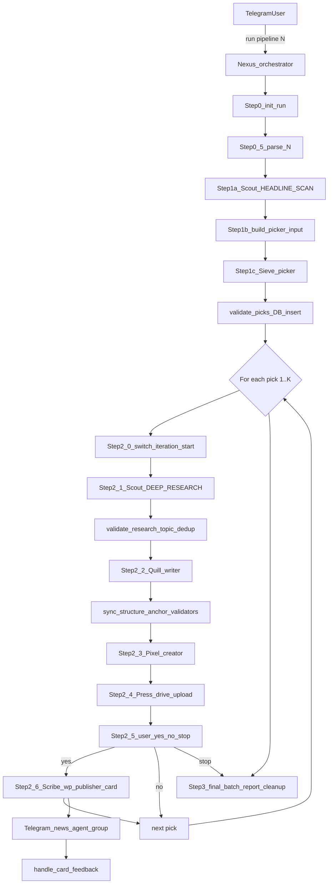

# Agent Pipeline Registry

**Last updated:** 2026-06-03  
**Purpose:** Canonical living reference for the OpenClaw crypto news pipeline — all agents, subagents, prompts, tools, skills, and pipeline steps.  
**Config source of truth:** [`openclaw.json`](openclaw.json)

> **Secrets policy:** This file documents *where* credentials live (`TOOLS.md`, `openclaw.json`, shell scripts) but never copies tokens, passwords, or API keys.

---

## Maintenance triggers

Update this registry in the **same change** whenever you edit any of:

| Category | Paths |
|----------|-------|
| Config | `openclaw.json`, `exec-approvals.json` |
| Prompts | `workspace-*/SOUL.md`, `workspace-*/AGENTS.md`, `workspace-*/IDENTITY.md`, `workspace-*/TOOLS.md`, `workspace-writer/COINOGRAPHY_TEMPLATE.md` |
| Skills | `workspace-*/skills/**`, `skills/**` |
| Pipeline scripts | `workspace-orchestrator/skills/pipeline/**` |

On each update: bump **Last updated**, edit only affected sections, append one line to **Change log**.

---

## Architecture



**Delegation:** `sessions_spawn` + `sessions_yield` only. Do **not** use `openclaw agent ... --deliver` in bash.

**Handoffs:** File-first. Workers write to `/tmp/crypto-run-<RUN_ID>/` (symlinked from `/tmp/...`). Chat returns `"SUCCESS"` or structured status (`CHART_DONE:`, `WP_FAILED:`). Nexus validates disk artifacts with Python/bash scripts.

**Multi-story batch model:** A single run may publish N stories (1 ≤ N ≤ 10). The Researcher is invoked twice per run: once in `MODE: HEADLINE_SCAN` to produce ~10 candidate headlines, then once per pick in `MODE: DEEP_RESEARCH`. The new `picker` agent (Sieve) classifies each candidate into one of 8 categories and selects N picks balancing freshness with category diversity. Within the per-pick loop the existing Writer / Creator / Publisher / WP-Publisher agents are reused unchanged.

**Entry point:** Telegram bound exclusively to `orchestrator` (`openclaw.json` → `bindings`).

---

## Global configuration

| Setting | Value |
|---------|-------|
| Default model | `local-bifrost/gpt-5.4-mini` |
| Default workspace | `/home/bhard/.openclaw/workspace` |
| LLM backend | Bifrost Azure proxy (`local-bifrost` provider in `openclaw.json`) |
| Tools profile | `coding` |
| Exec security | `full`, `ask: off` |
| Context injection | `always` |
| Web search | SearXNG plugin (`paulgo.io`) |
| Hooks | `session-memory`, `boot-md` |
| Gateway | Local port 18789, token auth |

---

## Projects (multi-site publishing)

The pipeline is **project-scoped**: a single agent stack publishes to one or more WordPress sites, each defined by a JSON config under `~/.openclaw/projects/<slug>.json`. There is no code change required to add a new site — drop in a config + credentials file and reference the slug at run time.

### Run syntax

| Command | Meaning |
|---------|---------|
| `run pipeline N` | Default project (`coinography`) — backward compatible |
| `run pipeline coinography N` | Explicit Coinography run |
| `run pipeline <slug> N` | Run pipeline `N` times for project `<slug>` |

The orchestrator parses `<slug>` in **Step 0.4**, validates `~/.openclaw/projects/<slug>.json` exists, locks the slug into `manifest.json` (`project` + `project_config_path`), and exports `PROJECT_SLUG` + `PROJECT_CONFIG` to all child agents.

### Config schema (`projects/<slug>.json`)

| Section | Keys | Used by |
|---------|------|---------|
| `slug`, `name` | unique slug, human label | all agents (logs, card prefix) |
| `wordpress` | `url`, `user`, `app_password_ref`, `default_status`, `fallback_category_id`, `picker_category_slugs[]`, `categories[]` | `publish.sh`, `wp_post_actions.sh`, `build_picker_input.py`, `validate_picks.py`, `sync_wp_categories.py` |
| `research` | `rss_feeds[]`, `exclude_keywords[]`, `source_priority_order[]` | Researcher (`emit_feed_fetch_commands.py`) |
| `picker` | `diversity_window_hours` | `build_picker_input.py`, Picker SOUL |
| `writer` | `template_path` | Writer SOUL |
| `creator` | `image_style_hint` | Creator SOUL |
| `publisher` | `drive_doc_prefix`, `drive_parent_id`, `drive_account` | Publisher SOUL |
| `telegram` | `card_prefix` | `build_and_send_card.py` |
| `authors[]` | `id`, `label`, `name` | `handle_card_feedback.py` (publish-author picker) |

### Isolation guarantees

- **Run directories**: `/tmp/<slug>-run-<RUN_ID>/`. Legacy `/tmp/crypto-run-*` symlinks are preserved when `slug == coinography`.
- **URL dedup**: `article_history.db` has a composite key `(url, project)` — same URL can run on different sites; project-prefixed active-URL files (`/tmp/<slug>-active-url.txt`).
- **Editorial data**: `articles` and `picked_stories` have a `project` column (default `'coinography'` for back-fill); `recent_published_categories` is project-scoped.
- **Credentials**: WP app passwords live in `~/.openclaw/credentials/wp/<slug>.pass` (mode `600`), referenced by `wordpress.app_password_ref` — never hardcoded in scripts.
- **Telegram card**: shared bot + group, but every card opens with `card_prefix` (e.g. `[Coinography]`) so editors can tell projects apart at a glance.

### Adding a new site

1. Copy `projects/coinography.json` to `projects/<newslug>.json` and edit fields.
2. Write the WP app password to `credentials/wp/<newslug>.pass`, then `chmod 600`.
3. (Optional) Drop a writer template at the path listed under `writer.template_path`.
4. Run `run pipeline <newslug> 1` to test.

No source edits, no DB migrations, no SOUL changes are required for routine new-site additions. See `projects/README.md` for the full one-page guide.

### Shared loader

All scripts read project config through `workspace-orchestrator/skills/pipeline/project_config.py` (Python) or `project_config.sh` (bash wrappers `project_cfg_field`, `project_cfg_password`). The loader resolves the active slug from (1) `--slug` CLI arg, (2) `$PROJECT_SLUG` env, (3) `manifest.json`, then (4) default `coinography`. `assert_project_matches_manifest()` is the runtime safety gate — a mismatch fails the run instead of silently publishing to the wrong site.

---

## Agent registry matrix

| Agent ID | Persona | Workspace | Model | Pipeline step |
|----------|---------|-----------|-------|---------------|
| `main` | (default) | `workspace/` | gpt-5.4-mini | Not in pipeline |
| `orchestrator` | Nexus | `workspace-orchestrator/` | gpt-5.4 | Controller (Steps 0–3) |
| `researcher` | Scout | `workspace-researcher/` | gpt-5.4 | Step 1a (HEADLINE_SCAN) + Step 2.1 (DEEP_RESEARCH per pick) |
| `picker` | Sieve | `workspace-picker/` | gpt-5.4 | Step 1c — Categorize + select N picks |
| `writer` | Quill | `workspace-writer/` | gpt-5.4 | Step 2.2 — Write |
| `chart-generator` | Pixel | `workspace-chart-generator/` | gpt-5.4-mini | Step 2.3 (chart sub-step, optional) |
| `creator` | Pixel | `workspace-creator/` | gpt-5.4-mini | Step 2.3 — Feature image |
| `publisher` | Press | `workspace-publisher/` | gpt-5.4-mini | Step 2.4 — Google Drive |
| `wp-publisher` | Scribe | `workspace-wp-publisher/` | gpt-5.4-mini | Step 2.6 — WordPress (user-gated) |

**Orchestrator subagent allowlist:** `researcher`, `picker`, `writer`, `chart-generator`, `creator`, `publisher`, `wp-publisher`

---

## Prompt assembly

OpenClaw injects workspace markdown at session start:

| File | Role |
|------|------|
| `SOUL.md` | Primary behavioral contract (the real prompt) |
| `AGENTS.md` | Universal safety / worker rules |
| `IDENTITY.md` | Name, role, emoji, vibe |
| `TOOLS.md` | Environment notes, RSS feeds, API config (secrets live here) |
| `USER.md` | Human preferences |
| `HEARTBEAT.md` | Periodic checks (mostly empty) |
| `BOOTSTRAP.md` | First-run setup (if present) |

Plus runtime base text and an injected skill catalog from `SKILL.md` files.

---

## Per-agent profiles

### Orchestrator — Nexus

| Field | Value |
|-------|-------|
| Workspace | `workspace-orchestrator/` |
| SOUL | `workspace-orchestrator/SOUL.md` (~440 lines) |
| Role | Sequence workers, validate every step, never write/publish content |
| Model | gpt-5.4 |

**Tools (config extras):** `agents_list`, `nodes`, `message`, `gateway`, `browser`, `canvas`, `tts`, `sessions_spawn`, `sessions_yield`, `subagents`

**Full runtime tools:** `read`, `write`, `edit`, `exec`, `process`, `canvas`, `message`, `tts`, `image_generate`, `agents_list`, `sessions_list`, `sessions_history`, `sessions_send`, `sessions_spawn`, `sessions_yield`, `subagents`, `session_status`, `web_search`, `web_fetch`, `browser`, `memory_search`, `memory_get`

**Pipeline steps:**

| Step | Action |
|------|--------|
| 0 | `init_run.sh` → run bundle at `/tmp/crypto-run-<RUN_ID>/` (now also creates `picker/` + `iter_<N>/` archive layout) |
| 0.5 | Parse `N` (story count) from user command (`run pipeline N`); persist into `manifest.batch.target_count` and `pick_run_id` |
| 1a | Spawn researcher in `MODE: HEADLINE_SCAN` → up to 10 fresh candidates → `validate_headlines.py` |
| 1b | `build_picker_input.py` — assemble `picker_input.json` with `target_count` + `recent_categories` (24h) + consumed-URL filter |
| 1c | Spawn `picker` (Sieve) → `picks.json` → `validate_picks.py` inserts each pick into `picked_stories` table |
| 2.0 | `switch_iteration.sh --start <N>` (per pick) — archive previous iter, truncate canonical files |
| 2.1 | Spawn researcher in `MODE: DEEP_RESEARCH` for the current pick → `validate_research.py` (with `--raw-path`/`--validated-path` for per-iteration files when using sub-bundles) → 24h topic dedup |
| 2.2 | Spawn writer → sync/validate article (structure, anchors, word count) — same retry/repair contract as before |
| 2.3 | Spawn creator → validate JPEG (chart sub-step still gated by `ENABLE_ARTICLE_CHARTS`) |
| 2.4 | Build DOCX with pandoc → `verify_artifacts.py --stage pre_drive` → spawn publisher for Drive upload |
| 2.5 | Per-story user gate — reply with headline + category + Drive link, **STOP** for `yes`/`no`/`stop` |
| 2.6 | If yes → spawn wp-publisher → `update_recent_topics.py --status drafted` → `build_and_send_card.py` → `update_pick_status.py --status published` |
|     | If no → `update_pick_status.py --status cancelled` and continue to next pick |
|     | If stop → cancel all remaining picks and break to Step 3 |
| 3 | Final batch report (per-pick statuses from `picked_stories`) → `cleanup_run_artifacts.sh` (ONCE per batch) |

**Spawn message templates:**

- **researcher (HEADLINE_SCAN):** `MODE: HEADLINE_SCAN` / `OUTPUT_FILE: $RUN_DIR/research/headlines.json` / `TARGET_COUNT: 10`
- **researcher (DEEP_RESEARCH):** `MODE: DEEP_RESEARCH` / `INPUT_FILE: $RUN_DIR/picker/picks.json` / `PICK_INDEX: <N>` / `OUTPUT_FILE: $RUN_DIR/research/raw.json`
- **picker:** `INPUT_FILE: $RUN_DIR/picker/picker_input.json` / `OUTPUT_FILE: $RUN_DIR/picker/picks.json`
- **writer:** Read `validated.json` + `COINOGRAPHY_TEMPLATE.md`; 1000–1200 body words; write to `$RUN_DIR/article/raw.md`; yield `SUCCESS` only.
- **chart-generator:** `CHART_COIN: [coin]` / `CHART_DAYS: 30` / `CHART_OUTPUT: $RUN_DIR/media/chart.png`
- **creator:** Generate feature image from `validated.json` using Scene Formula in SOUL; run `generate.sh`.
- **publisher:** Run exact `gog drive upload /tmp/crypto-article.docx ...`; return `webViewLink`.
- **wp-publisher:** Save WordPress draft from `/tmp/crypto-article.md` + `/tmp/crypto-feature.jpg` (live via Telegram card Publish).

**Key rules:** Writer told max 1200 words; sync accepts up to 1300 (+100 buffer, never tell writer). Must see `ARTICLE_SYNCED` + `ARTIFACTS_OK: post_sync` before Step 2.3 in each iteration. Per-story user gate at Step 2.5 (`yes`/`no`/`stop`). One bad story does **not** abort the batch — `update_pick_status.py --status failed` + `switch_iteration.sh --reset` + continue. Never hallucinate URLs.

**State:**
- `workspace-orchestrator/state/recent_topics.json` — 24h topic registry (now carries `category`).
- `~/.openclaw/data/editorial.db` — `articles` (with new `category` column) + `picked_stories` (new table).

---

### Researcher — Scout

| Field | Value |
|-------|-------|
| Workspace | `workspace-researcher/` |
| SOUL | `workspace-researcher/SOUL.md` |
| Model | gpt-5.4 |
| Pipeline step | 1a (HEADLINE_SCAN) and 2.1 (DEEP_RESEARCH per pick) |

**Two modes** (selected by the first non-empty line of the spawn message):

| Mode | Job | Output |
|------|-----|--------|
| `HEADLINE_SCAN` | Fetch RSS feeds, parse and dedupe items, return up to 10 fresh candidate headlines (last 24h). No deep extraction. | `$RUN_DIR/research/headlines.json` |
| `DEEP_RESEARCH` | Read the assigned pick from `INPUT_FILE` + `PICK_INDEX`, validate URLs, run `trafilatura` on primary + corroborating sources, build aggregated research JSON (≥600 words). Carries `category` through unchanged from the picker. | `$RUN_DIR/research/raw.json` (or `--validated-path` per-iteration variant) |

**Tools denied:** `web_search`, `web_fetch`

**Tools available:** `read`, `write`, `edit`, `exec`, `process`, `image_generate`, `sessions_yield`, `memory_search`, `memory_get`

**HEADLINE_SCAN required JSON fields:** `status="ok"`, `mode="headline_scan"`, `scanned_at`, `target_count`, `candidate_count`, `candidates[]` (each: `candidate_index`, `headline`, `url`, `pub_date`, `source`, `summary`, `corroborating_sources[]`).

**DEEP_RESEARCH required JSON fields:** `status="ok"`, `mode="deep_research"`, `story_id`, `category`, `topic_theme`, `primary_keyword`, `primary_headline`, `primary_asset`, `chart_coin`, `sources_used`, `source_urls`, `combined_key_facts`, `aggregated_raw_content` (≥600 words).

**Workspace skills/scripts:**

| Path | Purpose |
|------|---------|
| `skills/research/verify_feeds.sh` | RSS health check |
| `skills/history/article_history.sh` | SQLite duplicate URL check (7-day window) — used inside HEADLINE_SCAN |
| `skills/web-reader-pro/SKILL.md` | Optional fallback reader — not primary path in SOUL |

**Duplicate guards (cross-cutting):**
1. Scout HEADLINE_SCAN — `article_history.sh check` per candidate URL (7-day TTL).
2. `build_picker_input.py` — filters URLs already in `picked_stories` with `status IN ('drafted','published')` (permanent dedup).
3. Nexus topic dedup — `check_recent_topic_duplicates.py` per pick (24h topic-similarity window vs `recent_topics.json`).

---

### Picker — Sieve

| Field | Value |
|-------|-------|
| Workspace | `workspace-picker/` |
| SOUL | `workspace-picker/SOUL.md` |
| Model | gpt-5.4 (or pro for stronger reasoning) |
| Pipeline step | 1c |

**Job:** Read `picker_input.json` (target_count, recent_categories, candidates[]), classify each candidate into exactly one of 8 categories, then select N picks balancing freshness with category diversity. Write `picks.json`.

**Category taxonomy (closed set):**

| Category id | Coverage |
|---|---|
| `regulation` | Lawmakers, SEC/CFTC/EU/FCA actions, rulings, sanctions |
| `etf_institutional` | Spot/futures ETFs, BlackRock/Fidelity, treasury allocations |
| `hack_exploit` | Bridge hacks, smart-contract exploits, breaches |
| `l1_l2_protocol` | Major upgrades/forks/launches on L1s and L2s |
| `exchange` | CEX/DEX product launches, listings, outages |
| `stablecoin` | USDT/USDC/DAI mints/burns/depegs/issuer + stablecoin-specific regulation |
| `adoption_partnership` | Corporate adoption, payment integrations, MoUs |
| `market_movement` | Catalyst-driven BTC/ETH/altcoin price action |

**Selection algorithm:** Per-candidate `selection_score` from `category_score`, `recency_score` (pub_date), `corroboration_score`, `source_priority_score`. Then greedy pick with `recent_categories` penalty (×0.55, ×0.45 for top recent) and `same_batch` penalty (×0.50 primary / ×0.85 alt overlap). Early-stop when remaining `slot_score < 0.30`.

**Tools denied:** `web_search`, `web_fetch` (Picker reads/writes JSON only — no external calls)

**Output artifact:** `$RUN_DIR/picker/picks.json` → `validate_picks.py` inserts each pick into `editorial.db`'s `picked_stories` table.

---

### Writer — Quill

| Field | Value |
|-------|-------|
| Workspace | `workspace-writer/` |
| SOUL | `workspace-writer/SOUL.md` |
| Template | `workspace-writer/COINOGRAPHY_TEMPLATE.md` |
| Model | gpt-5.4 |
| Pipeline step | 2 |

**Job:** Read `validated.json`, write SEO article per COINOGRAPHY rules, output to `$RUN_DIR/article/raw.md`, yield `SUCCESS`.

**Editorial rules (summary):** 1000–1200 body words; META limits (55/70/155 chars); exactly 2 source anchor links; 2–4 H2s, 3–6 H3s, 3–6 FAQs; fixed section order (Conclusion before FAQs).

**Tools:** Default coding profile (no special allow/deny).

**Validation scripts (run by Nexus, not Quill):**

| Script | Purpose |
|--------|---------|
| `skills/validate_article_structure.py` | H2/H3/FAQ counts, section order |
| `skills/validate_anchor_links.py` | Exactly 2 distinct source URLs |

**Output artifact:** `$RUN_DIR/article/raw.md` → synced to `final.md` at `/tmp/crypto-article.md`

---

### Chart Generator — Pixel (optional)

| Field | Value |
|-------|-------|
| Workspace | `workspace-chart-generator/` |
| SOUL | `workspace-chart-generator/SOUL.md` |
| Model | gpt-5.4-mini |
| Pipeline step | 2.5 (skipped when `ENABLE_ARTICLE_CHARTS=0`) |

**Job:** Parse `CHART_COIN` / `CHART_DAYS` / `CHART_OUTPUT` → CoinGecko chart script → return `CHART_DONE:` or `CHART_ERROR:`.

**Skill:** `skills/chart-generator/SKILL.md` + `skills/chart-generator/scripts/generate_chart.py`

**Output artifact:** `$RUN_DIR/media/chart.png` (symlink `/tmp/chart.png`)

---

### Creator — Pixel (image)

| Field | Value |
|-------|-------|
| Workspace | `workspace-creator/` |
| SOUL | `workspace-creator/SOUL.md` |
| Model | gpt-5.4-mini |
| Pipeline step | 3 |

**Job:** Craft editorial prompt (human + crypto asset + Reuters-style suffix) → run Imagen skill → verify JPEG.

**Skill:** `skills/generate-image/SKILL.md` + `skills/generate-image/generate.sh` (Vertex Imagen 4 via Bifrost, logo stamp)

**Success output:** `/tmp/crypto-feature.jpg`  
**Failure output:** `IMAGE_FAILED: <error log>`

---

### Publisher — Press

| Field | Value |
|-------|-------|
| Workspace | `workspace-publisher/` |
| SOUL | `workspace-publisher/SOUL.md` |
| Model | gpt-5.4-mini |
| Pipeline step | 4 |

**Job:** Nexus often pre-builds DOCX with pandoc; Press runs `gog drive upload` and returns `webViewLink`.

**Skill:** `skills/gog/SKILL.md` — Google Workspace CLI

**Rule:** No `--convert` on .docx uploads (strips embedded images).

---

### WordPress Publisher — Scribe

| Field | Value |
|-------|-------|
| Workspace | `workspace-wp-publisher/` |
| SOUL | `workspace-wp-publisher/SOUL.md` |
| Model | gpt-5.4-mini |
| Pipeline step | 6 (only after explicit user "yes") |

**Job:** Run `publish.sh` → read `/tmp/wp-result.txt` or `/tmp/wp-error.log`.

**Skills:**

| Path | Purpose |
|------|---------|
| `skills/wordpress/SKILL.md` | Publish workflow docs |
| `skills/wordpress/publish.sh` | META parse, Gutenberg blocks, Rank Math SEO, feature image (draft default) |
| `skills/wordpress/wp_post_actions.sh` | Telegram Publish/Unpublish/Edit; `--author` on publish |
| `skills/wordpress/html_to_gutenberg.py` | Markdown HTML → Gutenberg blocks |
| `skills/history/article_history.sh` | History helper |

**Success output:** WordPress post URL  
**Failure output:** `WP_FAILED: <reason>`

---

### Main (not in pipeline)

| Field | Value |
|-------|-------|
| Workspace | `workspace/` |
| Model | gpt-5.4-mini |
| Role | Default general OpenClaw workspace |

**Extra skills:** `content-writer`, `programmatic-seo`, `web-reader-pro`, `gog`

---

## Orchestrator pipeline scripts

All under `workspace-orchestrator/skills/pipeline/`:

| Script | Function |
|--------|----------|
| `init_run.sh` | Create run bundle, manifest (now includes `batch.target_count` + `pick_run_id`), `/tmp` symlinks, env file. Touches `headlines.json`, `picker_input.json`, `picks.json` placeholders too. |
| `manifest_paths.py` | Resolve artifact paths from manifest |
| `validate_headlines.py` | NEW — validate Scout's `HEADLINE_SCAN` output, dedupe URLs, normalize pub_date |
| `build_picker_input.py` | NEW — assemble picker input with `target_count`, `recent_categories`, and consumed-URL filter from `picked_stories` |
| `validate_picks.py` | NEW — validate Sieve's `picks.json`, enforce taxonomy, insert each pick into `picked_stories` |
| `update_pick_status.py` | NEW — CLI wrapper around `editorial_db.update_pick_status` (researching/writing/drafted/published/failed/cancelled) |
| `switch_iteration.sh` | NEW — `--start <N>` archives previous iter into `iter_<N-1>/` and truncates canonical files; `--archive <N>` saves last iter; `--reset <N>` archives into `iter_<N>_failed/` after a mid-iteration failure |
| `validate_research.py` | Validate raw research JSON → `validated.json`. Now accepts `--raw-path` + `--validated-path` for per-iteration variants and carries `category` into manifest.story. |
| `check_recent_topic_duplicates.py` | 24h topic dedup vs `state/recent_topics.json` |
| `update_recent_topics.py` | Register researched/drafted/published topics. Now also stores `category`. |
| `verify_artifacts.py` | Stage gates: `pre_write`, `pre_sync`, `post_sync`, `post_image` (feature_image ≥50 KB, JPEG magic bytes), `pre_drive`, `pre_wp`. `post_image` is run after Creator (Pixel) yields; retried once with Universal Fallback prompt before continuing without image. |
| `sync_article_from_raw.py` | Sanitize raw.md → final.md; word count + topic gate |
| `count_article_body_words.py` | Body word count (same logic as sync; writer pre-flight) |
| `update_manifest_step.sh` | Record step status in manifest |
| `cleanup_run_artifacts.sh` | Remove `/tmp` symlinks on terminal state — runs ONCE per batch |
| `save_google_drive_json.py` | Persist `publish/google-drive.json` after Step 2.4 |
| `build_and_send_card.py` | Step 2.6 — Telegram news card + `editorial.db`. Now also writes `category` into `articles`. |
| `handle_card_feedback.py` | RATE, Publish (author picker), Unpublish, Edit |
| `editorial_db.py` | SQLite store. Now defines `picked_stories` + `articles.category`, plus helpers `insert_picked_stories`, `update_pick_status`, `recent_published_categories`, `pending_picks_for_run`, `get_pick`, `get_pick_by_index`, `list_picks_by_run` |

**Editorial config:** `workspace-orchestrator/config/wp_authors.json` (Toby 3, Ahmed 17, Golan 8), `telegram_card_config.json`

---

## Skills inventory

### Pipeline-critical (workspace-specific)

| Agent | Skill / scripts |
|-------|-----------------|
| Orchestrator | Pipeline scripts (14 files above) + `EDITORIAL_FEEDBACK.md` |
| Researcher | `verify_feeds.sh`, `article_history.sh`, `web-reader-pro` |
| Writer | `validate_article_structure.py`, `validate_anchor_links.py` |
| Chart-generator | `skills/chart-generator/` (global) |
| Creator | `generate-image/` |
| Publisher | `gog/` |
| WP-publisher | `wordpress/publish.sh`, `wordpress/wp_post_actions.sh`, `article_history.sh` |

### Global OpenClaw skills (visible to agents)

`chart-generator`, `clawhub`, `coding-agent`, `gog`, `healthcheck`, `mcporter`, `node-connect`, `skill-creator`, `taskflow`, `taskflow-inbox-triage`, `tmux`, `video-frames`, `weather`

Researcher additionally has workspace `web-reader-pro`.

---

## Run-bundle artifact model

Each pipeline run creates an isolated folder. Multi-story batches reuse the canonical paths across iterations and archive each completed iteration into `iter_<N>/` via `switch_iteration.sh`:

```
/tmp/crypto-run-<RUN_ID>/
├── manifest.json
├── .run_started               (epoch stamp; refreshed at start of each iter)
├── research/
│   ├── headlines.json         (HEADLINE_SCAN output, batch-level)
│   ├── raw.json               (DEEP_RESEARCH output for current iter)
│   └── validated.json         (validate_research.py output for current iter)
├── picker/
│   ├── picker_input.json
│   └── picks.json
├── article/
│   ├── raw.md                 (current iter)
│   ├── final.md               (current iter)
│   ├── with-image.md
│   └── article.docx
├── media/
│   ├── chart.png              (optional)
│   └── feature.jpg
├── publish/
│   ├── google-drive.json
│   ├── wordpress.json
│   └── news-card.json
├── iter_1/                    (archive — populated at start of iter 2 or via --archive 1)
│   ├── research/, article/, media/, publish/
│   └── manifest.snapshot.json
├── iter_2/                    (archive of iter 2)
└── iter_<K>_failed/           (only if iteration failed; contains REASON.txt)
```

Legacy `/tmp/...` paths are symlinks into the canonical (current-iteration) files; they never need to change between iterations because canonical paths are reused.

**DB-backed batch state:** `~/.openclaw/data/editorial.db` → `picked_stories` rows for `pick_run_id = "<RUN_ID>-pick"` track per-pick status (`pending`/`researching`/`writing`/`drafted`/`published`/`failed`/`cancelled`). The orchestrator can resume mid-batch by querying `pending_picks_for_run`.

---

## Known gaps and legacy docs

| Item | Notes |
|------|-------|
| Two "Pixel" personas | `creator` (Imagen feature images) vs `chart-generator` (CoinGecko charts) |
| Charts off by default | `ENABLE_ARTICLE_CHARTS=0` in Step 0 |
| Word count asymmetry | Writer told 1200 max; orchestrator sync silently accepts up to 1300 |
| Publisher SOUL vs Nexus | Press SOUL describes full pandoc flow; Nexus pre-builds DOCX and must run `save_google_drive_json.py` |
| Telegram vs DM | Pipeline gate in DM; news cards + editorial in `news-agent` group |
| Missing script | Docs reference `extract_tweet_quotes.py` under researcher — not present |
| `PIPELINE_DOCS/03_AGENT_PROFILES.md` | **Deprecated** — describes old `rm sessions.json` + `openclaw agent` flow |
| `PIPELINE_ARCHITECTURE.md` | High-level overview; see this registry for current agent/tool details |

---

## Related documentation

| File | Purpose |
|------|---------|
| **`AGENT_PIPELINE_REGISTRY.md`** | **This file — canonical living reference** |
| `PIPELINE_ARCHITECTURE.md` | High-level architecture overview |
| `PIPELINE_DOCS/` | Planning and legacy docs (some stale) |

---

## Change log

| Date | Change |
|------|--------|
| 2026-05-23 | Initial registry created; replaces `MULTI_AGENT_SYSTEM_DOCUMENTATION.md` |
| 2026-05-23 | Added `PLANS/tweet-embed-duckduckgo.md` — deferred tweet embed spec (not implemented) |
| 2026-05-25 | Writer length reliability: `count_article_body_words.py`; removed `pick_article_structure.py`; SOUL repair policy (measured length, REVISION MODE for structure/anchor after sync) |
| 2026-05-26 | Creator image provider: Leonardo → Vertex Imagen 4 via Bifrost (`generate.sh`) |
| 2026-05-26 | WordPress target: `https://coinography.com` (category 17) |
| 2026-05-26 | Step 6 default: WordPress draft (not live); Telegram card Publish promotes to live |
| 2026-05-27 | `wp_post_actions.sh` synced to coinography.com; Telegram publish author picker (Toby/Ahmed); `save_google_drive_json.py`; editorial `wp_status` defaults draft |
| 2026-06-03 | Multi-story Picker pipeline: new `picker` agent (Sieve), two-mode researcher (HEADLINE_SCAN / DEEP_RESEARCH), `picked_stories` table + `articles.category` column, per-iteration `iter_<N>/` archives via `switch_iteration.sh`, new scripts (`validate_headlines.py`, `build_picker_input.py`, `validate_picks.py`, `update_pick_status.py`), orchestrator SOUL rewritten with Step 0.5 (parse N) + Step 1a/1b/1c + per-pick loop with yes/no/stop user gate. |
| 2026-06-04 | Step 2.3 (Creator / Pixel) restored with concrete spawn recipe — was a stub referencing deleted legacy SOUL logic, causing creator to be silently skipped on all recent runs. Added `post_image` stage to `verify_artifacts.py` (size ≥ 50 KB, JPEG magic bytes, path under RUN_DIR) so future regressions fail loudly. Orchestrator retries Pixel once with Universal Fallback prompt before continuing without image. |
| 2026-06-04 | **Multi-project architecture**. Pipeline is now project-scoped: `run pipeline [<slug>] N` selects a publishing target from `projects/<slug>.json`. Default slug = `coinography` (no behavior change for existing `run pipeline N` commands). New: `projects/coinography.json`, `credentials/wp/coinography.pass`, `project_config.py`+`.sh` loaders, `emit_feed_fetch_commands.py`. Schema additions: `articles.project`, `picked_stories.project`, `article_history(url, project)` composite key — all back-filled to `'coinography'`. All agents (Researcher RSS feeds, Picker allowlist, Writer template, Creator style hint, Publisher Drive prefix, WP-Publisher creds, Telegram card prefix + per-project authors) now read from `$PROJECT_CONFIG`. Run dirs renamed `/tmp/<slug>-run-<RUN_ID>/` with legacy `/tmp/crypto-*` symlinks retained for coinography. See `## Projects` section and `projects/README.md`. |
| 2026-06-05 | **MemeCoinist project added** (`projects/memecoinist.json`, `credentials/wp/memecoinist.pass`). Second live publishing target. Memecoin-focused RSS set (Google News query for DOGE/SHIB/PEPE/BONK/WIF/FLOKI/dogwifhat + 8 shared sources). Inverse `exclude_keywords` to Coinography (blocks macro-crypto/ETF/stablecoin stories). Picker `allowed_categories` limited to 5 memecoin-relevant categories. Drafts post to `https://memecoinist.com` under Latest News (category 10) as author meep AI (id 6). Uses `workspace-mc-writer/MEMECOIN_TEMPLATE.md` trader-voice template. Telegram card prefix `[MemeCoinist]` on shared bot/group. Fixed two non-coinography path hardcodes: `creator/generate.sh` now uses `$OUTPUT_PATH` or `$PROJECT_SLUG` env (legacy `/tmp/crypto-feature.jpg` still works); `handle_card_feedback.py` fallback path now derives from `article.project` with legacy `crypto-run-*` as second-chance for old rows. |
| 2026-06-08 | **Creator image quality uplift.** Rewrote `workspace-creator/SOUL.md` and `workspace-mc-creator/SOUL.md`: removed mandatory human-subject rule; new article-specific scene templates (3D coin renders, brand/logo compositions, flags, abstract digital art). Universal Fallback is now a Bitcoin 3D coin on dark reflective surface. Updated `generate.sh` `NEGATIVE_SUFFIX` in both creator workspaces — removed `no logo` and `not 3d render` blockers; added `no humans`. Updated `creator.image_style_hint` in `projects/coinography.json` and `projects/memecoinist.json`. |
| 2026-06-08 | Added `PIPELINE_DOCS/coinography-wordpress-api-integration.md` — full Coinography WP REST API integration reference: Application Password setup (WP admin step-by-step), credential storage, project config wiring, all endpoints, publish/update flows with payloads, lifecycle table, error handling, smoke tests. Google Doc: https://docs.google.com/document/d/1mLAN9WyfZL8GTl7w6niWEG2hvfEGljSItuxLvsAaGp8/edit |
| 2026-06-10 | **Real WordPress categories + diversity (Phase 1: Coinography).** Picker no longer uses the hardcoded 8-item taxonomy — it now classifies each story into 1 primary + up to 2 secondary **live WP category slugs** from `wordpress.picker_category_slugs` (curated subset of `wordpress.categories`, synced from the site by new `sync_wp_categories.py`). New `wordpress.fallback_category_id` (17) replaces single `category_id`. `validate_picks.py` resolves slugs → numeric IDs, enforces **hard batch-unique primary category** + **72h primary exclusion** (graceful `diversity_relaxed` flag when the pool can't fill the batch), and rejects unknown/duplicate primaries. IDs flow via `picks.json` → `validate_research.py` (`--picks/--pick-index` authoritative injection) → `validated.json` → `publish.sh` which now sends `"categories": wp_category_ids` (fallback to `fallback_category_id`). New DB columns `wp_category_slugs`/`wp_category_ids` on `picked_stories` + `articles`. Creator SOUL got a slug→scene-template map. Files: `sync_wp_categories.py` (new), `build_picker_input.py`, `validate_picks.py`, `validate_research.py`, `editorial_db.py`, `publish.sh`, picker SOUL+USER, researcher SOUL, creator SOUL, orchestrator SOUL, `projects/coinography.json`. Phase 2 (memecoinist) delivered 2026-06-10 — see next row. |
| 2026-06-10 | **Real WordPress categories + diversity (Phase 2: MemeCoinist).** Config-only change — all pipeline code from Phase 1 is project-generic. `sync_wp_categories.py --slug memecoinist` populated 42 live WP categories into `projects/memecoinist.json`. Removed legacy `wordpress.category_id` and `site_categories[]`. Added `wordpress.fallback_category_id: 10` (Latest News), `wordpress.picker_category_slugs` (28 curated memecoin-relevant slugs), and `wordpress.categories[]` (full live list). Removed dead `picker.allowed_categories`; updated `picker.diversity_window_hours` 24→72. The Picker now assigns real memecoinist.com WP categories with hard 72h primary-category diversity, identical to Coinography behaviour. |
