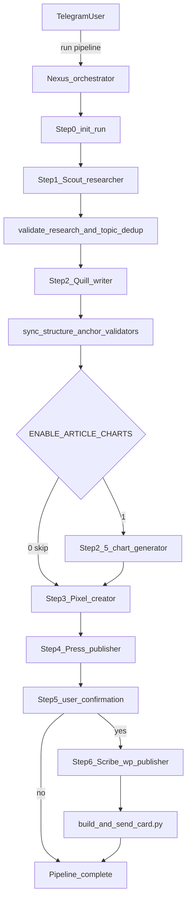

# Agent Pipeline Registry

**Last updated:** 2026-05-23
**Purpose:** Canonical living reference for the OpenClaw crypto news pipeline — all agents, subagents, prompts, tools, skills, and pipeline steps.  
**Config source of truth:** [`openclaw.json`](openclaw.json)

> **Secrets policy:** This file documents *where* credentials live (`TOOLS.md`, `openclaw.json`, shell scripts) but never copies tokens, passwords, or API keys.

---

## Maintenance triggers

Update this registry in the **same change** whenever you edit any of:

| Category | Paths |
|----------|-------|
| Config | `openclaw.json`, `exec-approvals.json` |
| Prompts | `workspace-*/SOUL.md`, `workspace-*/AGENTS.md`, `workspace-*/IDENTITY.md`, `workspace-*/TOOLS.md`, `workspace-writer/COINOGRAPHY_TEMPLATE.md` |
| Skills | `workspace-*/skills/**`, `skills/**` |
| Pipeline scripts | `workspace-orchestrator/skills/pipeline/**` |

On each update: bump **Last updated**, edit only affected sections, append one line to **Change log**.

---

## Architecture



**Delegation:** `sessions_spawn` + `sessions_yield` only. Do **not** use `openclaw agent ... --deliver` in bash.

**Handoffs:** File-first. Workers write to `/tmp/crypto-run-<RUN_ID>/` (symlinked from `/tmp/...`). Chat returns `"SUCCESS"` or structured status (`CHART_DONE:`, `WP_FAILED:`). Nexus validates disk artifacts with Python/bash scripts.

**Entry point:** Telegram bound exclusively to `orchestrator` (`openclaw.json` → `bindings`).

---

## Global configuration

| Setting | Value |
|---------|-------|
| Default model | `local-bifrost/gemini-3.5-flash` |
| Default workspace | `/home/bhard/.openclaw/workspace` |
| LLM backend | Bifrost Vertex proxy — Gemini via `shreyadelhi-vertex` (`local-bifrost` in `openclaw.json`) |
| Tools profile | `coding` |
| Exec security | `full`, `ask: off` |
| Context injection | `always` |
| Web search | SearXNG plugin (`paulgo.io`) |
| Hooks | `session-memory`, `boot-md` |
| Gateway | Local port 18789, token auth |

### LLM models (Gemini via Bifrost Vertex)

| Model ID | Tier | Used by |
|----------|------|---------|
| `gemini-3.1-pro-preview` | Smartest | orchestrator |
| `gemini-2.5-pro` | Smart | writer |
| `gemini-3.5-flash` | Fast | main, researcher, creator, publisher, wp-publisher, chart-generator (default primary) |
| `gemini-2.5-flash` | Fallback | default fallback chain |

Bifrost key: `shreyadelhi-vertex` (Vertex only).

---

## Agent registry matrix

| Agent ID | Persona | Workspace | Model | Pipeline step |
|----------|---------|-----------|-------|---------------|
| `main` | (default) | `workspace/` | gemini-3.5-flash | Not in pipeline |
| `orchestrator` | Nexus | `workspace-orchestrator/` | gemini-3.1-pro-preview | Controller (Steps 0–6) |
| `researcher` | Scout | `workspace-researcher/` | gemini-3.5-flash | Step 1 — Research |
| `writer` | Quill | `workspace-writer/` | gemini-2.5-pro | Step 2 — Write |
| `chart-generator` | Pixel | `workspace-chart-generator/` | gemini-3.5-flash | Step 2.5 — Chart (optional) |
| `creator` | Pixel | `workspace-creator/` | gemini-3.5-flash | Step 3 — Feature image |
| `publisher` | Press | `workspace-publisher/` | gemini-3.5-flash | Step 4 — Google Drive |
| `wp-publisher` | Scribe | `workspace-wp-publisher/` | gemini-3.5-flash | Step 6 — WordPress (user-gated) |

**Orchestrator subagent allowlist:** `researcher`, `writer`, `chart-generator`, `creator`, `publisher`, `wp-publisher`

---

## Prompt assembly

OpenClaw injects workspace markdown at session start:

| File | Role |
|------|------|
| `SOUL.md` | Primary behavioral contract (the real prompt) |
| `AGENTS.md` | Universal safety / worker rules |
| `IDENTITY.md` | Name, role, emoji, vibe |
| `TOOLS.md` | Environment notes, RSS feeds, API config (secrets live here) |
| `USER.md` | Human preferences |
| `HEARTBEAT.md` | Periodic checks (mostly empty) |
| `BOOTSTRAP.md` | First-run setup (if present) |

Plus runtime base text and an injected skill catalog from `SKILL.md` files.

---

## Per-agent profiles

### Orchestrator — Nexus

| Field | Value |
|-------|-------|
| Workspace | `workspace-orchestrator/` |
| SOUL | `workspace-orchestrator/SOUL.md` (~440 lines) |
| Role | Sequence workers, validate every step, never write/publish content |
| Model | gemini-3.1-pro-preview |

**Tools (config extras):** `agents_list`, `nodes`, `message`, `gateway`, `browser`, `canvas`, `tts`, `sessions_spawn`, `sessions_yield`, `subagents`

**Full runtime tools:** `read`, `write`, `edit`, `exec`, `process`, `canvas`, `message`, `tts`, `image_generate`, `agents_list`, `sessions_list`, `sessions_history`, `sessions_send`, `sessions_spawn`, `sessions_yield`, `subagents`, `session_status`, `web_search`, `web_fetch`, `browser`, `memory_search`, `memory_get`

**Pipeline steps:**

| Step | Action |
|------|--------|
| 0 | `init_run.sh` → run bundle at `/tmp/crypto-run-<RUN_ID>/` |
| 1 | Spawn researcher → validate JSON → 24h topic dedup → register topic |
| 2 | Spawn writer → sync/validate article (structure, anchors, word count) |
| 2.5 | Spawn chart-generator **only if** `ENABLE_ARTICLE_CHARTS=1` (default: off) |
| 3 | Spawn creator → validate JPEG |
| 4 | Build DOCX with pandoc → spawn publisher for Drive upload |
| 5 | Report to user → **STOP** for WordPress yes/no |
| 6 | If yes → spawn wp-publisher → update topic registry → cleanup |

**Spawn message templates:**

- **researcher:** Cross-reference RSS feeds; write JSON to `$RUN_DIR/research/raw.json`; yield `SUCCESS` only.
- **writer:** Read `validated.json` + `COINOGRAPHY_TEMPLATE.md`; 1000–1200 body words; write to `$RUN_DIR/article/raw.md`; yield `SUCCESS` only.
- **chart-generator:** `CHART_COIN: [coin]` / `CHART_DAYS: 30` / `CHART_OUTPUT: $RUN_DIR/media/chart.png`
- **creator:** Generate feature image from `validated.json` using Scene Formula in SOUL; run `generate.sh`.
- **publisher:** Run exact `gog drive upload /tmp/crypto-article.docx ...`; return `webViewLink`.
- **wp-publisher:** Publish live from `/tmp/crypto-article.md` + `/tmp/crypto-feature.jpg`.

**Key rules:** Writer told max 1200 words; sync accepts up to 1300 (+100 buffer, never tell writer). Must see `ARTICLE_SYNCED` + `ARTIFACTS_OK: post_sync` before Step 3. Human gate at Step 5. Never hallucinate URLs.

**State:** `workspace-orchestrator/state/recent_topics.json` — 24h topic registry.

---

### Researcher — Scout

| Field | Value |
|-------|-------|
| Workspace | `workspace-researcher/` |
| SOUL | `workspace-researcher/SOUL.md` |
| Model | gemini-3.5-flash |
| Pipeline step | 1 |

**Job:** Fetch 8–9 RSS feeds via `curl`, cross-reference last-24h stories, pick one topic (≥2 sources), deep-read with `trafilatura`, write structured JSON to disk.

**Tools denied:** `web_search`, `web_fetch`

**Tools available:** `read`, `write`, `edit`, `exec`, `process`, `image_generate`, `sessions_yield`, `memory_search`, `memory_get`

**Required JSON fields:** `status`, `story_id`, `topic_theme`, `primary_keyword`, `primary_headline`, `primary_asset`, `chart_coin`, `sources_used`, `source_urls`, `combined_key_facts`, `aggregated_raw_content` (≥600 words)

**Output artifact:** `$RUN_DIR/research/raw.json` → validated to `validated.json`

**Workspace skills/scripts:**

| Path | Purpose |
|------|---------|
| `skills/research/verify_feeds.sh` | RSS health check |
| `skills/history/article_history.sh` | SQLite duplicate URL check (7-day window) |
| `skills/web-reader-pro/SKILL.md` | Optional fallback reader — not primary path in SOUL |

**Duplicate guards:** (1) Scout — SQLite per-URL; (2) Nexus — `check_recent_topic_duplicates.py` (24h topic similarity).

---

### Writer — Quill

| Field | Value |
|-------|-------|
| Workspace | `workspace-writer/` |
| SOUL | `workspace-writer/SOUL.md` |
| Template | `workspace-writer/COINOGRAPHY_TEMPLATE.md` |
| Model | gemini-2.5-pro |
| Pipeline step | 2 |

**Job:** Read `validated.json`, write SEO article per COINOGRAPHY rules, output to `$RUN_DIR/article/raw.md`, yield `SUCCESS`.

**Editorial rules (summary):** 1000–1200 body words; META limits (55/70/155 chars); exactly 2 source anchor links; 2–4 H2s, 3–6 H3s, 3–6 FAQs; fixed section order (Conclusion before FAQs).

**Tools:** Default coding profile (no special allow/deny).

**Validation scripts (run by Nexus, not Quill):**

| Script | Purpose |
|--------|---------|
| `skills/validate_article_structure.py` | H2/H3/FAQ counts, section order |
| `skills/validate_anchor_links.py` | Exactly 2 distinct source URLs |
| `skills/pick_article_structure.py` | Structure picker |

**Output artifact:** `$RUN_DIR/article/raw.md` → synced to `final.md` at `/tmp/crypto-article.md`

---

### Chart Generator — Pixel (optional)

| Field | Value |
|-------|-------|
| Workspace | `workspace-chart-generator/` |
| SOUL | `workspace-chart-generator/SOUL.md` |
| Model | gemini-3.5-flash |
| Pipeline step | 2.5 (skipped when `ENABLE_ARTICLE_CHARTS=0`) |

**Job:** Parse `CHART_COIN` / `CHART_DAYS` / `CHART_OUTPUT` → CoinGecko chart script → return `CHART_DONE:` or `CHART_ERROR:`.

**Skill:** `skills/chart-generator/SKILL.md` + `skills/chart-generator/scripts/generate_chart.py`

**Output artifact:** `$RUN_DIR/media/chart.png` (symlink `/tmp/chart.png`)

---

### Creator — Pixel (image)

| Field | Value |
|-------|-------|
| Workspace | `workspace-creator/` |
| SOUL | `workspace-creator/SOUL.md` |
| Model | gemini-3.5-flash |
| Pipeline step | 3 |

**Job:** Craft editorial prompt (human + crypto asset + Reuters-style suffix) → run Leonardo skill → verify JPEG.

**Skill:** `skills/generate-image/SKILL.md` + `skills/generate-image/generate.sh` (Leonardo PhotoReal v2, logo stamp)

**Success output:** `/tmp/crypto-feature.jpg`  
**Failure output:** `IMAGE_FAILED: <error log>`

---

### Publisher — Press

| Field | Value |
|-------|-------|
| Workspace | `workspace-publisher/` |
| SOUL | `workspace-publisher/SOUL.md` |
| Model | gemini-3.5-flash |
| Pipeline step | 4 |

**Job:** Nexus often pre-builds DOCX with pandoc; Press runs `gog drive upload` and returns `webViewLink`.

**Skill:** `skills/gog/SKILL.md` — Google Workspace CLI

**Rule:** No `--convert` on .docx uploads (strips embedded images).

---

### WordPress Publisher — Scribe

| Field | Value |
|-------|-------|
| Workspace | `workspace-wp-publisher/` |
| SOUL | `workspace-wp-publisher/SOUL.md` |
| Model | gemini-3.5-flash |
| Pipeline step | 6 (only after explicit user "yes") |

**Job:** Run `publish.sh` → read `/tmp/wp-result.txt` or `/tmp/wp-error.log`.

**Skills:**

| Path | Purpose |
|------|---------|
| `skills/wordpress/SKILL.md` | Publish workflow docs |
| `skills/wordpress/publish.sh` | META parse, Gutenberg blocks, Rank Math SEO, feature image |
| `skills/wordpress/html_to_gutenberg.py` | Markdown HTML → Gutenberg blocks |
| `skills/history/article_history.sh` | History helper |

**Success output:** WordPress post URL  
**Failure output:** `WP_FAILED: <reason>`

---

### Main (not in pipeline)

| Field | Value |
|-------|-------|
| Workspace | `workspace/` |
| Model | gemini-3.5-flash |
| Role | Default general OpenClaw workspace |

**Extra skills:** `content-writer`, `programmatic-seo`, `web-reader-pro`, `gog`

---

## Orchestrator pipeline scripts

All under `workspace-orchestrator/skills/pipeline/`:

| Script | Function |
|--------|----------|
| `init_run.sh` | Create run bundle, manifest, `/tmp` symlinks, env file |
| `manifest_paths.py` | Resolve artifact paths from manifest |
| `validate_research.py` | Validate raw JSON → `validated.json` |
| `check_recent_topic_duplicates.py` | 24h topic dedup vs `state/recent_topics.json` |
| `update_recent_topics.py` | Register researched/published topics |
| `verify_artifacts.py` | Stage gates: `pre_write`, `pre_sync`, `post_sync`, `pre_drive`, `pre_wp` |
| `sync_article_from_raw.py` | Sanitize raw.md → final.md; word count + topic gate |
| `update_manifest_step.sh` | Record step status in manifest |
| `cleanup_run_artifacts.sh` | Remove `/tmp` symlinks on terminal state |
| `build_and_send_card.py` | Build `news-card.json`, send photo+caption to Telegram group, insert into `editorial.db` (fail-open) |
| `editorial_db.py` | SQLite schema + CRUD for articles and feedback events (`~/.openclaw/data/editorial.db`) |
| `handle_card_feedback.py` | Process RATE/IMAGE/DRAFT/PUBLISH/EDIT feedback; log to DB + Telegram confirmation |
| `wp_post_actions.sh` | WP post update: set-status draft + update-content from markdown |

---

## Skills inventory

### Pipeline-critical (workspace-specific)

| Agent | Skill / scripts |
|-------|-----------------|
| Orchestrator | Pipeline scripts (12 files above) + `wp_post_actions.sh` |
| Researcher | `verify_feeds.sh`, `article_history.sh`, `web-reader-pro` |
| Writer | `validate_article_structure.py`, `validate_anchor_links.py`, `pick_article_structure.py` |
| Chart-generator | `skills/chart-generator/` (global) |
| Creator | `generate-image/` |
| Publisher | `gog/` |
| WP-publisher | `wordpress/`, `article_history.sh` |

### Global OpenClaw skills (visible to agents)

`chart-generator`, `clawhub`, `coding-agent`, `gog`, `healthcheck`, `mcporter`, `node-connect`, `skill-creator`, `taskflow`, `taskflow-inbox-triage`, `tmux`, `video-frames`, `weather`

Researcher additionally has workspace `web-reader-pro`.

---

## Run-bundle artifact model

Each pipeline run creates an isolated folder:

```
/tmp/crypto-run-<RUN_ID>/
├── manifest.json
├── research/
│   ├── raw.json
│   └── validated.json
├── article/
│   ├── raw.md
│   └── final.md
├── media/
│   └── feature.jpg
└── publish/
    ├── wordpress.json
    ├── google-drive.json
    └── news-card.json
```

Legacy `/tmp/...` paths are symlinks into this bundle.

---

## Known gaps and legacy docs

| Item | Notes |
|------|-------|
| Two "Pixel" personas | `creator` (Leonardo images) vs `chart-generator` (CoinGecko charts) |
| Charts off by default | `ENABLE_ARTICLE_CHARTS=0` in Step 0 |
| Word count asymmetry | Writer told 1200 max; orchestrator sync silently accepts up to 1300 |
| Publisher SOUL vs Nexus | Press SOUL describes full pandoc flow; Nexus often pre-builds DOCX |
| Missing script | Docs reference `extract_tweet_quotes.py` under researcher — not present |
| `PIPELINE_DOCS/03_AGENT_PROFILES.md` | **Deprecated** — describes old `rm sessions.json` + `openclaw agent` flow |
| `PIPELINE_ARCHITECTURE.md` | High-level overview; see this registry for current agent/tool details |

---

## Related documentation

| File | Purpose |
|------|---------|
| **`AGENT_PIPELINE_REGISTRY.md`** | **This file — canonical living reference** |
| `PIPELINE_ARCHITECTURE.md` | High-level architecture overview |
| `PIPELINE_DOCS/` | Planning and legacy docs (some stale) |

---

## Change log

| Date | Change |
|------|--------|
| 2026-05-23 | Initial registry created; replaces `MULTI_AGENT_SYSTEM_DOCUMENTATION.md` |
| 2026-05-23 | Added `PLANS/tweet-embed-duckduckgo.md` — deferred tweet embed spec (not implemented) |
| 2026-05-23 | Phase 1 news card: `build_and_send_card.py`, Telegram config, Step 6b hook |
| 2026-05-23 | Phase 1.5: inline URL button tiles on news card (Read Article, Google Doc) |
| 2026-05-23 | Phase 2: `editorial.db`, rate callback tiles, `handle_card_feedback.py`, `EDITORIAL_FEEDBACK.md` |
| 2026-05-23 | Phase 3: DRAFT unpublish + EDIT with confirm-apply, `wp_post_actions.sh`, `article_versions` |
| 2026-05-23 | Phase 3b: Publish button on news card (`oc_publish:` confirm flow) |
