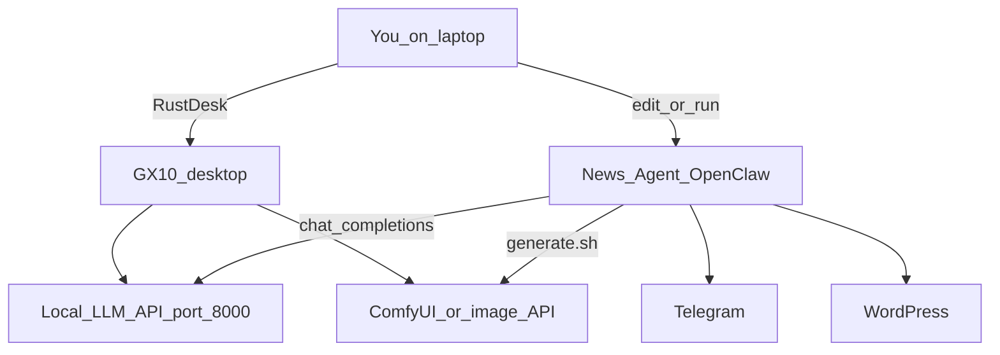
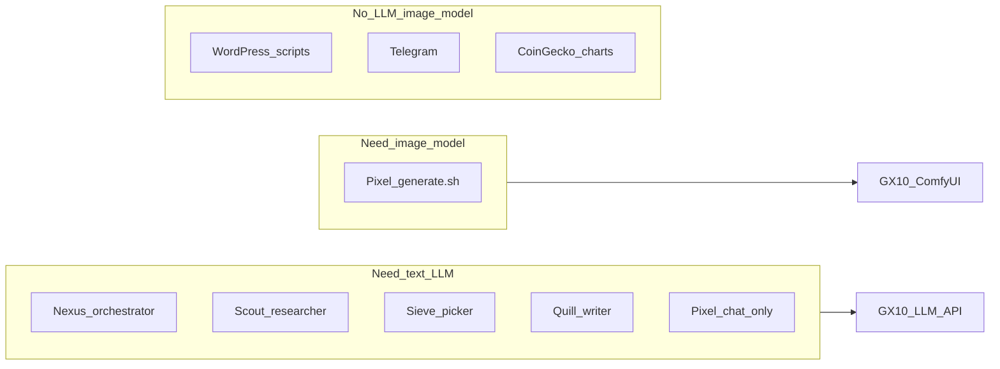
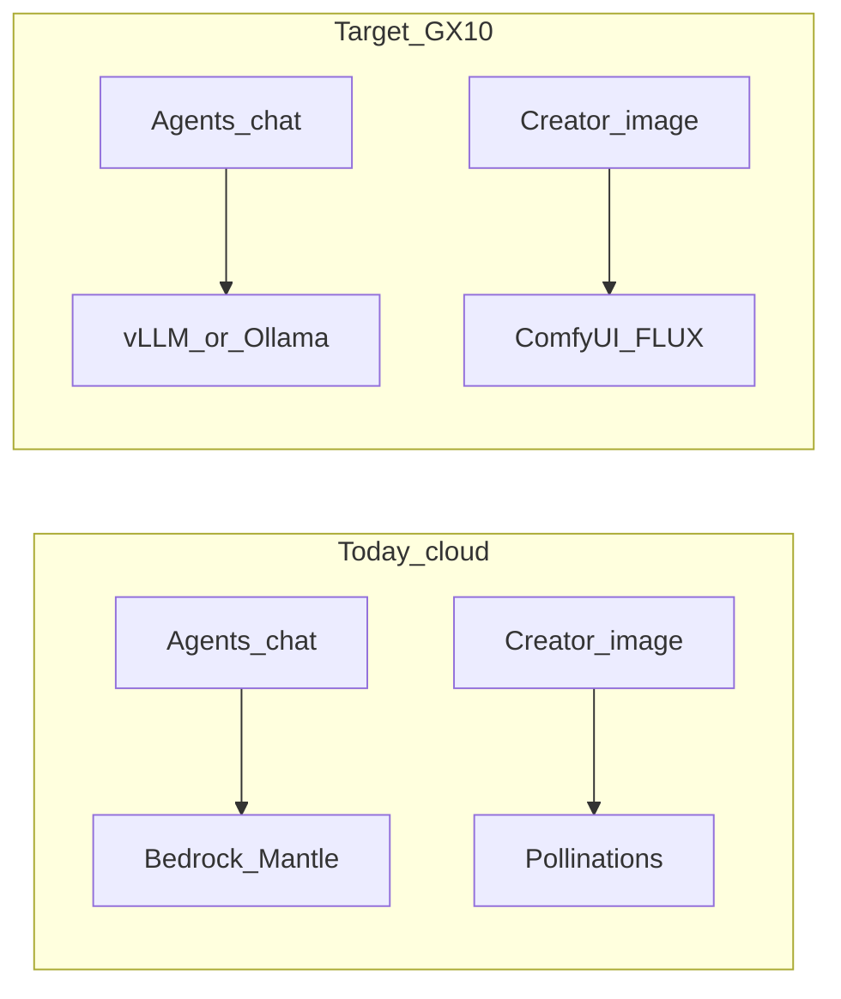

# GX10 Self-Hosted Models Walkthrough

This guide is for someone who has **zero knowledge of the GX10**, but wants to:

1. Host **open-source AI models** on the GX10.
2. Plug those models into the **News Agent** project (replace paid cloud models).
3. Keep using **RustDesk** for remote desktop and **Cursor** for setup work.

Read [PROJECT_OVERVIEW.md](PROJECT_OVERVIEW.md) first if you do not yet know how the news pipeline works (research → pick → write → image → WordPress).

> **This document teaches you.** It does not change your live config by itself. When you are ready to flip switches, use Part E as a checklist. Do not paste real API keys into git.

---

## Who does what (mental picture)



| Machine | Job |
|---------|-----|
| **GX10** | Runs big open-source models (chat + images). Always on when the pipeline needs AI. |
| **Your PC / Docker host** (News Agent) | Runs OpenClaw agents, scripts, Telegram, WordPress publish. Talks to GX10 over the network. |
| **Cursor Ultra on GX10** | Your helper to edit files and run commands *on* the GX10. Cursor is **not** the pipeline’s brain. |
| **Telegram / WordPress** | Still required for human review and publishing. Not replaced by models. |

---

## Part A — GX10 101 (zero knowledge)

### What is the GX10?

The **ASUS Ascent GX10** is a small **desktop AI computer**, not a normal laptop replacement.

- Powered by an **NVIDIA GB10 Grace Blackwell** chip.
- About **128 GB** of shared/unified memory (important: big models can fit).
- Runs a **Linux-based** NVIDIA/DGX-style OS (not Windows by design).
- Built to **run AI models locally** so you are less dependent on paid cloud APIs.

Think of it as: *“a dedicated box for AI models, always ready, no per-token cloud bill for chat/images.”*

### How you use it (RustDesk)

1. On your laptop, open **RustDesk**.
2. Connect to the GX10 using the ID/password you were given.
3. You now see the GX10 desktop as if you sat in front of it.
4. Open a **terminal** (black/gray window for typed commands).

Everything below that says “on GX10” means: do it in that remote session.

### Cursor Ultra on GX10

If Cursor Ultra is installed on the GX10:

- Use it like a smart text editor + AI pair programmer **on that machine**.
- Ask Cursor to help with install commands, config files, and log errors.
- **Do not** confuse Cursor’s cloud models with your pipeline models.
- The News Agent still needs its **own** model servers (vLLM/Ollama + ComfyUI) and OpenClaw config pointing at them.

### First-day checklist (do this once)

On the GX10 terminal:

```bash
# Who am I and what OS is this?
hostname
uname -a
cat /etc/os-release

# Free disk space (models need GBs of space)
df -h

# Memory size (you want to see a large amount available)
free -h

# GPU status (if the NVIDIA tools are installed)
nvidia-smi

# This machine's local IP address on your network
# Look for something like 192.168.x.x or 10.x.x.x
ip -4 addr show
# or older systems:
hostname -I
```

Write down:

- [ ] GX10 LAN IP: `________________` (example: `192.168.1.50`)
- [ ] Login user name: `________________`
- [ ] Free disk on main drive: `________________` GB
- [ ] `nvidia-smi` works? yes / no

You will use this IP in the News Agent config later (`http://GX10_IP:8000/v1`).

---

## Part B — How this maps to the News Agent

Pipeline overview: [PROJECT_OVERVIEW.md](PROJECT_OVERVIEW.md).

### Agents and what they need from AI



| Agent | Role | Text model on GX10? | Image model on GX10? |
|-------|------|----------------------|----------------------|
| **Nexus** (orchestrator) | Boss, sequences steps | Yes | No |
| **Scout** (researcher) | Facts / research JSON | Yes | No |
| **Sieve** (picker) | Choose/categorize stories | Yes | No |
| **Quill** (writer) | Full SEO article | Yes (best quality) | No |
| **Pixel** (creator) | Crafts image prompt in chat | Yes (small/fast ok) | **Yes** — feature image via `generate.sh` |
| **wp-publisher** | Posts to WordPress | Scripts; LLM rarely | No |
| **news-scanner** | Keep scheduler alive | Minimal | No |
| **chart-generator** | Price charts | Optional | No (uses CoinGecko) |

### What costs money or cloud today

| Service | Used for | Replace with GX10? |
|---------|----------|--------------------|
| **AWS Bedrock Mantle** | Almost all agent chat (live primary) | **Yes** — local LLM with OpenAI-style API |
| **Pollinations.ai** | Feature images in live `generate.sh` | **Yes** — ComfyUI + FLUX on GX10 |
| **Bifrost → Google Vertex** | Optional gateway / Docker defaults | **Skip** for this plan (point OpenClaw at GX10 directly) |
| **Jina Reader** | Reading web pages for research | Optional; free local extract exists |
| **Public SearXNG** | Web search tool | Optional self-host |
| **Telegram** | Cards, RATE / PUBLISH / EDIT | Keep — not a “model” |
| **WordPress** | Drafts and live posts | Keep — your site |
| **Google Drive (`gog`)** | Backup doc | Keep if you use backups |
| **CoinGecko** | Charts | Keep (free public API) |

Old docs may mention **OpenRouter** or **Leonardo**. Those are **history only** for this project’s live path.

### Target vs today



---

## Part C — Recommended stack on GX10 (one clear path)

### Default architecture

| Role | Tool | Port (example) | Why |
|------|------|----------------|-----|
| Chat for all agents | **Ollama** (easiest start) *or* **vLLM** (more “production”) | `8000` or `11434` | OpenAI-compatible `/v1` works like OpenClaw’s current providers |
| Feature images | **ComfyUI** + **FLUX.1-schnell** first | `8188` | Replaces Pollinations; strong open-source quality |
| Optional router | Bifrost | only if you want one door | Not required; OpenClaw can call GX10 directly |

**Starter rule for beginners:** run **one** solid text model first. Get chat working. Then add image. Then add a second stronger model for the writer if you need it.

### Memory guide (~128 GB unified)

| Job | Model class (examples) | Notes |
|-----|------------------------|-------|
| All-rounder starter | Qwen2.5 / Qwen3 / Llama **32B–70B** instruct (quantized if needed) | One model can serve every agent at first |
| Fast workers (picker, scanner, creator prompt) | **14B–32B** | Faster when many agents run |
| Writer + orchestrator (quality) | **32B–72B** | Better structure and SEO |
| Images | **FLUX.1-schnell** (fast), later **FLUX.1-dev** (quality) | Start with schnell so pipeline is not slow |

Names change often on Hugging Face. Use whatever current Qwen / Llama / similar **instruct** weights your host supports. Prefer models marked **chat / instruct** for agents.

### OpenAI-compatible (why OpenClaw can switch easily)

Today OpenClaw already talks to cloud models using an **OpenAI-style** HTTP API (`openai-completions`).

Your goal: GX10 exposes the same shape:

```text
http://GX10_IP:8000/v1/models
http://GX10_IP:8000/v1/chat/completions
```

Then in `openclaw.json` you only change the **base URL** and **model id** — not the whole pipeline logic.

---

## Part D — Install walkthrough (on GX10)

> Commands below are **templates**. Exact package names can differ by OS version. If a command fails, paste the error into Cursor on GX10 and fix step by step.

### D0 — Safety and network ground rules

- Keep model APIs on your **private LAN** or VPN.
- Do **not** open ports 8000/8188 to the whole public internet without a password proxy and firewall.
- Prefer bind to all interfaces only for LAN: `0.0.0.0` on a home/office network you control.
- Keep a note of GX10 IP. If the IP changes after reboot (DHCP), fix DHCP reservation or use a hostname.

### D1 — Prefer Docker when available

Docker makes restarts cleaner:

```bash
docker --version
docker compose version
```

If Docker is missing, use the product docs for your DGX/GX10 OS, or install models **natively** (Ollama native install is often easiest for beginners).

### D2 — Text model server (beginner path: Ollama)

#### Install Ollama (if not already)

Follow https://ollama.com/download for Linux, or:

```bash
# Typical Linux install (run only if official docs match your OS)
curl -fsSL https://ollama.com/install.sh | sh
```

#### Pull one starter model

```bash
# Example ids — pick a size that fits your remaining free memory
ollama pull qwen2.5:32b
# lighter example if memory is tight while also running ComfyUI:
# ollama pull qwen2.5:14b
```

#### Start and expose the OpenAI-compatible API

Ollama’s native port is often **11434**, with routes like:

```text
http://127.0.0.1:11434/v1/chat/completions
```

Server must listen on the LAN if News Agent runs on another machine:

```bash
# Example: make Ollama reachable on the network (env name can differ by version)
export OLLAMA_HOST=0.0.0.0:11434
# start ollama serve if it is not already a service
ollama serve
```

Or use **systemd** / Docker so it survives reboot (see Part G).

#### Smoke test **on GX10**

```bash
curl -s http://127.0.0.1:11434/v1/models | head

curl -s http://127.0.0.1:11434/v1/chat/completions \
  -H "Content-Type: application/json" \
  -d '{
    "model": "qwen2.5:32b",
    "messages": [{"role":"user","content":"Say hello in one short sentence."}],
    "max_tokens": 64
  }'
```

You should get JSON with an assistant message. If not, fix Ollama before touching OpenClaw.

#### Alternate path: vLLM (when you want one production HTTP server)

vLLM is often used like:

```bash
# Conceptual — image/tags and model paths change over time
# vllm serve YOUR_MODEL --host 0.0.0.0 --port 8000
```

Then OpenClaw base URL is:

```text
http://GX10_IP:8000/v1
```

Use this once you are comfortable; Ollama is enough for a first win.

### D3 — Image server: ComfyUI + FLUX

#### Why ComfyUI

Live image generation is in:

```text
workspace-creator/skills/generate-image/generate.sh
```

Today it downloads from **Pollinations**. You will later point it (or a small wrapper) at **your** ComfyUI (or any OpenAI-compatible local image API).

#### Install sketch (on GX10)

```bash
# Create a workspace folder
mkdir -p ~/ai && cd ~/ai
git clone https://github.com/comfyanonymous/ComfyUI.git
cd ComfyUI

# Create a Python virtual environment (recommended)
python3 -m venv .venv
source .venv/bin/activate
pip install -r requirements.txt

# Download FLUX.1-schnell weights into ComfyUI/models/... per FLUX/ComfyUI docs
# (paths depend on the pack you use — follow the current ComfyUI FLUX guide)

# Start the web UI / API
python main.py --listen 0.0.0.0 --port 8188
```

Open in browser (from laptop on same network or via RustDesk):

```text
http://GX10_IP:8188
```

Generate one test image by hand. Save a PNG/JPEG. Confirm file size is not tiny.

#### Make an HTTP path the pipeline can call

`generate.sh` today expects a simple “give me bytes of an image” call. You need one of:

1. A **thin wrapper script** on GX10 that accepts a prompt and returns a JPEG (recommended for the existing logo stamp flow), or  
2. An OpenAI-compatible **images** endpoint if you adopt that style later.

Write down:

- [ ] ComfyUI URL: `http://GX10_IP:8188`
- [ ] How you will call it from bash (API route or wrapper path)

### D4 — Firewall and LAN only

```bash
# Example: restrict or confirm who can reach ports (tools differ by OS)
ss -lntp | grep -E '8000|11434|8188'
```

If you must reach GX10 from outside the house, use **VPN** or a **SSH tunnel**, not a naked public port.

### D5 — Survive reboot (optional but important)

Create a systemd user/service or a Docker Compose file so:

- Ollama / vLLM starts on boot  
- ComfyUI starts on boot  

Minimum Compose shape (adjust image names as you settle):

```yaml
# ~/ai/docker-compose.gx10-models.yml  (example skeleton)
services:
  ollama:
    image: ollama/ollama
    ports:
      - "11434:11434"
    volumes:
      - ollama_data:/root/.ollama
    restart: unless-stopped
  # comfyui: add when you choose a Comfy image or bind-mount native install
volumes:
  ollama_data:
```

### D6 — Smoke test from the **News Agent machine**

On the PC/host that runs OpenClaw (replace IP):

```bash
export GX10_IP=192.168.1.50   # your real IP

curl -s "http://${GX10_IP}:11434/v1/models"

curl -s "http://${GX10_IP}:11434/v1/chat/completions" \
  -H "Content-Type: application/json" \
  -d '{
    "model": "qwen2.5:32b",
    "messages": [{"role":"user","content":"Reply with the single word OK."}],
    "max_tokens": 8
  }'
```

If this fails, OpenClaw will also fail. Fix network first (same Wi‑Fi/LAN, firewall, wrong IP).

---

## Part E — Wire into News Agent (config checklist)

No secrets in git. Edit live config on the machine that runs OpenClaw.

### E1 — Add a local provider in `openclaw.json`

File: project root `openclaw.json` (or `~/.openclaw/openclaw.json` on the runtime host).

Today you already have:

- `models.providers.local-bifrost` — OpenAI-compatible pattern with `baseUrl` + `api: "openai-completions"`
- `models.providers.bedrock-mantle` — **current paid chat primary**

**Add** something like (use your real IP and model id):

```json
"gx10-local": {
  "baseUrl": "http://192.168.1.50:11434/v1",
  "api": "openai-completions",
  "apiKey": "local-not-used",
  "models": [
    {
      "id": "qwen2.5:32b",
      "name": "Qwen 2.5 32B (GX10)",
      "contextWindow": 32768,
      "maxTokens": 8192,
      "input": ["text"],
      "cost": { "input": 0, "output": 0, "cacheRead": 0, "cacheWrite": 0 }
    }
  ]
}
```

If you use vLLM on port 8000:

```text
"baseUrl": "http://192.168.1.50:8000/v1"
```

### E2 — Point every agent away from Bedrock Mantle

In `openclaw.json`, under each agent in `agents.list` (and `agents.defaults`), change:

```text
"primary": "bedrock-mantle/...."
```

to:

```text
"primary": "gx10-local/qwen2.5:32b"
```

Suggested first layout (simple — one model everywhere):

| Agent | Primary |
|-------|---------|
| defaults, main, news-scanner, researcher, picker, creator, publisher, wp-publisher, chart-generator | `gx10-local/<your-main-model>` |
| orchestrator, writer | same model first; later a larger/better model id if you host two |

Fallbacks can be a second local model, not Bedrock, once you are offline from AWS.

Stop relying on production paths that need:

- `AWS_BEARER_TOKEN_BEDROCK`
- Bedrock Mantle `apiKey` in config

### E3 — Mirror provider in `agents/*/agent/models.json`

This repo keeps per-agent model registries under:

```text
agents/<agent-id>/agent/models.json
```

If OpenClaw uses those, copy the same `gx10-local` provider block (or regenerate from your main config). All agent folders that still list only Bedrock will keep trying the cloud.

### E4 — Images: stop Pollinations, use GX10

File: `workspace-creator/skills/generate-image/generate.sh`

**Today (live path):**

- Defaults: `IMAGE_MODEL=pollinations/flux-realism` (and other pollinations fallbacks)
- Function `call_pollinations()` hits `https://image.pollinations.ai/...`
- Env: `POLLINATIONS_API_KEY` in `openclaw.json` `env`

**Target:**

1. Keep logo stamping and min size checks (those are good).
2. Replace only **where image bytes are downloaded**.
3. Env ideas:

```bash
export IMAGE_BACKEND=gx10-comfy   # or openai-images
export IMAGE_API_BASE="http://192.168.1.50:8188"
export IMAGE_MODEL="flux-schnell"
# remove need for POLLINATIONS_API_KEY in production
```

Implementation approaches (when you code later):

- Call a small `http://GX10_IP:PORT/generate?prompt=...` wrapper you run next to ComfyUI, or  
- Restore/adapt the older Bifrost image path but with Bifrost’s **upstream** set to local FLUX, not Vertex.

Until that code change ships, chat can already be on GX10 while images still use Pollinations — hybrid mode is fine for testing.

### E5 — Docker stack (if you use `docker/`)

File: `docker/docker-compose.yml`

- Ensure `BIFROST_BASE_URL` is **not** required if agents call GX10 directly.
- Drop defaults that point images at Vertex (`IMAGE_MODEL: vertex/...`) when going fully local.
- If OpenClaw runs **inside Docker** and GX10 is the host/LAN, use the **host LAN IP**, not `localhost` (inside a container, `localhost` is the container itself). On Docker Desktop Windows/Mac, `host.docker.internal` is the **host PC**, not automatically the GX10.

### E6 — Optional free-ish extras (not required)

| Item | How |
|------|-----|
| Less Jina spend | Rely on researcher local extract (trafilatura etc.) when keyless is enough |
| Own search | Self-host SearXNG; set `plugins.entries.searxng.config.webSearch.baseUrl` |

---

## Part F — Test plan (prove paid APIs are off)

Do these in order.

### F1 — Chat only

1. Restart OpenClaw gateway so it reloads `openclaw.json`.
2. Send a short message to the orchestrator (or main) in Telegram / UI: “Reply with the word PONG.”
3. Check agent logs / session metadata: model should show `gx10-local/...`, **not** `bedrock-mantle/...`.

### F2 — Image only (after image backend exists)

On the OpenClaw host:

```bash
OUTPUT_PATH=/tmp/gx10-feature-test.jpg \
PROJECT_SLUG=test \
  bash workspace-creator/skills/generate-image/generate.sh \
  "Photorealistic gold Bitcoin coin on dark reflective surface, cinematic lighting"
```

Success criteria (matches existing checks):

- Exit code **0**
- File exists, size **≥ ~40 KB**
- Looks like a real image in a viewer

### F3 — Mini pipeline

```text
run pipeline 1
```

(or your project slug form: `run pipeline coinography 1`)

Expect: pick → research → write → image → WordPress draft → Telegram card.

If research fails, that can be RSS/Jina — not always a model issue.

### F4 — Confirm cloud is not needed

1. Temporarily unset/remove Bedrock token for a test environment (only if you can restore it).
2. With only GX10 online on LAN, chat should still work.
3. Unset `POLLINATIONS_API_KEY` after local image works; image should still work.
4. Network logs / firewall: no required traffic to `bedrock-mantle` or `image.pollinations.ai` for a full success path.

### F5 — Editorial path still works

Telegram RATE / EDIT / PUBLISH still need Telegram + WordPress. Those are not “failed migrations” if models are local.

---

## Part G — Everyday ops

### After GX10 reboot

1. RustDesk connect.
2. Confirm Ollama/vLLM is listening (`curl` models).
3. Confirm ComfyUI is listening.
4. Confirm News Agent still reaches `GX10_IP` (ping/curl from host).

### Disk and models

- Model files are huge. Watch `df -h`.
- Delete failed partial downloads and old quant versions you never use.
- Prefer one good chat model + one good image model over ten half-broken ones.

### Memory pressure

LLM + FLUX at the same time can OOM or thrash:

- Prefer starting FLUX only when creating an image, **or**
- Use a smaller chat model when image work is heavy, **or**
- Queue jobs so image gen does not overlap peak multi-agent chat.

### Security

- Strong RustDesk password; do not share the ID casually.
- LAN-only APIs; no public exposure.
- Do not commit `openclaw.json` with real keys (Bedrock, Pollinations, Telegram tokens).
- Treat the GX10 as a server: updates, limited open ports.

---

## Part H — What you still pay for

Self-hosting **does not** make everything free.

| Still costs / still needed | Why |
|----------------------------|-----|
| **Electricity** | GX10 runs 24/7 |
| **Telegram bot + internet** | Editorial UI |
| **WordPress hosting** | Your news sites |
| **Google account** | Drive backup if you use it |
| **Optional Jina / search** | Until you fully localise fetch/search |
| **Domain / CDN** | Site traffic |

You should **not** still need per-token **Bedrock Mantle** or **Pollinations** image bills for the core article loop once Parts D–F are done.

---

## Part I — Later option: move the whole pipeline onto GX10

Once models work:

1. Clone/copy this News Agent tree onto GX10 (Linux paths replace `C:\...`).
2. Install Docker Compose from [docker/](docker/), or run OpenClaw natively for ARM/Linux.
3. Point provider `baseUrl` to `http://127.0.0.1:11434/v1` (same machine).
4. Keep Telegram + WP credentials.
5. Note: **ARM + Linux** — some Windows-only paths and x86 Docker images may need different images/binaries.

Do not jump here on day one. Models first, then full move.

---

## Appendix A — Glossary

| Term | Simple meaning |
|------|----------------|
| **LLM** | Large language model — the chatbot brain that writes and reasons |
| **Token** | A chunk of text the model reads/writes; cloud bills often charge per token |
| **Endpoint / baseUrl** | The http address of the model server |
| **OpenAI-compatible** | API that looks like OpenAI’s `/v1/chat/completions` so many tools plug in easily |
| **Quantized model** | Smaller/faster version of a model (uses less memory, sometimes slightly lower quality) |
| **OOM** | Out of memory — model too big for free RAM |
| **ComfyUI** | Popular local UI + engine for Stable Diffusion / FLUX image workflows |
| **vLLM** | Fast server software for running chat models as an API |
| **Ollama** | Friendly local model runner with simple pull/serve commands |
| **OpenClaw** | Multi-agent framework this News Agent is built on |
| **RustDesk** | Remote desktop app to control GX10 from your laptop |

## Appendix B — Common failures

| Symptom | Likely cause | What to try |
|---------|--------------|-------------|
| `curl` to GX10 times out | Wrong IP, Wi‑Fi isolation, firewall | Confirm IP with `ip a`; same LAN; allow ports |
| OpenClaw still hits Bedrock | Primaries not changed / old process | Grep for `bedrock-mantle` in config; restart gateway |
| Images still Pollinations | `generate.sh` not modified | Wire local backend; unset pollinations key after |
| Agent hangs / timeout | Model too slow or overloaded | Smaller model; raise timeouts; fewer concurrent agents |
| OOM on GX10 | LLM + image + OS | One model at a time; smaller quant |
| Works on GX10, not from PC | Bound to `127.0.0.1` only | Listen on `0.0.0.0`; retest from PC |
| Docker OpenClaw cannot reach GX10 | Used `localhost` inside container | Use LAN IP of GX10 |
| ARM package/binary errors | x86 wheel on ARM | Use ARM builds / official containers for your OS |

## Appendix C — File map for later coding

| File / path | Why you open it |
|-------------|-----------------|
| `openclaw.json` | Providers, agent primary models, env keys |
| `agents/*/agent/models.json` | Per-agent model registries |
| `workspace-creator/skills/generate-image/generate.sh` | Feature image generation (today Pollinations) |
| `docker/docker-compose.yml` | Containerized OpenClaw + Bifrost defaults |
| `PROJECT_OVERVIEW.md` | How the newsroom agents fit together |
| `PIPELINE_DOCS/*` | Older designs; OpenRouter/Leonardo notes are historical |

## Appendix D — Your fill-in cheat sheet

```text
GX10 LAN IP:            ____________________
LLM base URL:           http://____:____/v1
LLM model id:           ____________________
Image API / ComfyURL:   http://____:____
News Agent host:        PC / Docker / GX10 (circle one)
Chat cutover date:      ____________________
Image cutover date:     ____________________
Bedrock keys removed?:  yes / no
Pollinations removed?:  yes / no
```

---

## Suggested order of operations (summary)

1. RustDesk into GX10 → first-day checklist → write down IP.  
2. Install Ollama → pull one instruct model → local `curl` works.  
3. From News Agent host → `curl` GX10 chat works.  
4. Add `gx10-local` provider + switch agent primaries → restart OpenClaw → short chat test.  
5. Install ComfyUI + FLUX → manual image works.  
6. Wire `generate.sh` (or wrapper) → image test ≥40 KB.  
7. `run pipeline 1` → Telegram card → publish path as usual.  
8. Remove Bedrock / Pollinations from the **success path**.  

---

*Plain-language guide for ASUS Ascent GX10 + News Agent local models. Setup and wiring checklist only — implement config changes carefully on a machine you control, and keep secrets out of git.*
