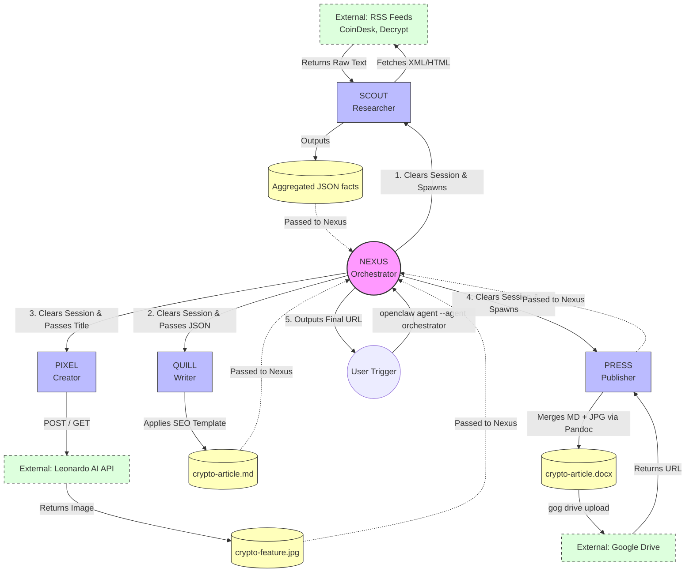

# Architecture Graph

This Mermaid diagram illustrates the exact flow of data and control between the OpenClaw agents and external systems.

```mermaid
flowchart TD
    %% Define Styles
    classDef orchestrator fill:#f9f,stroke:#333,stroke-width:2px;
    classDef worker fill:#bbf,stroke:#333,stroke-width:1px;
    classDef external fill:#dfd,stroke:#333,stroke-width:1px,stroke-dasharray: 5 5;
    classDef storage fill:#ffb,stroke:#333,stroke-width:1px;

    %% External Systems
    RSS[External: RSS Feeds<br/>CoinDesk, Decrypt]:::external
    Leonardo[External: Leonardo AI API]:::external
    GDrive[External: Google Drive]:::external

    %% Agents
    Nexus((NEXUS<br/>Orchestrator)):::orchestrator
    Scout[SCOUT<br/>Researcher]:::worker
    Quill[QUILL<br/>Writer]:::worker
    Pixel[PIXEL<br/>Creator]:::worker
    Press[PRESS<br/>Publisher]:::worker

    %% Storage/Artifacts
    JSONStorage[(Aggregated JSON facts)]:::storage
    MDStorage[(crypto-article.md)]:::storage
    ImgStorage[(crypto-feature.jpg)]:::storage
    DocxStorage[(crypto-article.docx)]:::storage

    %% Execution Flow
    Trigger((User Trigger)) -->|openclaw agent --agent orchestrator| Nexus

    %% Step 1: Research
    Nexus -->|1. Clears Session & Spawns| Scout
    Scout -->|Fetches XML/HTML| RSS
    RSS -->|Returns Raw Text| Scout
    Scout -->|Outputs| JSONStorage
    JSONStorage -.->|Passed to Nexus| Nexus

    %% Step 2: Write
    Nexus -->|2. Clears Session & Passes JSON| Quill
    Quill -->|Applies SEO Template| MDStorage
    MDStorage -.->|Passed to Nexus| Nexus

    %% Step 3: Create
    Nexus -->|3. Clears Session & Passes Title| Pixel
    Pixel -->|POST / GET| Leonardo
    Leonardo -->|Returns Image| ImgStorage
    ImgStorage -.->|Passed to Nexus| Nexus

    %% Step 4: Publish
    Nexus -->|4. Clears Session & Spawns| Press
    Press -->|Merges MD + JPG via Pandoc| DocxStorage
    DocxStorage -->|gog drive upload| GDrive
    GDrive -->|Returns URL| Press
    Press -.->|Passed to Nexus| Nexus

    %% Final
    Nexus -->|5. Outputs Final URL| Trigger
```
