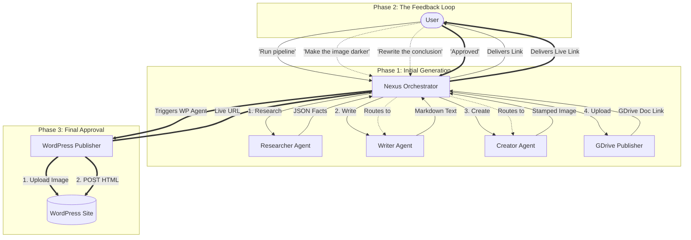

# Editor-in-Chief Interactive Pipeline (HITL)

This plan outlines the future architecture for turning the Orchestrator (Nexus) into an interactive Editor-in-Chief. This will allow the user to review drafts, request specific revisions from individual agents, and finally approve the post for automatic WordPress publication.

## Proposed Architecture Mind Map

The following Mermaid diagram visualizes the flow of data and feedback in the new system:

## Proposed Changes

### 1. Refactoring the Orchestrator (Nexus) SOUL
Currently, Nexus is a rigid, top-to-bottom script. We will rewrite `workspace-orchestrator/SOUL.md` so that Nexus operates as an **Intent Router**.
- **If the user says "Run Pipeline":** It executes the standard 4-step process and delivers a Google Doc.
- **If the user gives feedback (e.g., "Change the image"):** It uses its `<thinking>` block to identify which agent is responsible (Creator), clears *only* that agent's session, passes the feedback, and then updates the Google Doc.
- **If the user says "Approved":** It bypasses all generation agents and exclusively triggers the new WordPress Publisher agent.

### 2. Creating the WordPress Publisher Agent
We will create a new agent (e.g., `workspace-wp-publisher`) dedicated solely to the WordPress REST API.
- **Skillset:** It will use `curl`, `jq`, and `pandoc`.
- **Workflow:** 
  1. Upload `/tmp/crypto-feature.jpg` to the `/wp/v2/media` endpoint and extract the image ID.
  2. Convert `/tmp/crypto-article.md` to HTML.
  3. POST to `/wp/v2/posts` with the HTML body and the attached image ID, setting the status to "draft" or "publish".

## User Review Required

> [!IMPORTANT]
> This is just the blueprint for our brainstorming session. **No code changes will be made yet.** Please review the mind map and flow above.
> 
> **Open Question:** Do you want the final WordPress post to be created as a **Draft** (so you can do one final look on the website before it goes live) or published **Immediately** upon your "Approved" command?
