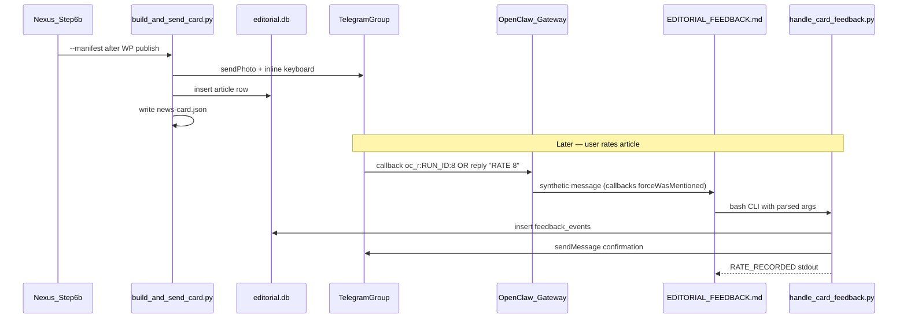

# Phase 2: Editorial DB + RATE Feedback

**Status:** implemented  
**Created:** 2026-05-23  
**Depends on:** Phase 1 (`PLANS/news-card-telegram.md`), Phase 1.5 (`PLANS/news-card-telegram-inline-buttons.md`)

---

## Scope

| In Phase 2 | Deferred to Phase 3 |
|------------|---------------------|
| SQLite article DB on card send | `DRAFT` → WP unpublish |
| RATE 1–10 (article score) | `EDIT` → send article, user paste, WP update |
| IMAGE 1–10 (image score) | `article_versions` table |
| Callback rate tiles + text reply fallback | Draft/Edit callback tiles |

**Feedback UI:** Both callback button tiles and text commands (`RATE 8`, `IMAGE 7`).

---

## Architecture



### Telegram ingress constraints

OpenClaw gateway owns the bot token (single `getUpdates` consumer). Feedback routes through gateway → orchestrator binding — **not** a sidecar poller.

| Ingress | Behavior |
|---------|----------|
| Callback tap | Forwarded to orchestrator as synthetic text (`callback.data`) with `forceWasMentioned: true` — no `@mention` needed |
| Reply to card | `reply_to_bot` implicit mention — `RATE 8` works without `@bot` |
| Plain group text | Requires `@mention` (`requireMention: true` in `openclaw.json`) |

---

## 1. SQLite editorial database

**Path:** `~/.openclaw/data/editorial.db`

**New module:** `workspace-orchestrator/skills/pipeline/editorial_db.py`

```sql
CREATE TABLE articles (
  id INTEGER PRIMARY KEY AUTOINCREMENT,
  run_id TEXT NOT NULL UNIQUE,
  alert_id TEXT NOT NULL,
  story_id TEXT,
  headline TEXT,
  wp_url TEXT,
  wp_post_id TEXT,
  telegram_group TEXT NOT NULL,
  telegram_message_id INTEGER NOT NULL,
  card_sent_at TEXT,
  created_at TEXT DEFAULT (datetime('now'))
);
CREATE INDEX idx_articles_tg_msg ON articles(telegram_group, telegram_message_id);
CREATE INDEX idx_articles_alert ON articles(alert_id);

CREATE TABLE feedback_events (
  id INTEGER PRIMARY KEY AUTOINCREMENT,
  article_id INTEGER NOT NULL REFERENCES articles(id),
  event_type TEXT NOT NULL,  -- 'rate_article' | 'rate_image'
  score INTEGER NOT NULL CHECK(score BETWEEN 1 AND 10),
  user_id TEXT,
  user_username TEXT,
  source TEXT NOT NULL,      -- 'callback' | 'text'
  raw_payload TEXT,
  created_at TEXT DEFAULT (datetime('now'))
);
CREATE INDEX idx_feedback_article ON feedback_events(article_id, event_type);
```

**Python API:**
- `init_db()` — idempotent schema create
- `insert_article(card) -> int` — upsert on `run_id`
- `lookup_by_message_id(group, message_id) -> Article | None`
- `lookup_by_run_id(run_id) -> Article | None`
- `lookup_by_alert_id(alert_id) -> Article | None`
- `record_rating(article_id, event_type, score, user, source, raw) -> int`

Follow patterns from `validate_research.py`: atomic writes, stdout status lines.

---

## 2. Insert article on card send

**Extend:** `workspace-orchestrator/skills/pipeline/build_and_send_card.py`

After successful `send_telegram_card()` and before writing `news-card.json`:

1. Call `editorial_db.init_db()` + `editorial_db.insert_article(card)`
2. Add `story_id` to card dict (read from `validated.json` via manifest)
3. On DB failure: log `DB_INSERT_FAILED: ...` to stderr, **still exit 0** (fail-open)

| DB column | Source at card-send |
|-----------|---------------------|
| `run_id`, `alert_id`, headline, wp_url, wp_post_id | existing card builder |
| `telegram_message_id`, `telegram_group` | post-send |
| `story_id` | `validated.json` (new read) |

---

## 3. Rate callback button tiles

**Extend `build_inline_keyboard()`** in `build_and_send_card.py`:

Existing URL rows: Read Article, Google Doc.

Add callback rows (`callback_data` max 64 bytes):

| Row | Buttons | callback_data |
|-----|---------|---------------|
| Rate article | `1` `2` `3` `4` `5` | `oc_r:{run_id}:{n}` |
| Rate article | `6` `7` `8` `9` `10` | `oc_r:{run_id}:{n}` |
| Rate image | `Img 1-5` (menu) | `oc_ri_menu:{run_id}` |

Image menu callback triggers `handle_card_feedback.py` to post a follow-up message with `oc_ri:{run_id}:{n}` buttons.

**Caption update** — remove unimplemented commands:

```
Reply: RATE 1-10 | IMAGE 1-10
```

**OpenClaw config:** Default inline button scope is `allowlist` (editors in `credentials/telegram-default-allowFrom.json`). If callbacks are swallowed in testing, add to `openclaw.json`:

```json
"capabilities": { "inlineButtons": "group" }
```

---

## 4. Feedback handler script

**New:** `workspace-orchestrator/skills/pipeline/handle_card_feedback.py`

Deterministic core — orchestrator runs via bash; script owns DB + Telegram replies.

```bash
python3 handle_card_feedback.py \
  --payload "oc_r:20260522-101746:8" \
  --chat-id "-1003760909509" \
  --user-id "5691449303" \
  --username "editor" \
  --reply-to-message-id "197" \
  --message-text "RATE 8"
```

**Parsing rules:**

| Input | Action |
|-------|--------|
| `oc_r:{run_id}:{score}` | `rate_article` |
| `oc_ri:{run_id}:{score}` | `rate_image` |
| `oc_ri_menu:{run_id}` | Post 1–10 image keyboard as reply; print `RATE_MENU_SENT` |
| Text `RATE {1-10}` | Lookup via `--reply-to-message-id` → DB; fallback parse `ta-{run_id}` from text |
| Text `IMAGE {1-10}` | Same lookup, `rate_image` event |

**Rating policy:** Append-only events (audit trail); confirmation shows latest score.

**Stdout contract:**
- `RATE_RECORDED: ta-{run_id} article=8`
- `RATE_INVALID: {reason}`
- `ARTICLE_NOT_FOUND`
- `RATE_MENU_SENT`

Always exit 0 (fail-open).

Reuse `telegram_request()` pattern from `build_and_send_card.py`.

---

## 5. Feedback router (separate from pipeline SOUL)

**New:** `workspace-orchestrator/EDITORIAL_FEEDBACK.md`

Dedicated routing doc — **not** in Step 0–6 pipeline block in `SOUL.md`.

**CRITICAL rules:**

1. If message matches feedback (`oc_r:`, `oc_ri:`, `oc_ri_menu:` OR text `^(RATE|IMAGE)\s+\d{1,2}`):
   - Do NOT start or continue the crypto pipeline
   - Do NOT spawn subagents
   - Run `handle_card_feedback.py` immediately
   - Reply with script stdout only; end turn

2. Pipeline triggers (`run pipeline`) take precedence only when message explicitly requests pipeline.

**Wire-up:** Add section to `workspace-orchestrator/AGENTS.md`:

```markdown
## Editorial feedback
For Telegram RATE/IMAGE messages, follow EDITORIAL_FEEDBACK.md — not SOUL.md pipeline steps.
```

Optional one-line pointer at bottom of `SOUL.md` Rules: "Editorial feedback → see EDITORIAL_FEEDBACK.md."

---

## 6. Files

| Action | File |
|--------|------|
| Create | `workspace-orchestrator/skills/pipeline/editorial_db.py` |
| Create | `workspace-orchestrator/skills/pipeline/handle_card_feedback.py` |
| Create | `workspace-orchestrator/EDITORIAL_FEEDBACK.md` |
| Modify | `workspace-orchestrator/skills/pipeline/build_and_send_card.py` |
| Modify | `workspace-orchestrator/AGENTS.md` |
| Modify | `AGENT_PIPELINE_REGISTRY.md` |
| Maybe modify | `openclaw.json` (inlineButtons capability) |

---

## 7. Test plan

1. **DB unit test:** Insert article, lookup by message_id, record rating (`--db-path` for temp DB).
2. **Card send:** Re-run `build_and_send_card.py --manifest` on existing run bundle → verify DB row + callback rows in Telegram.
3. **Callback rate:** Tap `8` on card → DB event + confirmation message.
4. **Text reply:** Reply to card with `RATE 9` (no `@mention`) → same result.
5. **Image score:** Reply `IMAGE 7` or tap Img menu → `rate_image` event logged.
6. **Negative:** Random group message without reply/mention → ignored (existing behavior).

---

## Phase 3 preview (implemented)

See `PLANS/news-card-telegram-draft-edit.md`.

---

## Change log

| Date | Note |
|------|------|
| 2026-05-23 | Phase 2 plan created (DB + RATE only; DRAFT/EDIT → Phase 3) |
| 2026-05-23 | Phase 2 implemented |
| 2026-05-23 | Phase 3: DRAFT + EDIT implemented |
