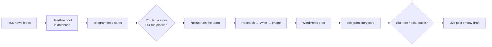
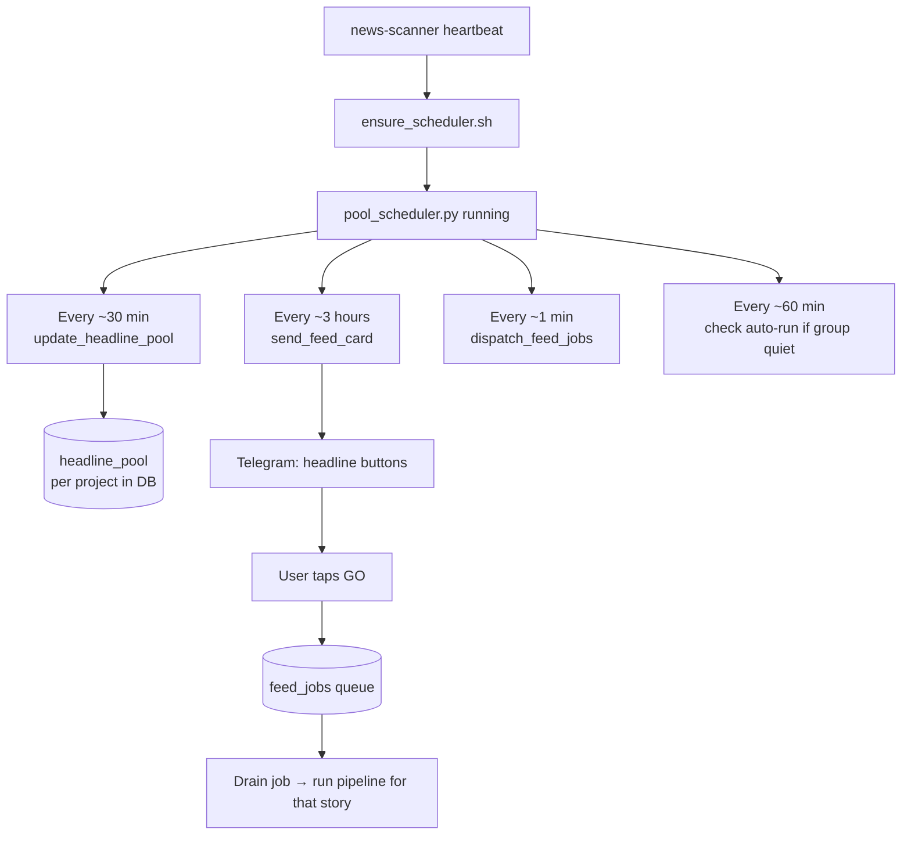
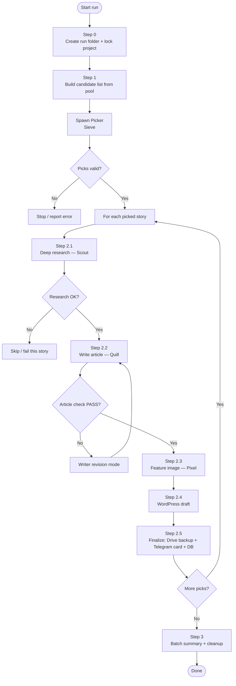
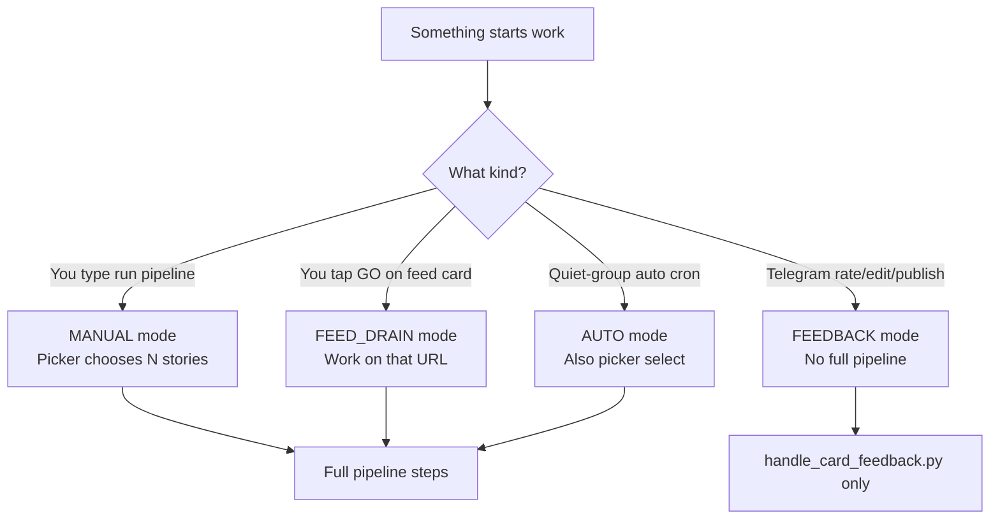
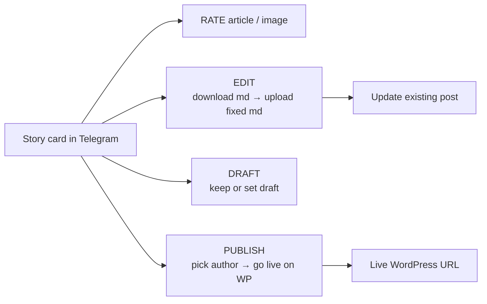
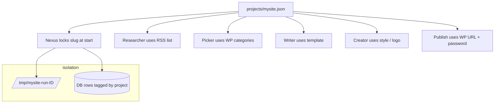

# News Agent — Simple Project Overview

This file explains **what this project is**, **who does what**, and **how stories move from news feeds to WordPress** — in plain language.

---

## 1. What is this project?

This is a **crypto news pipeline**.

It reads news from the web, picks good stories, writes articles, makes cover images, and puts drafts on your WordPress site. You control what goes live from **Telegram** (rate, edit, publish, etc.).

Think of it like a small newsroom of robots:

| Role (human idea) | Agent name | Job |
|-------------------|------------|-----|
| Boss / editor | **Nexus** (orchestrator) | Runs the steps in order. Does not write the article itself. |
| Story chooser | **Sieve** (picker) | Picks which headlines to cover and which WordPress categories fit. |
| Fact finder | **Scout** (researcher) | Digs into one story and collects real facts. |
| Journalist | **Quill** (writer) | Turns facts into a full SEO article in Markdown. |
| Artist | **Pixel** (creator) | Makes the feature image. |
| WordPress post | **Scribe** + scripts | Uploads draft (or live) post + image to WordPress. |
| Night watch | **news-scanner** | Keeps the background scheduler alive. |

The whole system runs on **OpenClaw** (the multi-agent framework). Each agent has its own folder (`workspace-*`) and its own rules (`SOUL.md`).

---

## 2. Big picture (one glance)



**In one sentence:**  
News is collected all day → you (or auto mode) choose stories → robots research, write, and image them → you see a Telegram card → you publish when ready.

---

## 3. The team (simple jobs)

### Nexus — the boss (orchestrator)

- Starts a run for a **project** (example: `coinography`).
- Calls other agents **one after another**.
- Checks that files and JSON look correct before moving on.
- Sends Telegram cards and listens for your button taps.
- **Does not** invent news, write the full article, or draw the image by itself.

### Sieve — the picker

- Reads a list of fresh headlines.
- Gives each story WordPress **categories** (from your real site list).
- Picks **N** stories (you asked for N, e.g. `run pipeline 2`).
- Prefers **variety** (not the same category all day).
- **Does not** fetch the web or write articles.

### Scout — the researcher

Two main modes:

1. **Headline scan** — look across RSS for candidate stories (used when filling the pool).
2. **Deep research** — for one chosen URL, pull facts, sources, key points into structured JSON.

Scout must **not make up numbers or quotes**. Facts go into a JSON file only.

### Quill — the writer

- Reads research JSON.
- Writes a full article following a **template** (title length, keyword rules, FAQs, etc.).
- Output is clean Markdown, then checked by scripts until it passes.

### Pixel — the image creator

- Gets headline + scene hint.
- Builds a short image prompt.
- Runs `generate.sh` (uses your image API under the hood).
- Saves a feature image (JPEG) for the article.

### WordPress publish

- Usually run as a **script** from Nexus (`publish.sh`), not always as a chatty agent.
- Uploads image + article HTML.
- Default is often **draft** so you can review, then go live from Telegram.

### news-scanner — the watchdog

- On heartbeat, runs `ensure_scheduler.sh`.
- Makes sure the **pool scheduler** is running.
- Replies `HEARTBEAT_OK` and does nothing else.

---

## 4. Always-on background flow (no chat needed)

Even when nobody types a message, background jobs keep the “news pile” full.



| Job | Rough timing | What it does |
|-----|--------------|--------------|
| Scan | ~30 min | Pull RSS, add fresh headlines into the **headline pool** (per site). |
| Feed cards | ~3 hours | Post clickable headlines in Telegram. |
| Dispatch | ~1 min | Restart stuck feed jobs if something crashed. |
| Auto-run | ~60 min check | If the group was silent a long time, may start an auto pipeline run. |
| Quiet hours | night (IST) | Scanner/feed can pause so the group is not spammed overnight. |

---

## 5. How a full article is made (main pipeline)

Command style:

```text
run pipeline              → coinnetwork (default test site), 1 story
run pipeline 3            → coinnetwork, 3 stories
run pipeline coinography 2 → main site coinography.com, 2 stories
run pipeline coinnetwork 1 → same as default, explicit
```

### Step-by-step flow



### What each step produces (files idea)

| Step | Who | Main result |
|------|-----|-------------|
| 0 | Nexus + scripts | Run folder like `/tmp/coinography-run-.../`, `manifest.json` |
| 1 | Sieve | `picker/picks.json` — chosen stories + categories |
| 2.1 | Scout | `research/validated.json` — facts and sources |
| 2.2 | Quill | `article/final.md` — finished article |
| 2.3 | Pixel | `media/feature.jpg` — cover image |
| 2.4 | publish script | WordPress **draft** post |
| 2.5 | finalize script | Google Drive doc (backup), Telegram card, status in DB |

---

## 6. Ways a run can start



| Mode | Simple meaning |
|------|----------------|
| **MANUAL** | You asked for N stories. |
| **FEED_DRAIN** | You tapped a feed card; system works that title. |
| **AUTO** | System starts itself after long silence; daily publish limit applies (e.g. max 4/day). |
| **FEEDBACK** | You pressed RATE / IMAGE / DRAFT / PUBLISH / EDIT on a **finished** card — small update, not a full rewrite from RSS. |

---

## 7. After the story: Telegram editorial flow

When a story is ready, Nexus (or finalize scripts) posts a **story card** in the project Telegram group.



| Action | What happens |
|--------|----------------|
| **RATE** | You score text and/or image quality. |
| **IMAGE** | Feedback related to the feature image. |
| **EDIT** | Download Markdown, fix it, upload → Apply. |
| **DRAFT** | Move or keep post as draft (not live). |
| **PUBLISH** | Choose author, then publish **live** on WordPress. |

Important: feedback is handled by **scripts** (`handle_card_feedback.py`). Nexus should **not** re-run the whole research→write pipeline for a simple button press.

---

## 8. Projects = different websites

Each news site is a **project** file, e.g. `projects/coinography.json`.

One project file holds things like:

- WordPress URL and user
- Password file reference (never put the real password in git)
- Allowed category slugs for the picker
- RSS feeds for research
- Telegram group id
- Writer template path
- Authors for the publish picker
- Logo / image style hints



**Why this matters:** You can run the **same pipeline** for Coinography, Memecoinist, etc. Changing sites is config, not a rewrite of the agents.

Add a site with the onboard wizard or Telegram `/onboard` (see `projects/README.md`).

---

## 9. Data stores (where things live)

| Place | Simple use |
|-------|------------|
| `projects/*.json` | Site settings |
| `credentials/wp/*.pass` | WordPress app passwords (secret) |
| `data/editorial.db` (or similar) | Headline pool, picks, story status |
| `/tmp/<slug>-run-<id>/` | One run’s files (picks, research, article, image) |
| `state/` | Long-lived runtime state |
| Telegram group | Human review + buttons |
| WordPress | Final draft / live posts |
| Google Drive | Backup doc + image path (fail-safe upload) |

---

## 10. Story journey (end-to-end, story form)

1. **Morning scan** — Background job reads CoinDesk / CoinTelegraph / etc. RSS.
2. **Pool** — Fresh unique headlines land in the database for `coinography`.
3. **Telegram feed** — You see short cards with “GO”.
4. **You tap GO** (or type `run pipeline coinnetwork 1`).
5. **Sieve** labels the story (e.g. primary category `bitcoin`) and locks the pick.
6. **Scout** opens sources, extracts facts into JSON.
7. **Quill** writes the article to match SEO rules.
8. **Pixel** makes a dark, pro crypto feature image.
9. **Publish script** creates a **WordPress draft**.
10. **Finalize** backs up to Drive and posts a **story card** in Telegram.
11. **You** click PUBLISH + author when you are happy — post goes **live**.

That’s the full product loop.

---

## 11. Why many agents (not one big AI)?

| Problem with one AI doing all | How this design helps |
|-------------------------------|------------------------|
| Mixes made-up facts with writing | Scout only researches; Quill only writes from JSON. |
| Forgets process rules | Each agent has a tight `SOUL.md` + validators. |
| Hard to restart one step | Fail research without redoing image, etc. |
| Site-specific rules | Project JSON + templates, not hard-coded sites. |
| Expensive chatting for dumb tasks | Timers & scripts use **zero AI tokens** where possible. |

---

## 12. Folder map (quick)

```text
News Agent/
├── openclaw.json          # Main runtime config (not fully committed)
├── projects/              # One JSON per website
├── credentials/           # Secrets (passwords, allow-lists)
├── workspace-orchestrator/  # Nexus + pipeline scripts
├── workspace-picker/        # Sieve
├── workspace-researcher/    # Scout
├── workspace-writer/        # Quill
├── workspace-creator/       # Pixel
├── workspace-wp-publisher/  # WordPress publish scripts / agent
├── workspace-news-scanner/  # Scheduler watchdog
├── workspace-chart-generator/ # Optional price charts
├── data/                  # Databases / caches
├── docker/                # Run in containers if needed
├── PIPELINE_DOCS/         # Older technical notes (some outdated)
└── PROJECT_OVERVIEW.md    # This file — human-friendly overview
```

Worker rules live in each workspace’s **`SOUL.md`**.  
Pipeline bash/python lives mainly under:

`workspace-orchestrator/skills/pipeline/`

---

## 13. Mental model checklist

Use this when you get lost:

1. **Is news collecting?** → pool scanner + headline pool  
2. **Is someone choosing?** → picker or feed-card GO  
3. **Is the article being built?** → research → write → image  
4. **Is it on the site?** → WordPress draft/publish scripts  
5. **Is a human deciding?** → Telegram card buttons  

If something fails, ask: **which step number above broke?** That almost always points to the right agent or script.

---

## 14. Related files

| File | When to open it |
|------|-----------------|
| `projects/README.md` | Add/remove a WordPress site |
| `workspace-orchestrator/SOUL.md` | Exact step order Nexus must follow |
| `workspace-orchestrator/EDITORIAL_FEEDBACK.md` | Telegram RATE / PUBLISH / EDIT rules |
| `GX10_SELF_HOSTED_WALKTHROUGH.md` | Host open-source models on GX10 and replace paid chat/image APIs |
| `PIPELINE_DOCS/` | Extra technical history (note: some diagrams are older) |

---

## 15. Full cost monitoring (mandatory on every story)

Sawan designed cost capture into **finalize**, not as a separate human step. After WordPress draft, `finalize_story.py` runs `aggregate_run_tokens.py` and writes:

- `RUN_DIR/publish/tokens.json` — official per-story cost
- `editorial.db` → `articles.cost_usd` / `tokens_total` (and pick row when present)

**Full cost = every LLM call that produced that story**, not only the image.

| Must be counted | Who | Typical models |
|-----------------|-----|----------------|
| Headline classify / pick | Picker (Sieve) | Flash / Flash Lite |
| Deep research | Researcher (Scout) | Flash |
| Article + any rewrite | Writer (Quill) | Flash |
| Image prompt + generation | Creator (Pixel) | Flash + Nano Banana image |
| Orchestrator control loop | Nexus | Flash |
| Feature image | Pixel script | `vertex/gemini-3.1-flash-lite-image` (~$0.000034 / ₹0.003) |
| Telegram RATE / PUBLISH / EDIT | Nexus + `handle_card_feedback.py` | Flash (often **missed** today) |

**Zero-token (do not treat as LLM cost):** RSS scan, pool scheduler, dispatch, WordPress `publish.sh`, most `handle_card_feedback.py` work after the script is invoked.

### How a clean automated run should look

1. Nexus spawns picker → researcher → writer → creator (each has a session log).
2. Image script writes `publish/image-cost.json`.
3. `finalize_story.py` scans `~/.openclaw/agents/*/sessions/` for that **run dir**, prices tokens from `openclaw.json`, adds image cost.
4. Telegram card and DB get the same `cost_usd`.

Healthy fully-automated Coinnetwork/Coinography stories in DB (Jul 2026) were about **$0.28–$0.70 → ₹27–₹67** and **~380k–1.2M tokens**. That is the expected band when all workers run inside OpenClaw.

### Why the 12 Aug 2026 Cardano story looked almost free

| Piece | Recorded? | Why |
|-------|-----------|-----|
| Feature image | Yes — **$0.000034 / ₹0.003** | `image-cost.json` only |
| Picker / research / write tokens | **No (0 tokens)** | Those steps ran in Cursor, not OpenClaw worker sessions |
| Orchestrator FEED_DRAIN retries | Partial / not in `tokens.json` | Isolated drain crons died; run dir not in those logs |
| Publish button retries | **No** | After finalize; aggregator already finished |
| Vertex credits catalog | Shows **$0** | `vertex-credits/gemini-2.5-flash` cost fields are 0 in config |

So **₹0.003 was not the full cost**. It was only what the recorder could see.

### How to report full cost next time (checklist)

After every story, before telling sir the number:

1. Open `RUN_DIR/publish/tokens.json` — need **non-zero** `tokens_in` / `by_agent` for picker, researcher, writer, orchestrator, plus `image_cost_usd`.
2. If `tokens_total` is 0 and only image cost exists → **do not** report that as full cost. Say “image only; text agents not attributed.”
3. Check `editorial.db` article row matches `tokens.json`.
4. Add publish-feedback usage from orchestrator session (same `run_id` / `oc_publish` window) if buttons were used.
5. Convert USD → INR at the day’s rate (12 Aug 2026 mid-market ≈ **₹95.4 / $1**).
6. Quote **two lines**: recorded pipeline USD/INR, and any extra (Cursor, retries, credits not priced).

### Cost gotchas to watch

- **`vertex-credits` priced at $0** in `openclaw.json` — credits still get consumed; USD field will understate unless you apply Vertex list prices (Flash ~$0.10 in / $0.40 out per 1M tokens).
- Manual / Cursor work is **outside** OpenClaw billing. Count it separately or do not call the run “full automated cost.”
- FEED_DRAIN must complete inside OpenClaw (Git Bash, not broken WSL `bash`) or worker sessions never attach to the run dir.
- Do not fire another drain after a story is already drafted — retries burn extra orchestrator tokens without new article value.

---

*Last plain-language overview for the current multi-project, pool + Telegram + WordPress pipeline. Written for easy reading — not a replacement for agent SOUL.md files during a live run. Section 15 added so every story report includes full cost, not image-only.*
