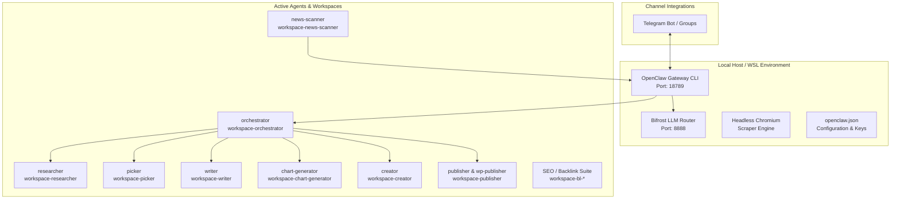

# OpenClaw System & Architecture Specification (`SYSTEM_INFO.md`)

## Executive Summary
**OpenClaw** (v2026.4.23) is an autonomous, multi-agent AI orchestration platform. It operates a suite of domain-specialized agents (Orchestrator, Researcher, Writer, News Scanner, Publishers, and SEO/Backlink agents) that collaborate to monitor feeds, gather data, write content, generate visual assets, and automate multi-channel publishing (Telegram, WordPress, etc.).

> [!IMPORTANT]
> **Deployment Strategy Update**: Docker is NOT being used for initial local execution. The system will first be run and tested natively on the local WSL host environment using the OpenClaw Node.js CLI gateway.

---

## Architecture & Component Matrix



### 1. Core Daemon & Gateway
- **Executable**: OpenClaw CLI (`openclaw` / Node.js runtime located at `/home/bhard/.npm-global/bin/openclaw`)
- **Default Port**: `18789` (WebSocket / RPC Gateway)
- **Configuration File**: `/home/bhard/.openclaw/openclaw.json`
- **Log Level & State**: `/home/bhard/.openclaw/logs/` & `/home/bhard/.openclaw/state/`

### 2. Model Routing & LLM Provider (Bifrost Gateway)
- **Provider Proxy**: Bifrost OpenAI-compatible Proxy Gateway
- **Target Endpoint**: `http://192.168.32.1:8888/v1`
- **Primary Models**:
  - `vertex/gemini-3.1-flash-lite` (Default lightweight agent model)
  - `vertex/gemini-3.5-flash` (Orchestrator primary model)
  - `vertex/gemini-2.5-flash` (Fallback model)

### 3. Agent Topology & Workspaces
Each agent operates with isolated prompts (`SOUL.md`), operational rules (`AGENTS.md`), tool configs (`TOOLS.md`), and specialized skills (`skills/`):

1. **`orchestrator`** (`/home/bhard/.openclaw/workspace-orchestrator`)
   - **Role**: Primary coordinator. Listens to Telegram groups, delegates work to subagents (`researcher`, `picker`, `writer`, `chart-generator`, `creator`).
2. **`news-scanner`** (`/home/bhard/.openclaw/workspace-news-scanner`)
   - **Role**: Background monitor running on a 30-minute heartbeat cycle (Active 06:00 - 24:00 IST).
3. **`researcher`** (`/home/bhard/.openclaw/workspace-researcher`)
   - **Role**: Executes web searches (via SearXNG / Jina API) and extracts raw research data.
4. **`picker`** (`/home/bhard/.openclaw/workspace-picker`)
   - **Role**: Filters and curates top news topics for publishing.
5. **`writer`** (`/home/bhard/.openclaw/workspace-writer`)
   - **Role**: Generates articles, reports, and coinographies using markdown templates.
6. **`chart-generator`** (`/home/bhard/.openclaw/workspace-chart-generator`)
   - **Role**: Renders visual charts and data graphs.
7. **`creator`** (`/home/bhard/.openclaw/workspace-creator`)
   - **Role**: Produces media assets and social banners.
8. **`publisher` & `wp-publisher`** (`/home/bhard/.openclaw/workspace-publisher`, `workspace-wp-publisher`)
   - **Role**: Posts formatted articles and media directly to WordPress / social targets.
9. **Backlink Agent Suite** (`workspace-bl-*`)
   - **Role**: Handles SEO outreach, site finding, scoring, and opportunity scanning.

---

## Local Non-Docker Execution & Setup Plan (Phase 1)

### Prerequisites Check
1. **Node.js**: Installed in WSL environment (`v20.x+`).
2. **OpenClaw CLI**: Installed globally (`openclaw@2026.4.23` at `/home/bhard/.npm-global/bin/openclaw`).
3. **Chromium Headless**: Installed at `/home/bhard/.openclaw/bin/chromium`.
4. **Bifrost Router**: Must be reachable at `http://192.168.32.1:8888/v1` (or local LLM provider).

### Step-by-Step Local Startup Instructions
1. **Validate Configuration & System Health**:
   ```bash
   openclaw doctor
   openclaw config validate
   ```
2. **Start the OpenClaw Gateway Service Locally**:
   ```bash
   openclaw gateway --port 18789
   ```
3. **Verify Gateway & Channel Status**:
   ```bash
   openclaw status
   openclaw health
   ```
4. **Test Agent Execution (Local Non-Docker Turn)**:
   ```bash
   openclaw agent --id orchestrator --message "Test heartbeat"
   ```

---

## Multi-Phase System Roadmap

### Phase 1: Local Host (WSL) Direct Execution & Testing (Current Phase)
- Run OpenClaw natively via Node.js CLI on local WSL host without Docker.
- Validate LLM proxy connectivity, Telegram channel bindings, and agent workflow loops.
- Perform iterative testing, prompt updates in `SOUL.md`, and logic refinements.

### Phase 2: Local Docker Containerization & Integration Testing
- Spin up local Docker Desktop containers using `docker-compose.yml` (`bifrost` + `openclaw-news-agent`).
- Test persistent volume mounting (`openclaw-data/`, `bifrost-data/`) and container network isolation locally.

### Phase 3: Remote Production Deployment via Docker
- Package configuration and state bundles using `docker/export-data.sh`.
- Deploy Docker stack to remote server with production monitoring, restart policies, and SSL termination.
