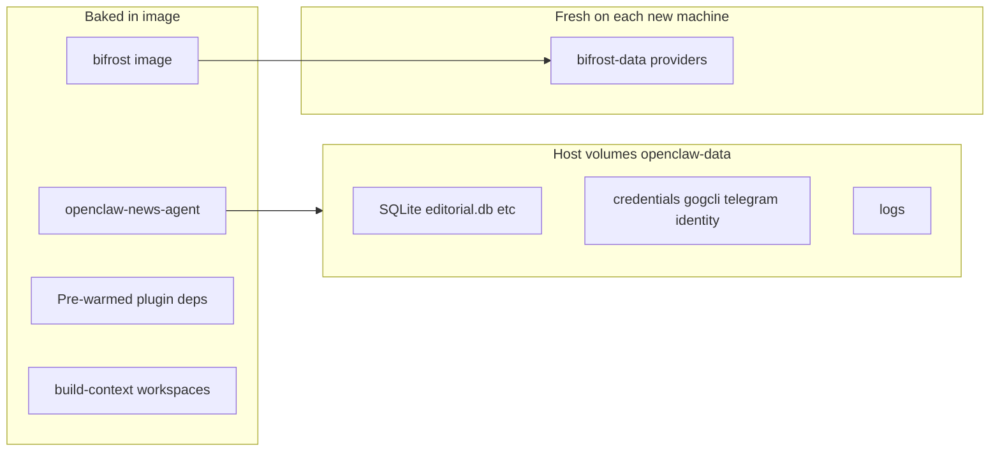

# Docker Preparation and Transfer

Context-first reference for building, updating, and transferring the News Agent OpenClaw stack. Written for future maintainers and agents who need to understand *why* things are set up this way—not only which commands to run.

---

## 1. Purpose and scope

This folder contains everything needed to run **News Agent OpenClaw** together with **Bifrost** (LLM gateway) as a production-style Docker deployment.

- **Two containers:** `openclaw-news-agent` (gateway + Python scheduler) and `bifrost` (OpenAI-compatible LLM proxy).
- **Pre-built images:** The recipient machine does not run `npm install` or `docker compose build`.
- **Persistent host volumes:** SQLite databases, credentials, Telegram state, Google Drive auth, and logs live outside the container filesystem.
- **Target deployment:** **Windows Docker Desktop** on the recipient PC. WSL is **not** required on the boss machine (Docker Desktop runs Linux containers in its own VM). Development can happen on WSL/Linux.

**What “transfer” means:** You ship **Docker images + volume data + compose/deploy scripts**, not running containers. A container is a process; images and volumes are the portable artifacts.



---

## 2. Architecture

### Bifrost (`maximhq/bifrost:v1.6.2`)

- OpenAI-compatible API proxy (Vertex, Gemini, etc.).
- Listens on port **8080** inside the container; mapped to host **8888** by default (`BIFROST_UI_PORT` in `.env`).
- Provider configuration persists in **`./bifrost-data/`** (SQLite `config.db`).
- On a **new machine**, providers are added once via the Bifrost web UI; they survive restarts.

### news-agent (`openclaw-news-agent:2026.4.24`)

- **OpenClaw gateway** — Web UI, Telegram, agent sessions.
- **Python `pool_scheduler`** — news pipeline (scan, feed jobs, cards).
- Connects to Bifrost at a **fixed internal URL:** `http://bifrost:8080/v1` (Docker Compose service DNS). Never use host IPs like `192.168.x.x` or `host.docker.internal` in config intended for this stack—they break when moved to another PC.

### Entrypoint (`entrypoint.sh`)

On each container start:

1. Patches `openclaw.json` with `BIFROST_BASE_URL=http://bifrost:8080/v1`.
2. Verifies `openclaw-data/data/editorial.db` is mounted.
3. Seeds missing logo files into mounted `assets/` from image bake (`openclaw-asset-seed`).
4. Runs `sync_openclaw_from_projects.py --apply --skip-restart` (Telegram groups/bindings derived from `projects/*.json`).
5. Checks Google Drive (`gog`) auth using env vars + mounted keyring.
6. Starts gateway in background, then runs `pool_scheduler` in foreground.

### Project single source of truth (SSOT)

- **Canonical config:** `openclaw-data/projects/<slug>.json` (WordPress, Telegram group id, RSS preset, logo path, Drive doc prefix, etc.).
- **Derived at startup:** `openclaw.json` Telegram `groups[]` + `bindings[]` via `sync_openclaw_from_projects.py` — do not hand-edit per project after onboard.
- **`/onboard`:** writes project JSON + credentials + logo; finalize runs sync-all + validation. Drive folder/account are shared — onboard prompts say **skip**; empty values inherit from an existing project.
- **Persistence mounts (2026.4.24+):** `assets/`, `media/inbound/`, `backups/` so logos and onboard uploads survive `docker compose down`.

### Boss daily start vs first install

| Script | When |
|---|---|
| `deploy.bat` | **First install only** — load images, extract `openclaw-data.tar.gz` |
| `start.bat` | **Every day after reboot** — launch Docker Desktop if needed, `docker compose up -d` |

Never re-run `deploy.bat` on a live machine (can overwrite `editorial.db`).

### Volume mounts (`docker-compose.yml`)

| Host path | Container path | Purpose |
|---|---|---|
| `openclaw-data/data` | `~/.openclaw/data` | `editorial.db`, caches |
| `openclaw-data/credentials` | `~/.openclaw/credentials` | WordPress site passwords |
| `openclaw-data/projects` | `~/.openclaw/projects` | Project configs |
| `openclaw-data/telegram` | `~/.openclaw/telegram` | Telegram offsets/state |
| `openclaw-data/identity` | `~/.openclaw/identity` | OpenClaw identity |
| `openclaw-data/devices` | `~/.openclaw/devices` | Device pairing |
| `openclaw-data/logs` | `~/.openclaw/logs` | Gateway log file |
| `openclaw-data/article_history.db` | file mount | Article history |
| `openclaw-data/workspace-orchestrator/state` | orchestrator state | Pipeline state |
| `openclaw-data/gogcli-config` | `~/.config/gogcli` | Google Drive OAuth keyring |
| `openclaw-data/assets` | `~/.openclaw/assets` | Watermark logos (`creator.logo_path`) |
| `openclaw-data/media/inbound` | `~/.openclaw/media/inbound` | `/onboard` logo uploads from Telegram |
| `openclaw-data/backups` | `~/.openclaw/.backups` | `openclaw.json` backups before sync |
| `bifrost-data` | `/app/data` | Bifrost LLM providers |

**Do not mount** `node_modules`, `plugin-runtime-deps`, or other paths that would shadow deps baked into the image (see §4).

---

## 3. Image vs data — what transfers where

| Component | In image | In `openclaw-data` | Configured after deploy on new PC |
|---|---|---|---|
| OpenClaw workspaces, plugins, `openclaw.json` (base) | yes (`build-context/`) | no | — |
| Pre-warmed plugin runtime deps | yes | **must not mount over** | — |
| `editorial.db`, `article_history.db` | no | yes | — |
| WordPress / Telegram credentials | no | yes | — |
| Google Drive OAuth keyring files | no | yes (`gogcli-config/`) | `.env` GOG_* unlocks keyring |
| Bifrost LLM providers | no | `bifrost-data/` (empty initially) | Bifrost UI once |
| Telegram poll offsets | no | yes | — |

### Google Drive auth (GOG)

Two parts work together:

1. **Keyring files** in `openclaw-data/gogcli-config/` — the actual OAuth tokens (transferred in `openclaw-data.tar.gz`).
2. **`.env` variables:**
   - `GOG_ACCOUNT` — which Gmail account (e.g. `bhardwaj0sawan@gmail.com`).
   - `GOG_KEYRING_PASSWORD` — password that **decrypts** the keyring; not a new Google login.

To use the **same Google account** on another PC, copy `.env.example` → `.env` without changing the GOG lines (assuming the keyring in the bundle matches).

---

## 4. Plugin performance fix (preserve on every rebuild)

### Problem we hit

OpenClaw is installed globally as **root** at `/usr/local/lib/node_modules/openclaw`, but the container runs as user **`node`**. The package directory was read-only to `node`.

OpenClaw’s loader then uses a **slow external install path**, writing ~385 MB into ephemeral `~/.openclaw/plugin-runtime-deps/` and `~/.openclaw/node_modules/` on the container overlay. That layer is wiped on every recreate. Worse: each UI action (Sessions, Logs, Models) triggered a **plugin install storm**, blocking the gateway for minutes and delaying Telegram replies.

### Fix (in `Dockerfile`)

1. **`chown -R node:node /usr/local/lib/node_modules/openclaw`** — enables the fast in-package install path.
2. **Build-time warm** via `warm-plugins.sh` — starts the gateway once during `docker build`, waits for `[gateway] ready`, bakes extension deps (acpx, browser, telegram, etc.) into the image layer.
3. **`HOME=/home/openclaw`** must be set when running the warm step (`RUN su node -s /bin/bash -c "HOME=... warm-plugins.sh"`). Without it, the gateway fails with “Missing config” and nothing is baked.

### What not to do

- Do **not** add volume mounts for `node_modules` or `plugin-runtime-deps`.
- Do **not** skip the warm step after bumping OpenClaw version.
- Do **not** assume “it works after waiting 15 minutes once”—that was paying the install cost into ephemeral storage, not a fix.

### How to verify the fix

After `docker compose up` or recreate:

```bash
# Should be zero lines after the latest boot timestamp
grep "installed bundled runtime deps" openclaw-data/logs/gateway.log | tail

# Gateway should report ready in seconds, not minutes
grep "gateway] ready" openclaw-data/logs/gateway.log | tail -1
```

Healthy boot: **0** install lines, gateway **ready in ~3–10s**.

---

## 5. Build pipeline and scripts

Typical order for **local development / rebuild:**

| Step | Script / command | What it does |
|---|---|---|
| 1 | `prepare-build-context.sh` | Rsync `~/.openclaw` → `build-context/`; patch `/home/bhard` → `/home/openclaw`; set Bifrost URL to `http://bifrost:8080/v1`; **excludes** DBs, credentials, logs, sessions |
| 2 | `docker compose build news-agent` | Builds image using `Dockerfile` (includes plugin warm) |
| 3 | `export-data.sh` | Copies persistent data from `~/.openclaw` → `docker/openclaw-data/` (optional—see pitfall below) |
| 4 | `docker compose up -d` | Starts stack |
| 5 | `verify.sh` | Checks DB row counts, scheduler, gateway HTTP |

For **transfer packaging:**

| Step | Script | What it does |
|---|---|---|
| 1 | Confirm tests pass (§9) | — |
| 2 | `package-for-boss.sh` | Saves both images as `.tar.gz`, tars `openclaw-data/`, writes `news-agent-deploy/` with Windows + Linux deploy scripts |
| 3 | Zip (optional) | `zip -r news-agent-deploy.zip news-agent-deploy/` (~2.1 GB) for Drive/USB transfer |

### Pitfall: `export-data.sh` vs running container data

`export-data.sh` reads from **`~/.openclaw`** (native tree), **not** from what the running Docker container has written only to **`docker/openclaw-data/`** mounts.

If the scheduler updated the DB only inside the container mount, running `export-data.sh` can **overwrite** `docker/openclaw-data/data/editorial.db` with an **older** native copy.

**Safer approach before packaging:** Confirm `sqlite3 docker/openclaw-data/data/editorial.db "SELECT COUNT(*) FROM headline_pool;"` matches what you expect, then let `package-for-boss.sh` tar **`docker/openclaw-data/` as-is**. Only run `export-data.sh` when `~/.openclaw` is the canonical source of truth.

### Pitfall: `docker load` and gzip

Image files in the bundle are **gzip-compressed** tar archives.

- **Linux (`deploy.sh`):** `gunzip -c image.tar.gz | docker load`
- **Windows (`deploy.ps1`):** decompresses via .NET `GZipStream` into `docker load` stdin.

Plain `docker load < file.tar.gz` without decompression **does not work reliably**.

---

## 6. Local dev vs transfer bundle

| | Local dev (`docker/`) | Transfer bundle (`news-agent-deploy/`) |
|---|---|---|
| Compose | Has `build:` section | Images only, no build |
| Images | Built locally | Pre-saved `.tar.gz` |
| Deploy | `docker compose up -d` | `deploy.bat` (Windows) or `deploy.sh` (Linux) |
| Env | `docker/.env` (e.g. `BIFROST_UI_PORT=8889` if 8888 busy) | Recipient copies `.env.example` → `.env` |
| Bifrost URL | Fixed in compose + patched at runtime | Same |

Boss-facing quick steps live in `news-agent-deploy/README-WINDOWS.txt` (generated by `package-for-boss.sh`).

---

## 7. Transfer workflow

### Bundle contents (~2.1 GB total)

- `openclaw-news-agent-image.tar.gz` (~2.0 GB) — warmed OpenClaw image
- `bifrost-image.tar.gz` (~77 MB)
- `openclaw-data.tar.gz` (~1–2 MB) — databases, credentials, gog keyring, telegram state
- `docker-compose.yml`, `deploy.bat`, `deploy.ps1`, `deploy.sh`, `.env.example`, `README-WINDOWS.txt`

Outer ZIP (`news-agent-deploy.zip`) adds little compression (inner files are already gzip) but gives **one file** for upload.

### Transfer methods that work

- **Google Drive** (or OneDrive/Dropbox) — share link; ~2.1 GB fits free tiers; treat link as secret (bundle has credentials).
- **USB / external drive** — simplest offline handoff.
- **Split archives** — if a channel has a 2 GB file limit, `split -b 500M openclaw-news-agent-image.tar.gz part-` and rejoin on Windows with `copy /b part-* openclaw-news-agent-image.tar.gz`.

### Methods that do not work well

- **Telegram** for the full image — 2 GB per-file limit; bundle contains secrets.
- **Copying running containers** — ephemeral overlay; not portable.
- **`docker commit`** — mixes runtime junk; avoid for production handoff.

### Accessing files from WSL on Windows

The bundle is built under `/home/bhard/.openclaw/docker/`. On Windows Explorer:

- `\\wsl.localhost\Ubuntu\home\bhard\.openclaw\docker\`
- Or from WSL: `explorer.exe /home/bhard/.openclaw/docker/`

Hidden folder `.openclaw` — enable “Hidden items” in Explorer if needed.

---

## 8. Boss deploy (Windows Docker Desktop)

Prerequisites: **Docker Desktop installed and running** (whale icon in system tray). No WSL install required.

1. Extract `news-agent-deploy.zip` → e.g. `C:\news-agent-deploy`
2. Copy `.env.example` → `.env` (same GOG values = same Google Drive account)
3. Double-click **`deploy.bat`** (first run: 10–20 minutes loading images)
4. **OpenClaw UI:** http://localhost:18789
5. **Bifrost UI:** http://localhost:8888 — add Vertex/Gemini providers **once** (saved in `bifrost-data/`)
6. If port 8888 is in use: set `BIFROST_UI_PORT=8889` in `.env` before deploy

### Telegram note

`openclaw.json` may have **`requireMention: true`** for groups. Plain “hi” without `@YourBot` is ignored by design. Use @mention when testing.

---

## 9. Pre-transfer verification checklist

Run on the **source machine** after rebuild, before `package-for-boss.sh`:

1. **`./verify.sh`** — DB counts, scheduler running, gateway HTTP OK.
2. **Restart test:** `docker compose restart news-agent` → no new `installed bundled runtime deps` in gateway log; `ready` in seconds.
3. **Control UI** — Sessions, Logs, Models load in seconds (not minutes).
4. **Bifrost** — `curl` or UI; chat reply in OpenClaw works.
5. **Telegram** — @mention in group; reply within ~30–60s.
6. **Data** — after restart, credentials and sessions still present.

---

## 10. Adapting for another OpenClaw system

To package a **different** OpenClaw deployment (not News Agent):

1. **Version pins** — Update `openclaw@…` in `Dockerfile`, image tag in `docker-compose.yml` and `package-for-boss.sh`.
2. **Source tree** — Set `OPENCLAW_SRC=/path/to/other/.openclaw` when running `prepare-build-context.sh`, or adjust rsync excludes for what that system needs in the image vs volumes.
3. **Volume mounts** — Edit `docker-compose.yml` to mount only what must persist; document the table in §3 for the new system.
4. **Re-warm** — Always rebuild with `warm-plugins.sh` after OpenClaw version change.
5. **Bifrost** — Keep internal URL pattern `http://bifrost:8080/v1` if using the same compose service name.
6. **Secrets** — Refresh `.env.example`; never commit real `.env` or credential files to git.
7. **Services** — If the new system does not need Bifrost, gog, or scheduler, remove those from Dockerfile, entrypoint, and compose—but then adjust the warm step and entrypoint accordingly.

---

## 11. Known follow-ups / out of scope

- **Telegram polling stalls** (`getUpdates` network errors in Docker/WSL2) — if replies are slow *after* plugin fix is verified, consider DNS / `NODE_OPTIONS=--dns-result-order=ipv4first` as a separate change.
- **Stuck orchestrator sessions** — may require session cleanup or gateway restart; not fixed by image baking.
- **Security** — The transfer bundle contains WP credentials, gog keyring, and `.env.example` with keyring password. Prefer sharing Drive links to specific people, not fully public URLs.

---

## File index (this folder)

| File | Role |
|---|---|
| `Dockerfile` | Image definition + plugin warm |
| `docker-compose.yml` | Dev compose (with build) |
| `entrypoint.sh` | Startup: Bifrost patch, auth, gateway + scheduler |
| `warm-plugins.sh` | Build-time gateway boot to bake plugin deps |
| `prepare-build-context.sh` | Stage `build-context/` from live OpenClaw tree |
| `export-data.sh` | Sync persistent data into `openclaw-data/` |
| `package-for-boss.sh` | Create `news-agent-deploy/` transfer bundle |
| `deploy.ps1.template` | Source for Windows PowerShell deploy |
| `verify.sh` | Post-deploy smoke test |
| `verify-auth.sh` | Auth-specific checks |
| `.env.example` | Template env for recipient |
| `openclaw-data/` | Persistent volume source (not in git) |
| `news-agent-deploy/` | Generated bundle output (not in git) |
