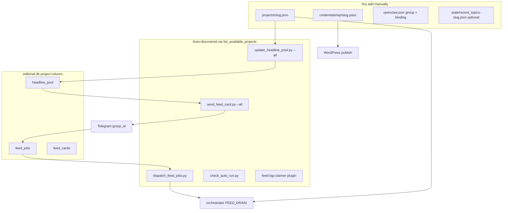

# Complete Guide: Adding a New Project to the News-Agent

This is the manual reference checklist. **Prefer the automated onboarding
engine** — either the Telegram `/onboard` command (run from an existing
project group) or the terminal wizard:

```bash
python3 ~/.openclaw/workspace-orchestrator/skills/pipeline/onboard_project.py wizard
```

The engine automates everything below except Phase 0 (Telegram group
creation — no bot can do this) and the final decision to apply the
`openclaw.json` patch + restart the gateway (you confirm explicitly). Use
this checklist to understand what the engine is doing, to debug it, or as a
manual fallback if you prefer not to use the automation.

**Core rule:** Adding a project is **configuration only** — no Python
changes, no DB migrations, no SOUL edits, no new cron jobs.

---

## Architecture (what happens automatically)



---

## PHASE 0 — Before you start

| Check | Why |
|-------|-----|
| Pick a **unique slug** (lowercase, no spaces) e.g. `coinnetwork` | Used everywhere: DB, `/tmp/` runs, logs |
| Pick a **unique `callback_code`** (3 chars) e.g. `cnw`, `cog`, `mci` | Card/callback identifiers |
| Create a **dedicated Telegram supergroup** | One group = one publication |
| Get **supergroup ID** (`-100XXXXXXXXXX`) | Forward a message to `@userinfobot` or `@getidsbot` |
| Add the news bot as **admin** in that group | Required for cards + callbacks |
| Have **WP Application Password** ready | Not the login password |
| Decide niche: RSS feeds + exclude keywords | Scanner filters per project |

**Automated equivalent:** the engine's intro message walks through steps 1-4
and takes the pasted group id as its first answer.

---

## PHASE 1 — Project config file

**Where:** [`~/.openclaw/projects/<slug>.json`](/home/bhard/.openclaw/projects/)

**How (manual):**
```bash
cp ~/.openclaw/projects/coinography.json ~/.openclaw/projects/<slug>.json
```

**How (automated):** the engine builds this from
[`projects/_template.json`](/home/bhard/.openclaw/projects/_template.json) +
a niche preset ([`presets/general-crypto.json`](/home/bhard/.openclaw/projects/presets/general-crypto.json)
or [`presets/memecoin.json`](/home/bhard/.openclaw/projects/presets/memecoin.json)) + your answers.

### 1.1 Identity (required)

| Field | Example | Notes |
|-------|---------|-------|
| `slug` | `"coinnetwork"` | Must match filename |
| `callback_code` | `"cnw"` | Unique across all projects |
| `name` | `"Coinnetwork"` | Human label on cards |
| `description` | one-line niche | Used by agents for context |

### 1.2 WordPress section (required)

| Field | Where to get it |
|-------|-----------------|
| `wordpress.url` | Site URL e.g. `https://coinnetwork.info` |
| `wordpress.user` | WP username/email |
| `wordpress.app_password_ref` | `"credentials/wp/<slug>.pass"` |
| `wordpress.default_status` | Usually `"draft"` |
| `wordpress.fallback_category_id` | Numeric ID of "News" / "Latest News" category |
| `wordpress.picker_category_slugs` | **Hand-curated** after category sync (step 2b) |
| `wordpress.categories` | **Do NOT hand-edit** — filled by `sync_wp_categories.py` |

### 1.3 Telegram section (required)

| Field | Example |
|-------|---------|
| `telegram.account` | `"news"` (shared bot account) |
| `telegram.group_id` | `"-1003963851656"` (**supergroup** format) |
| `telegram.group_name` | `"coinnetwork_news-agent"` (label only) |
| `telegram.card_prefix` | `"[Coinnetwork]"` (shows on every card) |

### 1.4 Research section (required for scanner)

| Field | Purpose |
|-------|---------|
| `research.rss_feeds[]` | `{ "source": "...", "url": "..." }` per feed |
| `research.exclude_keywords[]` | Stories to skip |
| `research.source_priority_order[]` | Optional source ranking |
| `research.headline_scan_target_count` | Usually `10` |
| `research.max_age_hours` | Usually `24` |

### 1.5 Picker section

| Field | Default |
|-------|---------|
| `picker.diversity_window_hours` | `72` (primary category not reused within N hours) |

### 1.6 Writer section

| Field | Notes |
|-------|-------|
| `writer.template_path` | e.g. `workspace-writer/templates/COINOGRAPHY_TEMPLATE.md` |
| `writer.min_body_words` / `max_body_words` / `sync_max_body_words` | Copy from similar site |
| `writer.voice_hint` | Editorial tone hint |

### 1.7 Creator section

| Field | Notes |
|-------|-------|
| `creator.image_style_hint` | Image prompt guidance |
| `creator.image_aspect` / `image_size` | Usually `16:9`, `1024x576` |
| `creator.logo_path` | **Collected by wizard** — saved to `assets/logo-{slug}.png` during onboarding (transparent PNG watermark) |

### 1.8 Publisher section (Google Drive)

| Field | Notes |
|-------|-------|
| `publisher.drive_doc_prefix` | e.g. `"Coinnetwork News"` |
| `publisher.drive_parent_id` | Google Drive folder ID |
| `publisher.drive_account` | gog account email |

### 1.9 Authors (required for publish picker)

```json
"authors": [
  { "id": 1, "label": "Renu Sharma", "name": "Renu Sharma" }
]
```

IDs must match **live WP user IDs** on that site (pull from `/wp-json/wp/v2/users`,
or use `sync_wp_authors.py --slug <slug>` for a dry-run listing).

### 1.10 State (optional but recommended)

```json
"state": {
  "recent_topics_file": "workspace-orchestrator/state/recent_topics-<slug>.json"
}
```

Create the file as empty `[]` if you add this field.

---

## PHASE 2 — Credentials

**Where:** [`~/.openclaw/credentials/wp/<slug>.pass`](/home/bhard/.openclaw/credentials/wp/)

```bash
echo -n "YOUR WP APP PASSWORD HERE" > ~/.openclaw/credentials/wp/<slug>.pass
chmod 600 ~/.openclaw/credentials/wp/<slug>.pass
```

The loader **refuses** world-readable password files.

**Automated equivalent:** the engine verifies the password against the WP
REST API (`/wp-json/wp/v2/users/me`) before writing it, and always writes
with mode 600.

---

## PHASE 3 — WordPress categories + authors

```bash
python3 ~/.openclaw/workspace-orchestrator/skills/pipeline/sync_wp_categories.py --slug <slug> --dry-run
python3 ~/.openclaw/workspace-orchestrator/skills/pipeline/sync_wp_categories.py --slug <slug>
python3 ~/.openclaw/workspace-orchestrator/skills/pipeline/sync_wp_authors.py --slug <slug>
```

Then manually edit `projects/<slug>.json`: set `fallback_category_id`,
curate `picker_category_slugs[]`, and pick `authors[]` from the printed list.

**Automated equivalent:** the engine fetches both in one pass right after
verifying WordPress credentials, and lets you pick by number.

---

## PHASE 4 — Telegram wiring in `openclaw.json`

**Critical:** Group ID must match **exactly** in **three places** (this
caused MemeCoinist drift when only one was updated).

### 4.1 Groups ACL

```json
"-100XXXXXXXXXX": {
  "requireMention": true,
  "systemPrompt": "PROJECT_SLUG=<slug>. You operate EXCLUSIVELY for the <Name> project in this group. Never ask which project; never act on <other slugs> here."
}
```

### 4.2 Orchestrator binding

```json
{
  "agentId": "orchestrator",
  "match": { "channel": "telegram", "accountId": "news", "peer": { "kind": "group", "id": "-100XXXXXXXXXX" } }
}
```

### 4.3 Triple-check alignment

| Location | Must equal |
|----------|------------|
| `projects/<slug>.json` → `telegram.group_id` | `-100XXXXXXXXXX` |
| `openclaw.json` → `groups` key | same |
| `openclaw.json` → `bindings` peer id | same |

**Automated equivalent:**
[`bind_telegram_group.py`](/home/bhard/.openclaw/workspace-orchestrator/skills/pipeline/bind_telegram_group.py)
writes all three in one atomic, backed-up operation — defaults to `--dry-run`
(prints the patch); use `--apply` to write + restart the gateway.

---

## PHASE 5 — Optional files

| File | Where | Content |
|------|-------|---------|
| Topic registry | `workspace-orchestrator/state/recent_topics-<slug>.json` | `[]` |
| Writer template | `workspace-writer/templates/<NAME>_TEMPLATE.md` | Copy + edit if needed |
| Registry changelog | `AGENT_PIPELINE_REGISTRY.md` | Document the addition |

---

## PHASE 6 — Restart services

| Service | Command | Why |
|---------|---------|-----|
| Gateway | `openclaw gateway restart` | Picks up new Telegram group + binding + /onboard menu |
| Pool scheduler | `bash ~/.openclaw/workspace-orchestrator/skills/pipeline/ensure_scheduler.sh` | Not started by gateway; needed for scan/cards/dispatch |

Gateway alone is **not enough** for background scanner/feed cards.
`bind_telegram_group.py --apply` runs both and verifies gateway health
before declaring success.

---

## PHASE 7 — Verification

**Automated equivalent:**
```bash
python3 ~/.openclaw/workspace-orchestrator/skills/pipeline/onboard_project.py verify --slug <slug>
python3 ~/.openclaw/workspace-orchestrator/skills/pipeline/onboard_project.py verify --slug <slug> --pipeline
```

### 7.1 Config discovery

```bash
python3 ~/.openclaw/workspace-orchestrator/skills/pipeline/project_config.py --list
python3 ~/.openclaw/workspace-orchestrator/skills/pipeline/project_config.py --chat-id -100XXXXXXXXXX
python3 ~/.openclaw/workspace-orchestrator/skills/pipeline/validate_project_config.py --slug <slug> --openclaw-sync --scanner-ready --live
```

### 7.2 Scanner (headline pool)

```bash
python3 ~/.openclaw/workspace-orchestrator/skills/pipeline/update_headline_pool.py --project <slug>
sqlite3 ~/.openclaw/data/editorial.db "SELECT status, COUNT(*) FROM headline_pool WHERE project='<slug>' GROUP BY status;"
```

### 7.3 Feed cards (Telegram)

```bash
python3 ~/.openclaw/workspace-orchestrator/skills/pipeline/send_feed_card.py --project <slug>
```

### 7.4 Queue + dispatch

Tap **Run this story** in Telegram, then:
```bash
sqlite3 ~/.openclaw/data/editorial.db "SELECT id, status, headline FROM feed_jobs WHERE project='<slug>' ORDER BY id DESC LIMIT 5;"
tail -20 ~/.openclaw/logs/pool-scheduler.log | grep DISPATCH
```

### 7.5 Full pipeline (creates a real WP draft — only when ready)

```
@bot run pipeline 1
```

---

## TRIPLE-CHECK CHECKLIST (before calling it done)

| # | Check | Pass? |
|---|-------|-------|
| 1 | `projects/<slug>.json` exists, valid JSON, unique slug | |
| 2 | `credentials/wp/<slug>.pass` exists, mode `600` | |
| 3 | `sync_wp_categories.py` ran; `categories[]` populated | |
| 4 | `picker_category_slugs[]` curated; `fallback_category_id` set | |
| 5 | `authors[]` IDs match live WP users | |
| 6 | `telegram.group_id` is **`-100…`** supergroup ID | |
| 7 | Same ID in `openclaw.json` **groups** entry | |
| 8 | Same ID in `openclaw.json` **bindings** entry | |
| 9 | `systemPrompt` contains `PROJECT_SLUG=<slug>` | |
| 10 | Bot is admin in that Telegram group | |
| 11 | Gateway restarted after `openclaw.json` change | |
| 12 | `pool_scheduler` running (`pgrep -af pool_scheduler`) | |
| 13 | `--list` includes slug; `--chat-id` resolves to slug | |
| 14 | Manual scan: `total_fresh > 0` in DB | |
| 15 | `send_feed_card` → cards appear in correct group | |
| 16 | Tap **Run this story** → `feed_jobs` row + `DISPATCH_FIRED` | |
| 17 | `@bot hi` in group → no "which project?" question | |
| 18 | (Optional) `run pipeline 1` → draft on correct WP site | |

`onboard_project.py verify --slug <slug>` automates checks 1, 3-9, 12, 13-14.

---

## COMMON MISTAKES (learned from production)

| Mistake | Consequence | Guarded by |
|---------|-------------|------------|
| Group ID only updated in **one** of project JSON / groups / binding | Cards in one group, chat in another (MemeCoinist drift) | `bind_telegram_group.py` writes all 3 atomically; `validate_project_config.py --openclaw-sync` |
| Using old basic-group ID instead of `-100…` supergroup | Broken or split routing | `h_group_id` / validator regex reject non-supergroup IDs |
| Forgetting `chmod 600` on `.pass` | Loader refuses password | Engine always writes mode 600 |
| Hand-editing `wordpress.categories[]` | Overwritten on next sync | Engine fetches from REST only |
| Putting fallback category slug in `picker_category_slugs` | Picker picks "News" too often | Validator WARNs |
| Duplicate `slug` or `callback_code` | Wrong site / wrong callbacks | Engine + validator reject duplicates |
| Expecting gateway to start scanner | Pool stays empty until `ensure_scheduler.sh` | `bind_telegram_group.py --apply` runs it |
| Skipping gateway restart | Old Telegram bindings still active | `bind_telegram_group.py --apply` restarts + health-checks |
| Running full pipeline before categories/authors verified | WP publish fails or wrong category | Engine collects these before writing the project |

---

## RETIRING A PROJECT

1. Stop using it (`run pipeline <slug>` / remove from active groups).
2. Archive `projects/<slug>.json` and `credentials/wp/<slug>.pass`.
3. Remove group + binding from `openclaw.json`; restart gateway.
4. Old DB rows stay as history — no cleanup required.

---

## QUICK REFERENCE — File map

| What | Path |
|------|------|
| Onboarding engine (wizard + Telegram) | `~/.openclaw/workspace-orchestrator/skills/pipeline/onboard_project.py` |
| Telegram `/onboard` plugin | `~/.openclaw/plugins/project-onboarder/` |
| WP REST helpers | `~/.openclaw/workspace-orchestrator/skills/pipeline/wp_rest_client.py` |
| Category sync | `~/.openclaw/workspace-orchestrator/skills/pipeline/sync_wp_categories.py` |
| Author sync | `~/.openclaw/workspace-orchestrator/skills/pipeline/sync_wp_authors.py` |
| Config validator | `~/.openclaw/workspace-orchestrator/skills/pipeline/validate_project_config.py` |
| openclaw.json binder | `~/.openclaw/workspace-orchestrator/skills/pipeline/bind_telegram_group.py` |
| Project template + presets | `~/.openclaw/projects/_template.json`, `~/.openclaw/projects/presets/` |
| Project config | `~/.openclaw/projects/<slug>.json` |
| WP password | `~/.openclaw/credentials/wp/<slug>.pass` |
| Telegram wiring | `~/.openclaw/openclaw.json` |
| Headline pool + queue DB | `~/.openclaw/data/editorial.db` |
| Scheduler log | `~/.openclaw/logs/pool-scheduler.log` |
| Topic state (optional) | `~/.openclaw/workspace-orchestrator/state/recent_topics-<slug>.json` |
| Start scheduler | `~/.openclaw/workspace-orchestrator/skills/pipeline/ensure_scheduler.sh` |

---

## Reference implementation

Use **[Coinnetwork](/home/bhard/.openclaw/projects/coinnetwork.json)** (Jul 2, 2026) as the template for a third general-crypto site: categories synced, Telegram wired in both `openclaw.json` places, authors from WP, shared Coinography RSS/template initially.
